# Intelligent Data Detective v5: Complete Lecture Script
**A Comprehensive Technical Presentation and Code Walkthrough**

---

## Table of Contents

1. [Introduction and System Overview](#1-introduction-and-system-overview)
2. [Architecture and Design Philosophy](#2-architecture-and-design-philosophy)
3. [Technology Stack and Dependencies](#3-technology-stack-and-dependencies)
4. [Complete Cell-by-Cell Walkthrough](#4-complete-cell-by-cell-walkthrough)
5. [Workflow Graph Flow Design](#5-workflow-graph-flow-design)
6. [Function and Development Status Infographic](#6-function-and-development-status-infographic)
7. [Comprehensive Library, Class, and Method Inventory](#7-comprehensive-library-class-and-method-inventory)
8. [Agent Ecosystem Deep Dive](#8-agent-ecosystem-deep-dive)
9. [State Management and Data Flow](#9-state-management-and-data-flow)
10. [Tool Ecosystem and Capabilities](#10-tool-ecosystem-and-capabilities)
11. [Execution Patterns and Examples](#11-execution-patterns-and-examples)
12. [Advanced Features and Future Roadmap](#12-advanced-features-and-future-roadmap)

---

## 1. Introduction and System Overview

### Welcome to Intelligent Data Detective v5

Good evening, everyone. Tonight, we're going to explore the Intelligent Data Detective version 5—a sophisticated multi-agent AI system that transforms raw data into actionable insights through automated data cleaning, comprehensive analysis, dynamic visualization, and intelligent reporting.

### What Makes IDD v5 Special?

Unlike traditional data analysis tools that follow rigid, predefined workflows, IDD v5 uses **collaborative AI agents** powered by Large Language Models. These agents:

- **Think** like data scientists
- **Reason** through complex analytical problems
- **Collaborate** to produce comprehensive insights
- **Adapt** to different types of data and analysis requirements
- **Explain** their decisions and findings transparently

### Core Capabilities at a Glance

```mermaid
flowchart TB
    Input[📊 Raw Data Input] --> System{🤖 IDD v5 System}
    System --> Clean[✨ Cleaned Data]
    System --> Analysis[📈 Statistical Insights]
    System --> Viz[📊 Dynamic Visualizations]
    System --> Report[📄 Comprehensive Report]
    
    style System fill:#4A90E2,color:#fff
    style Clean fill:#50C878,color:#fff
    style Analysis fill:#FFD700,color:#000
    style Viz fill:#FF6B6B,color:#fff
    style Report fill:#9B59B6,color:#fff
```



**Key Innovation**: IDD v5 implements a **supervisor-worker multi-agent pattern** using LangGraph v0.6.6, where specialized agents handle different aspects of data analysis while a central supervisor coordinates the entire workflow.

### Real-World Impact

Imagine you're a data analyst facing:
- A messy dataset with missing values, duplicates, and inconsistent formatting
- Tight deadlines for comprehensive analysis
- Need for clear visualizations and reports for stakeholders

**IDD v5 automates this entire pipeline**—from data cleaning to final report generation—with:
- ✅ **6-25 minutes** for complete analysis (depending on dataset size)
- ✅ **Transparent reasoning** at every step
- ✅ **Production-ready outputs** in multiple formats
- ✅ **Persistent memory** across analysis sessions

---

## 2. Architecture and Design Philosophy

### The Multi-Agent Paradigm

IDD v5 is built on a **hub-and-spoke architecture** where:

```
                    ┌─────────────────┐
                    │   SUPERVISOR    │◄─── Central Orchestrator
                    │     AGENT       │
                    └────────┬────────┘
                             │
         ┌───────────────────┼───────────────────┐
         │                   │                   │
         ▼                   ▼                   ▼
┌─────────────────┐ ┌─────────────────┐ ┌─────────────────┐
│ Initial Analysis│ │  Data Cleaner   │ │    Analyst      │
│     Agent       │ │     Agent       │ │     Agent       │
└─────────────────┘ └─────────────────┘ └─────────────────┘
         ▲                   ▲                   ▲
         │                   │                   │
         └───────────────────┼───────────────────┘
                             │
         ┌───────────────────┼───────────────────┐
         │                   │                   │
         ▼                   ▼                   ▼
┌─────────────────┐ ┌─────────────────┐ ┌─────────────────┐
│ Visualization   │ │Report Generator │ │  File Writer    │
│     Agent       │ │     Agent       │ │     Agent       │
└─────────────────┘ └─────────────────┘ └─────────────────┘
```

### Core Design Principles

**1. Separation of Concerns**
   - Each agent has a specific, well-defined responsibility
   - No overlap in primary functions
   - Clear interfaces between agents

**2. Central Coordination**
   - Supervisor manages workflow and dependencies
   - All routing decisions flow through one point
   - Maintains global state consistency

**3. Shared Context**
   - State object provides consistent data access
   - All agents can access common information
   - Results accumulate progressively

**4. Tool Abstraction**
   - Reusable tools across multiple agents
   - Consistent error handling
   - Modular and extensible design

**5. Error Isolation**
   - Agent failures don't cascade
   - Checkpointing enables recovery
   - Emergency routing for critical issues

### Technology Foundation: LangGraph v0.6.6

IDD v5 leverages the latest LangGraph features:

- **StateGraph**: Type-safe state management with custom reducers
- **Command Pattern**: Sophisticated routing and control flow
- **Memory Systems**: Persistent context with LangMem and InMemoryStore
- **Checkpointing**: Automatic state persistence with MemorySaver
- **Parallel Processing**: Fan-out/fan-in patterns for concurrent operations
- **Streaming**: Real-time progress updates during execution

### The Notebook Structure

The system is implemented as a **Jupyter notebook** with 96 cells:

- **39 Code Cells**: Implementation logic
- **57 Markdown Cells**: Documentation and explanations
- **~11,000+ lines of code**: Comprehensive implementation

This notebook-based approach provides:
- ✅ Interactive development and testing
- ✅ Clear documentation alongside code
- ✅ Easy sharing and collaboration
- ✅ Google Colab compatibility

---

## 3. Technology Stack and Dependencies

### Core Framework Stack

Let's walk through the technology foundation of IDD v5:

#### **LangChain Ecosystem** (Primary Framework)
```python
langchain==0.3.27              # Core LangChain framework
langchain-core==0.3.75         # Foundational abstractions
langchain-openai==0.3.15       # OpenAI integration
langchain_experimental==0.3.6   # Experimental features
langgraph==0.6.6               # Multi-agent orchestration
```

**Why LangChain?**
- Provides abstractions for building LLM applications
- Comprehensive tool and agent ecosystem
- Strong typing and validation support
- Active community and development

#### **Language Models** (AI Reasoning Engine)
```python
openai==1.102.0                # OpenAI API client
```

**Models Used:**
- `gpt-4o-mini`: High-level reasoning and planning (GPT-5 series)
- `gpt-4o-nano`: Lightweight routing and simple decisions
- **Responses API**: Cutting-edge reasoning capabilities

**Why GPT-5 Models?**
- Advanced reasoning capabilities
- Better context understanding
- Improved performance on complex tasks
- Forward-compatible implementation

#### **Data Science Stack** (Analysis Engine)
```python
pandas==2.2.3                  # DataFrame operations
numpy==2.2.1                   # Numerical computing
scipy==1.15.1                  # Scientific computing
scikit-learn==1.6.1           # Machine learning
```

**Capabilities:**
- Data manipulation and transformation
- Statistical analysis and hypothesis testing
- Machine learning model training
- Numerical operations and optimization

#### **Visualization Libraries** (Chart Generation)
```python
matplotlib==3.10.0             # Core plotting
seaborn==0.13.2               # Statistical visualizations
```

**Features:**
- Histogram and distribution plots
- Scatter plots and correlation matrices
- Box plots for outlier detection
- Heatmaps for correlation visualization
- Base64 encoding for web integration

#### **Data Validation** (Type Safety)
```python
pydantic==2.11.7              # Data validation and settings
pydantic-core==2.27.2         # Core validation logic
```

**Benefits:**
- Runtime type validation
- Automatic schema generation
- Clear error messages
- JSON serialization support

#### **Memory and Persistence** (State Management)
```python
langmem==0.1.24               # Memory management for LangGraph
chromadb==0.5.23              # Vector database (installed but not active)
```

**Capabilities:**
- Persistent conversation memory
- Semantic search over past interactions
- Session-based memory isolation
- Checkpointing for workflow recovery

#### **External Services** (Context Enrichment)
```python
tavily-python==0.5.3          # Web search integration
kagglehub==0.3.8              # Dataset acquisition
```

**Features:**
- Contextual web search
- Real-time information retrieval
- Dataset downloading from Kaggle
- Domain-specific knowledge enrichment

#### **Report Generation** (Output Formats)
```python
xhtml2pdf==0.2.16             # PDF generation
openpyxl==3.1.5               # Excel file support
jinja2==3.1.5                 # Template engine
```

**Outputs:**
- HTML reports with embedded visualizations
- PDF documents for distribution
- Markdown documentation
- Excel exports for data sharing

#### **Development Tools** (Quality Assurance)
```python
pytest==8.3.4                 # Testing framework
black==24.11.0                # Code formatting
flake8==7.1.1                 # Linting
mypy==1.14.1                  # Type checking
jupyter==1.1.1                # Notebook environment
```

### Complete Dependency Tree

Here's the comprehensive view of all dependencies:

```
IDD v5 Core Dependencies
│
├── AI & LLM Layer
│   ├── langchain (orchestration)
│   ├── langchain-core (abstractions)
│   ├── langchain-openai (model integration)
│   ├── langgraph (multi-agent graphs)
│   └── openai (API client)
│
├── Data Science Layer
│   ├── pandas (data manipulation)
│   ├── numpy (numerical computing)
│   ├── scipy (statistical analysis)
│   └── scikit-learn (machine learning)
│
├── Visualization Layer
│   ├── matplotlib (plotting)
│   └── seaborn (statistical viz)
│
├── Validation Layer
│   └── pydantic (type safety)
│
├── Memory & Storage Layer
│   ├── langmem (persistent memory)
│   └── chromadb (vector storage)
│
├── External Services Layer
│   ├── tavily-python (web search)
│   └── kagglehub (datasets)
│
├── Output Generation Layer
│   ├── xhtml2pdf (PDF reports)
│   ├── openpyxl (Excel files)
│   └── jinja2 (templating)
│
└── Development Layer
    ├── pytest (testing)
    ├── black (formatting)
    ├── flake8 (linting)
    └── mypy (type checking)
```

### Installation Process

The notebook handles installation automatically in Cell 1:

```python
# Environment detection (Colab vs local)
IN_COLAB = 'google.colab' in sys.modules

# Secure API key management
if IN_COLAB:
    from google.colab import userdata
    OPENAI_API_KEY = userdata.get('OPENAI_API_KEY')
    TAVILY_API_KEY = userdata.get('TAVILY_API_KEY')
else:
    OPENAI_API_KEY = os.getenv('OPENAI_API_KEY')
    TAVILY_API_KEY = os.getenv('TAVILY_API_KEY')

# Comprehensive package installation
!pip install langchain langchain-core langchain-openai \
    langchain_experimental langgraph pandas numpy scipy \
    scikit-learn matplotlib seaborn pydantic python-dotenv \
    tiktoken openpyxl xhtml2pdf tavily-python chromadb \
    joblib kagglehub
```

**Total Installation Time**: 2-5 minutes
**Disk Space Required**: ~500 MB
**Python Version**: 3.10+ (tested on 3.12.3)

---

## 4. Complete Cell-by-Cell Walkthrough

Now, let's walk through the notebook systematically, cell by cell. I'll explain what each section does and how it contributes to the overall system.

### 📑 Cells 1-2: Colab Integration (Markdown)

**Cell 1**: Colab link
**Cell 2**: Colab badge

These cells provide easy access to run the notebook in Google Colab with a single click.

```markdown
<a href="https://colab.research.google.com/github/dhar174/...">
```

**Purpose**: Enables cloud-based execution without local setup.

---

### 📝 Cell 3: Introduction (Markdown)

```markdown
# Intelligent Data Detective Introduction
```

**Purpose**: Sets the stage for the notebook, provides overview.

---

### 🔧 Cells 5-7: Environment Setup

#### **Cell 5** (Markdown): Section header

```markdown
# 🔧 Environment Setup and Dependency Management
```

#### **Cell 6** (Code): Local LLM support toggle

```python
# Enable custom llama.cpp llama-server connections
USE_LOCAL_LLM = False
```

**Purpose**: Future-proofing for local LLM deployment.
**Current Status**: Disabled (uses OpenAI API).

#### **Cell 7** (Code): Primary environment setup

This is the **critical setup cell** that:

1. **Detects environment** (Colab vs local)
2. **Retrieves API keys** securely
3. **Installs all dependencies**

```python
import os
import sys

# Environment detection
IN_COLAB = 'google.colab' in sys.modules

# API key management
if IN_COLAB:
    from google.colab import userdata
    OPENAI_API_KEY = userdata.get('OPENAI_API_KEY')
    TAVILY_API_KEY = userdata.get('TAVILY_API_KEY')
else:
    OPENAI_API_KEY = os.getenv('OPENAI_API_KEY')
    TAVILY_API_KEY = os.getenv('TAVILY_API_KEY')

# Set environment variables
os.environ['OPENAI_API_KEY'] = OPENAI_API_KEY
os.environ['TAVILY_API_KEY'] = TAVILY_API_KEY

# Install dependencies
!pip install langchain langchain-core langchain-openai langchain_experimental \
    langgraph pandas numpy scipy scikit-learn matplotlib seaborn pydantic \
    python-dotenv tiktoken openpyxl xhtml2pdf tavily-python chromadb joblib \
    kagglehub
```

**Expected Output**: Package installation progress (2-5 minutes).

**Key Features**:
- ✅ Cross-platform compatibility
- ✅ Secure credential handling
- ✅ Comprehensive dependency installation
- ✅ Environment variable configuration

---

### 📚 Cells 10-11: Core Imports and Type System

#### **Cell 10** (Markdown): Section header

```markdown
# 📚 Core Imports and Type System Foundation
```

#### **Cell 11** (Code): Essential imports (~200 lines)

This is the **type system foundation** of the entire project. Let me break it down by category:

**LangChain Core Imports**:
```python
from langchain_core.messages import (
    HumanMessage, AIMessage, SystemMessage, ToolMessage,
    BaseMessage, AnyMessage
)
from langchain_core.prompts import ChatPromptTemplate, MessagesPlaceholder
from langchain_core.runnables import RunnableConfig
from langchain_core.tools import tool
```

**LangGraph Orchestration**:
```python
from langgraph.graph import StateGraph, MessagesState, START, END
from langgraph.types import Command, CachePolicy, Send
from langgraph.checkpoint.memory import MemorySaver
from langgraph.store.memory import InMemoryStore
from langgraph.prebuilt import create_react_agent
```

**Type System**:
```python
from typing import (
    TypedDict, Annotated, Sequence, Optional, List, Dict,
    Literal, Union, Any, Tuple
)
from typing_extensions import NotRequired
from pydantic import BaseModel, Field, ConfigDict, model_validator
```

**Data Science Stack**:
```python
import pandas as pd
import numpy as np
import matplotlib.pyplot as plt
import seaborn as sns
from scipy import stats
from sklearn.model_selection import train_test_split
from sklearn.linear_model import LinearRegression, LogisticRegression
from sklearn.metrics import mean_squared_error, accuracy_score
```

**Utilities**:
```python
import os
import re
import json
import uuid
import operator
from pathlib import Path
from datetime import datetime
from collections import OrderedDict
from dataclasses import dataclass
import tempfile
import threading
```

**Why This Matters**:
- ✅ Establishes consistent typing throughout
- ✅ Prevents common programming errors
- ✅ Enables IDE autocomplete and type checking
- ✅ Creates foundation for all subsequent code

**Expected Output**: None (imports complete silently).

---

### 🤖 Cells 13-14: OpenAI API Integration

#### **Cell 13** (Markdown): Section header

```markdown
# 🤖 OpenAI API Integration and Model Customization
```

#### **Cell 14** (Code): Custom ChatOpenAI implementation (~177 lines)

This cell contains a **critical customization** of the LangChain ChatOpenAI class to support GPT-5 models and the new Responses API.

**Why Custom Implementation?**

Standard ChatOpenAI doesn't support:
- GPT-5 model family (o-series models)
- New Responses API with reasoning capabilities
- Model-specific parameter handling

**Key Implementation**:

```python
class MyChatOpenai(ChatOpenAI):
    """Custom ChatOpenAI with GPT-5 and Responses API support"""
    
    use_responses_api: bool = False
    reasoning: Optional[Dict[str, Any]] = None
    
    def _get_request_payload_mod(self, input_, *, stop=None, **kwargs):
        """Modified payload construction for new API"""
        
        # Detect GPT-5 models (o-series)
        if self.model_name and re.match(r"^o\d", self.model_name):
            # Use Responses API
            if self.use_responses_api:
                return self._build_responses_api_payload(input_)
            else:
                return self._build_chat_completions_payload(input_)
        
        # Standard models use regular API
        return super()._get_request_payload(input_, stop=stop, **kwargs)
```

**Responses API Features**:
```python
payload = {
    "model": self.model_name,
    "modalities": self.modalities or ["text"],
    "reasoning": {
        "effort": "high",  # Reasoning intensity
        "type": "enabled"
    },
    "text": {
        "verbosity": "low"  # Output conciseness
    }
}
```

**Backward Compatibility**:
- Falls back to standard API for GPT-4 models
- Handles parameter deprecations gracefully
- Maintains consistent interface

**Expected Output**: None (class definition).

**Impact**: Enables cutting-edge GPT-5 features throughout the system.

---

### 📋 Cells 16-17: Dependency Verification

#### **Cell 16** (Markdown): Section header

```markdown
# 📋 Dependency Version Verification
```

#### **Cell 17** (Code): Version checking

```python
!pip show --verbose langchain_experimental
```

**Purpose**: Verify installed package versions for debugging.
**Expected Output**: Package metadata and version information.

**Why Important**:
- Helps diagnose version conflicts
- Documents exact environment state
- Ensures compatibility

---

### 🏗️ Cells 19-20: Data Models and State Architecture

#### **Cell 19** (Markdown): Section header

```markdown
# 🏗️ Data Models and State Architecture
```

#### **Cell 20** (Code): Pydantic models and State class (~204 lines)

This is the **heart of the data architecture**. Let me explain each model:

**1. Base Model with Strict Validation**:

```python
class BaseNoExtrasModel(BaseModel):
    """Base model preventing extra fields"""
    model_config = ConfigDict(extra="forbid")
    
    reply_msg_to_supervisor: str
    finished_this_task: bool
    expect_reply: bool
```

**Why `extra="forbid"`?**
- Prevents accidental field additions
- Catches typos and errors early
- Ensures schema compliance

**2. AnalysisConfig** (User Configuration):

```python
class AnalysisConfig(BaseModel):
    """User-configurable analysis settings"""
    
    default_visualization_style: str = "seaborn-v0_8-whitegrid"
    report_author: Optional[str] = None
    datetime_format_preference: str = "%Y-%m-%d %H:%M:%S"
    large_dataframe_preview_rows: int = 5
```

**Purpose**: Customize analysis behavior without code changes.

**3. InitialDescription** (Dataset Overview):

```python
class InitialDescription(BaseNoExtrasModel):
    """Output from initial analysis agent"""
    
    dataset_description: str = Field(
        description="Brief overview of the dataset"
    )
    data_sample: Optional[str] = Field(
        default=None,
        description="Sample of first few rows"
    )
```

**4. CleaningMetadata** (Data Cleaning Record):

```python
class CleaningMetadata(BaseNoExtrasModel):
    """Documentation of cleaning actions"""
    
    steps_taken: list[str] = Field(
        description="List of cleaning operations performed"
    )
    data_description_after_cleaning: str = Field(
        description="Dataset state after cleaning"
    )
```

**5. AnalysisInsights** (Statistical Findings):

```python
class AnalysisInsights(BaseNoExtrasModel):
    """Output from analyst agent"""
    
    summary: str = Field(description="Overall EDA summary")
    correlation_insights: str = Field(description="Key correlations")
    anomaly_insights: str = Field(description="Patterns and anomalies")
    recommended_visualizations: list[str] = Field(
        description="Suggested chart types"
    )
    recommended_next_steps: Optional[List[str]] = None
```

**6. VisualizationResults** (Generated Charts):

```python
class VisualizationResults(BaseNoExtrasModel):
    """Output from visualization agent"""
    
    visualizations: List[dict] = Field(
        description="List of generated plots with base64 images"
    )
```

**7. ReportResults** (Final Report):

```python
class ReportResults(BaseNoExtrasModel):
    """Output from report generator"""
    
    report_path: str = Field(
        description="Path to generated report file"
    )
```

**8. Helper Models for Data Access**:

```python
class CellIdentifier(BaseModel):
    """Identifies a single cell in DataFrame"""
    row_index: int
    column_name: str

class DataQueryParams(BaseModel):
    """Parameters for querying DataFrames"""
    columns: List[str]
    filter_column: Optional[str] = None
    filter_value: Optional[str] = None
    operation: str = "select"

class GetDataParams(BaseModel):
    """Flexible data retrieval parameters"""
    df_id: str
    index: Union[int, List[int], Tuple[int, int]]
    columns: Union[str, List[str]] = "all"
    cells: Optional[List[CellIdentifier]] = None
    
    @model_validator(mode='before')
    def validate_index(cls, values):
        """Ensures index has correct type and format"""
        idx = values.get('index')
        if isinstance(idx, tuple):
            if len(idx) != 2:
                raise ValueError("Tuple index must have exactly 2 elements")
        return values
```

**9. The State Class** (Central State Object):

```python
class State(TypedDict, total=False):
    """Shared state across all agents"""
    
    # Message history
    messages: Annotated[Sequence[BaseMessage], operator.add]
    
    # Routing
    next: str
    
    # User input
    user_prompt: str
    
    # DataFrame management
    df_ids: List[str]
    current_dataframe_id: str
    available_df_ids: List[str]
    
    # Configuration
    _config: Optional[RunnableConfig]
    analysis_config: Optional[AnalysisConfig]
    
    # Agent outputs
    initial_description: Optional[InitialDescription]
    cleaning_metadata: Optional[CleaningMetadata]
    analysis_insights: Optional[AnalysisInsights]
    visualization_results: Optional[VisualizationResults]
    report_results: Optional[ReportResults]
    
    # Completion flags
    initial_analysis_complete: bool
    data_cleaning_complete: bool
    analyst_complete: bool
    visualization_complete: bool
    report_generator_complete: bool
    file_writer_complete: bool
    
    # Internal tracking
    _count_: int
    _id_: str
```

**Why TypedDict with total=False?**
- Allows optional fields
- Type checking support
- Flexible initialization
- LangGraph compatibility

**Expected Output**: None (model definitions).

**Impact**: Provides type-safe data structures for entire system.

---

### 📊 Cells 22-23: DataFrame Registry

#### **Cell 22** (Markdown): Section header

```markdown
# 📊 DataFrame Registry and Data Management
```

#### **Cell 23** (Code): DataFrameRegistry class (~116 lines)

This implements a **thread-safe DataFrame cache** with LRU eviction:

```python
class DataFrameRegistry:
    """Centralized DataFrame management with caching"""
    
    def __init__(self, capacity=20):
        self._lock = threading.RLock()  # Thread safety
        self.registry: Dict[str, dict] = {}
        self.df_id_to_raw_path: Dict[str, str] = {}
        self.cache = OrderedDict()  # LRU cache
        self.capacity = capacity
```

**Key Methods**:

**1. Register DataFrame**:
```python
def register_dataframe(self, df=None, df_id=None, raw_path=""):
    """Register a DataFrame with optional file path"""
    with self._lock:
        if df_id is None:
            df_id = str(uuid.uuid4())
        
        if not raw_path:
            raw_path = str(WORKING_DIRECTORY / f"{df_id}.csv")
        
        self.registry[df_id] = {"df": df, "raw_path": raw_path}
        self.df_id_to_raw_path[df_id] = raw_path
        
        # Add to LRU cache
        if df is not None:
            if len(self.cache) >= self.capacity:
                self.cache.popitem(last=False)  # Remove oldest
            self.cache[df_id] = df
            self.cache.move_to_end(df_id)  # Mark as recent
        
        return df_id
```

**2. Retrieve DataFrame**:
```python
def get_dataframe(self, df_id: str, load_if_not_exists=False):
    """Get DataFrame from cache or load from disk"""
    with self._lock:
        # Check cache first (fast path)
        if df_id in self.cache:
            self.cache.move_to_end(df_id)  # Update LRU
            return self.cache[df_id]
        
        # Check registry
        if df_id in self.registry:
            df = self.registry[df_id].get("df")
            if df is not None:
                # Cache and return
                self.cache[df_id] = df
                self.cache.move_to_end(df_id)
                return df
        
        # Lazy loading from disk
        if load_if_not_exists:
            raw_path = self.df_id_to_raw_path.get(df_id)
            if raw_path and Path(raw_path).exists():
                df = pd.read_csv(raw_path)
                self.registry[df_id]["df"] = df
                self.cache[df_id] = df
                return df
        
        return None
```

**3. Remove DataFrame**:
```python
def remove_dataframe(self, df_id: str):
    """Remove from registry and cache"""
    with self._lock:
        self.registry.pop(df_id, None)
        self.cache.pop(df_id, None)
        self.df_id_to_raw_path.pop(df_id, None)
```

**Global Instance**:
```python
global_df_registry = DataFrameRegistry()
```

**Why This Design?**

- ✅ **Thread Safety**: RLock prevents race conditions
- ✅ **Memory Efficiency**: LRU cache limits memory usage
- ✅ **Performance**: O(1) cache lookups
- ✅ **Lazy Loading**: Loads data only when needed
- ✅ **Persistence**: Tracks file paths for reload

**Expected Output**: None (class and instance creation).

---

### 🔄 Cells 25-26: State Reducers

#### **Cell 25** (Markdown): Section header

```markdown
# 🔄 State Management and Reducer Functions
```

#### **Cell 26** (Code): Custom reducer functions

These functions handle **state merging** in LangGraph:

```python
from langchain_core.messages import AnyMessage
from langgraph.graph import add_messages

# Custom reducers for state fields
def keep_first(left, right):
    """Keep the first (existing) value"""
    return left if left is not None else right

def _reduce_plan_keep_sorted(left: Optional[Plan], right: Optional[Plan]):
    """Merge plans while maintaining order"""
    if right is None:
        return left
    if left is None:
        return right
    # Merge logic here
    return merged_plan
```

**Why Reducers?**

In a multi-agent system, multiple nodes may update the same state field. Reducers define how to merge these updates:

- `operator.add`: Concatenate lists
- `keep_first`: Preserve original value
- `_reduce_plan_keep_sorted`: Custom merge logic for plans

**Expected Output**: None (function definitions).

---

### 💬 Cells 28-29: Agent Prompt Templates

#### **Cell 28** (Markdown): Section header

```markdown
# 💬 Agent Prompt Templates and Instructions
```

#### **Cell 29** (Code): Main agent prompts (~386 lines)

This cell defines the **personality and instructions** for each agent. Let me show you key examples:

**Data Cleaner Agent Prompt**:

```python
data_cleaner_prompt_template = ChatPromptTemplate.from_messages([
    ("system", """You are an expert Data Cleaner Agent specializing in data preprocessing.

Your responsibilities:
1. Identify data quality issues (missing values, duplicates, outliers)
2. Propose and execute cleaning strategies
3. Document all cleaning steps taken
4. Explain your reasoning for each decision

Available tools:
{tool_descriptions}

Output format:
{output_format}

Available DataFrames: {available_df_ids}

IMPORTANT:
- Use tools systematically and methodically
- Explain your reasoning before each action
- Return results in the specified JSON schema
- Report back to supervisor when complete
"""),
    MessagesPlaceholder(variable_name="messages")
])
```

**Analyst Agent Prompt**:

```python
analyst_prompt_template_main = ChatPromptTemplate.from_messages([
    ("system", """You are a senior Data Analyst Agent specializing in EDA.

Your mission:
1. Perform comprehensive exploratory data analysis
2. Calculate descriptive statistics
3. Identify correlations and patterns
4. Detect anomalies and outliers
5. Recommend visualizations
6. Suggest next analysis steps

Cleaned dataset description: {cleaned_dataset_description}
Cleaning metadata: {cleaning_metadata}

Tools available:
{tool_descriptions}

Output in this format:
{output_format}

Think step-by-step and show your reasoning.
"""),
    MessagesPlaceholder(variable_name="messages")
])
```

**Visualization Agent Prompt**:

```python
visualization_prompt_template = ChatPromptTemplate.from_messages([
    ("system", """You are a Visualization Agent expert in data storytelling.

Your task:
1. Create visualizations based on analysis insights
2. Choose appropriate chart types for the data
3. Generate clear, informative plots
4. Explain the story each visualization tells

Analysis insights: {analysis_insights}

Tools: {tool_descriptions}
Output: {output_format}

Create visualizations that illuminate the data.
"""),
    MessagesPlaceholder(variable_name="messages")
])
```

**Why Detailed Prompts?**

- ✅ Sets clear expectations for agent behavior
- ✅ Defines scope of responsibilities
- ✅ Guides reasoning process
- ✅ Ensures consistent output formats
- ✅ Prevents scope creep between agents

**Expected Output**: None (template definitions).

---

(Continuing in next section due to length...)


### 📝 Cells 31-32: Supervisor and Planning Prompts

#### **Cell 31** (Markdown): Section header

```markdown
# 📝 Supervisor and Planning Prompt Templates
```

#### **Cell 32** (Code): Supervisor orchestration prompts

The supervisor uses multiple specialized prompts for different aspects of orchestration:

**Planning Prompt**:
```python
planning_prompt = ChatPromptTemplate.from_messages([
    ("system", """You are a Planning Agent creating analysis workflows.

Create a structured plan with:
1. Clear objectives
2. Sequential steps
3. Resource requirements
4. Expected outputs
5. Success criteria

Output as structured Plan object.
"""),
    MessagesPlaceholder(variable_name="messages")
])
```

**Progress Tracking Prompt**:
```python
progress_prompt = ChatPromptTemplate.from_messages([
    ("system", """You track workflow progress and maintain todo lists.

Update the todo list based on:
- Completed tasks
- Current state
- Remaining work
- Blockers or issues

Keep the team on track.
"""),
    MessagesPlaceholder(variable_name="messages")
])
```

**Expected Output**: None (prompt template definitions).

---

### 🛠️ Cells 34-36: Comprehensive Tool Ecosystem

#### **Cell 34** (Markdown): Section header

```markdown
# 🛠️ Comprehensive Tool Ecosystem and Error Handling
```

#### **Cells 35-36** (Code): Tool implementations (~4,613 lines total)

This is the **largest and most critical section** of the notebook. It contains 70+ tools organized into categories. Let me walk through the major tool categories:

**1. Error Handling Framework**:

```python
def validate_dataframe_exists(df_id: str) -> bool:
    """Validates DataFrame exists in registry"""
    df = global_df_registry.get_dataframe(df_id, load_if_not_exists=True)
    if df is None:
        return False
    return True

def handle_tool_errors(func):
    """Decorator for consistent error handling"""
    def wrapper(*args, **kwargs):
        try:
            # Validate DataFrame if df_id in parameters
            df_id = kwargs.get('df_id')
            if df_id and not validate_dataframe_exists(df_id):
                return f"Error: DataFrame '{df_id}' not found"
            
            # Execute tool
            return func(*args, **kwargs)
            
        except FileNotFoundError as e:
            return f"File error: {str(e)}"
        except KeyError as e:
            return f"Column not found: {str(e)}"
        except Exception as e:
            return f"Error in {func.__name__}: {str(e)}"
    
    return wrapper
```

**Why This Matters**:
- All 70+ tools use this decorator
- Consistent error messages
- Automatic DataFrame validation
- Graceful failure handling

**2. Data Inspection Tools**:

```python
@tool("GetDataframeSchema")
@handle_tool_errors
def get_dataframe_schema(df_id: str) -> str:
    """Returns DataFrame schema and sample data"""
    df = global_df_registry.get_dataframe(df_id)
    
    schema = {
        "columns": list(df.columns),
        "dtypes": {col: str(dtype) for col, dtype in df.dtypes.items()},
        "shape": df.shape,
        "sample": df.head(5).to_dict(orient='records')
    }
    
    return json.dumps(schema, indent=2)

@tool("GetColumnNames")
@handle_tool_errors  
def get_column_names(df_id: str) -> str:
    """Returns comma-separated column names"""
    df = global_df_registry.get_dataframe(df_id)
    return ", ".join(df.columns.tolist())

@tool("GetData")
@handle_tool_errors
def get_data(df_id: str, index: Union[int, List[int], Tuple[int, int]], 
             columns: Union[str, List[str]] = "all") -> str:
    """Flexible data retrieval supporting:
    - Single row: index=5
    - Multiple rows: index=[1, 3, 5]
    - Range: index=(0, 10)
    - Specific cells: cells=[CellIdentifier(...), ...]
    """
    df = global_df_registry.get_dataframe(df_id)
    
    # Handle different index types
    if isinstance(index, int):
        result = df.iloc[index:index+1]
    elif isinstance(index, list):
        result = df.iloc[index]
    elif isinstance(index, tuple):
        start, end = index
        result = df.iloc[start:end+1]
    
    # Handle column selection
    if columns != "all":
        if isinstance(columns, str):
            columns = [columns]
        result = result[columns]
    
    return result.to_json(orient='records')
```

**3. Data Cleaning Tools**:

```python
@tool("CheckMissingValues")
@handle_tool_errors
def check_missing_values(df_id: str) -> str:
    """Analyzes missing values across all columns"""
    df = global_df_registry.get_dataframe(df_id)
    
    missing = df.isnull().sum()
    missing_pct = (missing / len(df)) * 100
    
    report = {
        col: {
            "count": int(missing[col]),
            "percentage": float(missing_pct[col])
        }
        for col in df.columns if missing[col] > 0
    }
    
    return json.dumps(report, indent=2)

@tool("FillMissingMedian")
@handle_tool_errors
def fill_missing_median(df_id: str, column_name: str) -> str:
    """Fills missing values with column median"""
    df = global_df_registry.get_dataframe(df_id)
    
    median_value = df[column_name].median()
    df[column_name].fillna(median_value, inplace=True)
    
    return f"Filled {column_name} missing values with median: {median_value}"

@tool("DropColumn")
@handle_tool_errors
def drop_column(df_id: str, column_name: str) -> str:
    """Removes a column from DataFrame"""
    df = global_df_registry.get_dataframe(df_id)
    df.drop(columns=[column_name], inplace=True)
    return f"Dropped column: {column_name}"

@tool("DetectAndRemoveDuplicates")
@handle_tool_errors
def detect_and_remove_duplicates(df_id: str, subset: Optional[List[str]] = None) -> str:
    """Detects and removes duplicate rows"""
    df = global_df_registry.get_dataframe(df_id)
    
    duplicates_before = df.duplicated(subset=subset).sum()
    df.drop_duplicates(subset=subset, inplace=True)
    duplicates_after = df.duplicated(subset=subset).sum()
    
    return f"Removed {duplicates_before} duplicates. {duplicates_after} remain."

@tool("ConvertDataTypes")
@handle_tool_errors
def convert_data_types(df_id: str, column_name: str, target_type: str) -> str:
    """Converts column to specified data type"""
    df = global_df_registry.get_dataframe(df_id)
    
    type_map = {
        "int": int,
        "float": float,
        "str": str,
        "datetime": pd.to_datetime,
        "category": "category"
    }
    
    if target_type == "datetime":
        df[column_name] = pd.to_datetime(df[column_name])
    else:
        df[column_name] = df[column_name].astype(type_map[target_type])
    
    return f"Converted {column_name} to {target_type}"
```

**4. Statistical Analysis Tools**:

```python
@tool("GetDescriptiveStatistics")
@handle_tool_errors
def get_descriptive_statistics(df_id: str, column_names: str = "all") -> str:
    """Calculates comprehensive descriptive statistics"""
    df = global_df_registry.get_dataframe(df_id)
    
    if column_names == "all":
        stats = df.describe(include='all')
    else:
        cols = [c.strip() for c in column_names.split(',')]
        stats = df[cols].describe(include='all')
    
    return stats.to_json(orient='columns')

@tool("CalculateCorrelation")
@handle_tool_errors
def calculate_correlation(df_id: str, column1: str, column2: str) -> str:
    """Calculates Pearson correlation between two columns"""
    df = global_df_registry.get_dataframe(df_id)
    
    corr = df[column1].corr(df[column2])
    
    return json.dumps({
        "column1": column1,
        "column2": column2,
        "correlation": float(corr)
    })

@tool("CalculateCorrelationMatrix")
@handle_tool_errors
def calculate_correlation_matrix(df_id: str) -> str:
    """Calculates full correlation matrix for numeric columns"""
    df = global_df_registry.get_dataframe(df_id)
    
    numeric_df = df.select_dtypes(include=[np.number])
    corr_matrix = numeric_df.corr()
    
    return corr_matrix.to_json(orient='split')

@tool("PerformHypothesisTest")
@handle_tool_errors
def perform_hypothesis_test(df_id: str, column_name: str, 
                           test_value: float) -> str:
    """Performs one-sample t-test"""
    df = global_df_registry.get_dataframe(df_id)
    
    data = df[column_name].dropna()
    t_stat, p_value = stats.ttest_1samp(data, test_value)
    
    return json.dumps({
        "column": column_name,
        "test_value": test_value,
        "t_statistic": float(t_stat),
        "p_value": float(p_value),
        "significant": p_value < 0.05
    })

@tool("DetectOutliers")
@handle_tool_errors
def detect_outliers(df_id: str, column_name: str) -> str:
    """Detects outliers using IQR method"""
    df = global_df_registry.get_dataframe(df_id)
    
    Q1 = df[column_name].quantile(0.25)
    Q3 = df[column_name].quantile(0.75)
    IQR = Q3 - Q1
    
    lower_bound = Q1 - 1.5 * IQR
    upper_bound = Q3 + 1.5 * IQR
    
    outliers = df[(df[column_name] < lower_bound) | 
                  (df[column_name] > upper_bound)]
    
    return json.dumps({
        "column": column_name,
        "total_outliers": len(outliers),
        "outlier_percentage": (len(outliers) / len(df)) * 100,
        "lower_bound": float(lower_bound),
        "upper_bound": float(upper_bound)
    })

@tool("PerformNormalityTest")
@handle_tool_errors
def perform_normality_test(df_id: str, column_name: str) -> str:
    """Performs Shapiro-Wilk normality test"""
    df = global_df_registry.get_dataframe(df_id)
    
    data = df[column_name].dropna()
    stat, p_value = stats.shapiro(data)
    
    return json.dumps({
        "column": column_name,
        "shapiro_statistic": float(stat),
        "p_value": float(p_value),
        "is_normal": p_value > 0.05
    })
```

**5. Visualization Tools**:

```python
@tool("CreateHistogram")
@handle_tool_errors
def create_histogram(df_id: str, column_name: str, bins: int = 30) -> tuple[str, dict]:
    """Creates histogram with statistical overlays"""
    df = global_df_registry.get_dataframe(df_id)
    
    plt.figure(figsize=(10, 6))
    plt.hist(df[column_name].dropna(), bins=bins, edgecolor='black', alpha=0.7)
    plt.xlabel(column_name)
    plt.ylabel('Frequency')
    plt.title(f'Histogram of {column_name}')
    plt.grid(True, alpha=0.3)
    
    # Save to base64
    buffer = BytesIO()
    plt.savefig(buffer, format='png', dpi=150, bbox_inches='tight')
    buffer.seek(0)
    image_base64 = base64.b64encode(buffer.read()).decode()
    plt.close()
    
    return "Histogram created successfully", {
        "type": "histogram",
        "column": column_name,
        "image": image_base64
    }

@tool("CreateScatterPlot")
@handle_tool_errors
def create_scatter_plot(df_id: str, x_column: str, y_column: str) -> tuple[str, dict]:
    """Creates scatter plot for two variables"""
    df = global_df_registry.get_dataframe(df_id)
    
    plt.figure(figsize=(10, 6))
    plt.scatter(df[x_column], df[y_column], alpha=0.6)
    plt.xlabel(x_column)
    plt.ylabel(y_column)
    plt.title(f'{y_column} vs {x_column}')
    plt.grid(True, alpha=0.3)
    
    # Calculate and display correlation
    corr = df[x_column].corr(df[y_column])
    plt.text(0.05, 0.95, f'Correlation: {corr:.3f}',
             transform=plt.gca().transAxes,
             verticalalignment='top',
             bbox=dict(boxstyle='round', facecolor='wheat', alpha=0.5))
    
    buffer = BytesIO()
    plt.savefig(buffer, format='png', dpi=150, bbox_inches='tight')
    buffer.seek(0)
    image_base64 = base64.b64encode(buffer.read()).decode()
    plt.close()
    
    return "Scatter plot created", {
        "type": "scatter",
        "x_column": x_column,
        "y_column": y_column,
        "correlation": float(corr),
        "image": image_base64
    }

@tool("CreateCorrelationHeatmap")
@handle_tool_errors
def create_correlation_heatmap(df_id: str) -> tuple[str, dict]:
    """Creates correlation heatmap for all numeric columns"""
    df = global_df_registry.get_dataframe(df_id)
    
    numeric_df = df.select_dtypes(include=[np.number])
    corr = numeric_df.corr()
    
    plt.figure(figsize=(12, 10))
    sns.heatmap(corr, annot=True, fmt='.2f', cmap='coolwarm',
                center=0, square=True, linewidths=1)
    plt.title('Correlation Heatmap')
    plt.tight_layout()
    
    buffer = BytesIO()
    plt.savefig(buffer, format='png', dpi=150, bbox_inches='tight')
    buffer.seek(0)
    image_base64 = base64.b64encode(buffer.read()).decode()
    plt.close()
    
    return "Correlation heatmap created", {
        "type": "heatmap",
        "image": image_base64
    }

@tool("CreateBoxPlot")
@handle_tool_errors
def create_box_plot(df_id: str, column_name: str) -> tuple[str, dict]:
    """Creates box plot for outlier visualization"""
    df = global_df_registry.get_dataframe(df_id)
    
    plt.figure(figsize=(8, 6))
    plt.boxplot(df[column_name].dropna())
    plt.ylabel(column_name)
    plt.title(f'Box Plot of {column_name}')
    plt.grid(True, alpha=0.3)
    
    buffer = BytesIO()
    plt.savefig(buffer, format='png', dpi=150, bbox_inches='tight')
    buffer.seek(0)
    image_base64 = base64.b64encode(buffer.read()).decode()
    plt.close()
    
    return "Box plot created", {
        "type": "boxplot",
        "column": column_name,
        "image": image_base64
    }
```

**6. File Operations Tools**:

```python
@tool("WriteFile")
@handle_tool_errors
def write_file(file_name: str, content: str) -> str:
    """Writes content to a file"""
    file_path = WORKING_DIRECTORY / file_name
    file_path.parent.mkdir(parents=True, exist_ok=True)
    
    with open(file_path, 'w') as f:
        f.write(content)
    
    return f"File written successfully: {file_path}"

@tool("ReadFile")
@handle_tool_errors
def read_file(file_name: str, start_line: int = 1, end_line: Optional[int] = None) -> str:
    """Reads content from a file"""
    file_path = WORKING_DIRECTORY / file_name
    
    with open(file_path, 'r') as f:
        lines = f.readlines()
    
    if end_line is None:
        end_line = len(lines)
    
    selected_lines = lines[start_line-1:end_line]
    return ''.join(selected_lines)

@tool("ExportDataframe")
@handle_tool_errors
def export_dataframe(df_id: str, file_name: str, format: str = "csv") -> str:
    """Exports DataFrame to file"""
    df = global_df_registry.get_dataframe(df_id)
    file_path = WORKING_DIRECTORY / file_name
    
    if format == "csv":
        df.to_csv(file_path, index=False)
    elif format == "excel":
        df.to_excel(file_path, index=False)
    elif format == "json":
        df.to_json(file_path, orient='records', indent=2)
    
    return f"DataFrame exported to {file_path}"
```

**7. Python REPL Tool**:

```python
@tool("PythonREPL")
def python_repl_tool(code: str, df_id: Optional[str] = None) -> tuple[str, Any]:
    """Executes Python code with DataFrame access"""
    
    # Build execution namespace
    namespace = {
        'pd': pd,
        'np': np,
        'plt': plt,
        'sns': sns,
        'stats': stats
    }
    
    # Inject DataFrame if provided
    if df_id:
        df = global_df_registry.get_dataframe(df_id)
        namespace['df'] = df
    
    # Execute code
    try:
        exec(code, namespace)
        result = namespace.get('result', 'Code executed successfully')
        return str(result), result
    except Exception as e:
        return f"Error executing code: {str(e)}", None
```

**8. Web Search Tool**:

```python
@tool("SearchWebForContext")
def search_web_for_context(query: str) -> str:
    """Performs web search using Tavily API"""
    
    tavily_api_key = os.environ.get('TAVILY_API_KEY')
    if not tavily_api_key:
        return json.dumps({"error": "TAVILY_API_KEY not found"})
    
    try:
        from tavily import TavilyClient
        client = TavilyClient(api_key=tavily_api_key)
        
        response = client.search(
            query=query,
            search_depth="advanced",
            max_results=5
        )
        
        return json.dumps(response, indent=2)
    except Exception as e:
        return json.dumps({"error": str(e)})
```

**9. Report Generation Tools**:

```python
@tool("GenerateHTMLReport")
@handle_tool_errors
def generate_html_report(title: str, sections: List[dict], 
                        images: List[dict]) -> str:
    """Generates HTML report with embedded visualizations"""
    
    html_template = """
    <!DOCTYPE html>
    <html>
    <head>
        <title>{{title}}</title>
        <style>
            body { font-family: Arial, sans-serif; margin: 40px; }
            h1 { color: #333; }
            h2 { color: #666; margin-top: 30px; }
            .section { margin-bottom: 30px; }
            img { max-width: 100%; height: auto; margin: 20px 0; }
        </style>
    </head>
    <body>
        <h1>{{title}}</h1>
        
        <div class="section">
            <h2>{{section.heading}}</h2>
            <p>{{section.content}}</p>
        </div>
        
        
        
        <div class="visualization">
            <h3>{{image.caption}}</h3>
            
        </div>
        
    </body>
    </html>
    """
    
    from jinja2 import Template
    template = Template(html_template)
    
    html_content = template.render(
        title=title,
        sections=sections,
        images=images
    )
    
    output_path = WORKING_DIRECTORY / "report.html"
    with open(output_path, 'w') as f:
        f.write(html_content)
    
    return f"HTML report generated: {output_path}"

@tool("FormatMarkdownReport")
@handle_tool_errors
def format_markdown_report(title: str, sections: List[dict]) -> str:
    """Formats report as Markdown"""
    
    md_content = f"# {title}\n\n"
    
    for section in sections:
        md_content += f"## {section['heading']}\n\n"
        md_content += f"{section['content']}\n\n"
    
    output_path = WORKING_DIRECTORY / "report.md"
    with open(output_path, 'w') as f:
        f.write(md_content)
    
    return f"Markdown report generated: {output_path}"

@tool("CreatePDFReport")
@handle_tool_errors
def create_pdf_report(html_file: str, output_name: str = "report.pdf") -> str:
    """Converts HTML report to PDF"""
    from xhtml2pdf import pisa
    
    html_path = WORKING_DIRECTORY / html_file
    pdf_path = WORKING_DIRECTORY / output_name
    
    with open(html_path, 'r') as html_file:
        html_content = html_file.read()
    
    with open(pdf_path, 'wb') as pdf_file:
        pisa_status = pisa.CreatePDF(html_content, dest=pdf_file)
    
    if pisa_status.err:
        return f"Error creating PDF: {pisa_status.err}"
    
    return f"PDF report created: {pdf_path}"
```

**Tool Organization**:

Tools are organized into specialized lists for agent assignment:

```python
data_cleaning_tools = [
    get_dataframe_schema, get_column_names, check_missing_values,
    drop_column, fill_missing_median, detect_and_remove_duplicates,
    convert_data_types, standardize_column_names, handle_categorical_encoding,
    query_dataframe, get_data, write_file, edit_file, python_repl_tool,
    export_dataframe, assess_data_quality
]

analyst_tools = [
    get_dataframe_schema, get_column_names, get_data, query_dataframe,
    get_descriptive_statistics, calculate_correlation, calculate_correlation_matrix,
    perform_hypothesis_test, detect_outliers, perform_normality_test,
    assess_data_quality, train_ml_model, search_web_for_context,
    python_repl_tool, export_dataframe
]

visualization_tools = [
    get_column_names, get_data, create_histogram, create_scatter_plot,
    create_correlation_heatmap, create_box_plot, python_repl_tool
]

report_generator_tools = [
    read_file, write_file, edit_file, generate_html_report,
    format_markdown_report, create_pdf_report, python_repl_tool
]

file_writer_tools = [
    read_file, write_file, edit_file, export_dataframe, python_repl_tool
]
```

**Expected Output**: None (tool definitions and lists created).

**Impact**: Provides comprehensive toolkit for all agents.

---

(Continue to next section...)


### Continuing Cell Walkthrough...

### 🔧 Cells 39-40: Extended Imports and Memory Integration

#### **Cell 39** (Markdown): Section header
#### **Cell 40** (Code): Memory system setup

```python
from langchain.embeddings import init_embeddings
from langmem import create_manage_memory_tool, create_search_memory_tool

# Initialize OpenAI embeddings
oai_key = os.environ.get('OPENAI_API_KEY')
embeddings = init_embeddings("openai:text-embedding-3-small", api_key=oai_key)

def _embed_docs(texts: List[str]) -> List[List[float]]:
    '''LangGraph store expects callable returning list[list[float]]'''
    return embeddings.embed_documents(texts)

# Create memory tools
mem_manage = create_manage_memory_tool(namespace=("memories",))
mem_search = create_search_memory_tool(namespace=("memories",))

# Initialize InMemoryStore with embeddings
in_memory_store = InMemoryStore(index={"embed": _embed_docs})
```

**Why Memory Integration?**
- ✅ Persistent context across sessions
- ✅ Semantic search over past interactions
- ✅ Learning from previous analyses
- ✅ User preference tracking

**Expected Output**: Memory tools and store initialized.

---

### 🤖 Cells 42-46: LLM Initialization and Agent Factories

#### **Cell 42** (Markdown): Section header
#### **Cells 43-46** (Code): LLM setup and agent creation functions

**LLM Configuration**:

```python
# Global toggles
USE_RESPONSES_API = True
USE_REASONING = True

# Primary LLMs for different tasks
big_picture_llm = MyChatOpenai(
    model="gpt-4o-mini",
    use_responses_api=USE_RESPONSES_API,
    reasoning={'effort': 'high'} if USE_REASONING else None,
    model_kwargs={'text': {'verbosity': 'low'}}
)

router_llm = MyChatOpenai(
    model="gpt-4o-nano",
    use_responses_api=USE_RESPONSES_API
)

reply_llm = MyChatOpenai(
    model="gpt-4o-mini",
    use_responses_api=USE_RESPONSES_API
)

plan_llm = big_picture_llm
replan_llm = big_picture_llm
progress_llm = router_llm
todo_llm = router_llm
```

**Model Specialization Strategy**:
- **gpt-4o-mini**: Complex reasoning, planning, big-picture thinking
- **gpt-4o-nano**: Quick routing, simple decisions, progress tracking
- **Responses API**: Advanced reasoning capabilities when enabled

**Agent Factory Functions**:

```python
def create_initial_analysis_agent(df_ids: List[str] = []):
    '''Creates the initial analysis agent'''
    tools = analyst_tools + [mem_manage, mem_search]
    
    agent = create_react_agent(
        big_picture_llm,
        tools,
        state_schema=State,
        checkpointer=MemorySaver(),
        store=in_memory_store,
        response_format=InitialDescription
    )
    
    return agent

def create_data_cleaner_agent(df_ids: List[str] = []):
    '''Creates the data cleaning agent'''
    tools = data_cleaning_tools + [mem_manage, mem_search]
    
    agent = create_react_agent(
        big_picture_llm,
        tools,
        state_schema=State,
        checkpointer=MemorySaver(),
        store=in_memory_store,
        response_format=CleaningMetadata
    )
    
    return agent

def create_analyst_agent(df_ids: List[str] = []):
    '''Creates the main analyst agent'''
    tools = analyst_tools + [mem_manage, mem_search]
    
    agent = create_react_agent(
        big_picture_llm,
        tools,
        state_schema=State,
        checkpointer=MemorySaver(),
        store=in_memory_store,
        response_format=AnalysisInsights
    )
    
    return agent

def create_visualization_agent(df_ids: List[str] = []):
    '''Creates the visualization agent'''
    tools = visualization_tools + [mem_manage, mem_search]
    
    agent = create_react_agent(
        big_picture_llm,
        tools,
        state_schema=State,
        checkpointer=MemorySaver(),
        store=in_memory_store,
        response_format=VisualizationResults
    )
    
    return agent

def create_report_generator_agent(df_ids: List[str] = []):
    '''Creates the report generation agent'''
    tools = report_generator_tools + [mem_manage, mem_search]
    
    agent = create_react_agent(
        big_picture_llm,
        tools,
        state_schema=State,
        checkpointer=MemorySaver(),
        store=in_memory_store,
        response_format=ReportResults
    )
    
    return agent

def create_file_writer_agent():
    '''Creates the file writing agent'''
    tools = file_writer_tools + [mem_manage, mem_search]
    
    agent = create_react_agent(
        router_llm,
        tools,
        state_schema=State,
        checkpointer=MemorySaver(),
        store=in_memory_store
    )
    
    return agent
```

**Key Features**:
- ✅ Consistent agent creation pattern
- ✅ Memory integration for all agents
- ✅ Specialized tool assignment
- ✅ Response format validation
- ✅ State persistence with checkpointing

**Expected Output**: Agent factory functions defined.

---

### 📂 Cells 48-50: Dataset Loading and Registration

#### **Cell 48** (Markdown): Section header
#### **Cell 49** (Code): Dataset acquisition

```python
import kagglehub
import glob

# Download sample dataset from Kaggle
path = kagglehub.dataset_download("datafiniti/consumer-reviews-of-amazon-products")

# Find CSV files
csv_files = glob.glob(os.path.join(path, "*.csv"))
print(f"Found {len(csv_files)} CSV files")

# Load primary dataset
df = pd.read_csv(csv_files[0])
print(f"Loaded dataset shape: {df.shape}")
print(f"Columns: {list(df.columns)}")

# Register with global registry
df_id = global_df_registry.register_dataframe(
    df=df,
    df_id="amazon_reviews",
    raw_path=csv_files[0]
)

print(f"Dataset registered with ID: {df_id}")
```

**What This Does**:
1. Downloads dataset from Kaggle
2. Discovers CSV files automatically
3. Loads into pandas DataFrame
4. Registers in global DataFrame registry

**Expected Output**: Dataset download progress, shape info, and registration confirmation.

---

### ⚙️ Cells 51-52: Runtime Context Configuration

#### **Cell 51** (Markdown): Section header
#### **Cell 52** (Code): Runtime environment setup

```python
from dataclasses import dataclass
from pathlib import Path

@dataclass
class RuntimeContext:
    '''Runtime configuration and paths'''
    session_id: str
    artifacts_dir: Path
    viz_dir: Path
    reports_dir: Path
    
    def setup_directories(self):
        '''Create all required directories'''
        self.artifacts_dir.mkdir(parents=True, exist_ok=True)
        self.viz_dir.mkdir(parents=True, exist_ok=True)
        self.reports_dir.mkdir(parents=True, exist_ok=True)

# Global runtime context
RUNTIME = RuntimeContext(
    session_id=str(uuid.uuid4()),
    artifacts_dir=Path("/tmp/artifacts"),
    viz_dir=Path("/tmp/artifacts/visualizations"),
    reports_dir=Path("/tmp/artifacts/reports")
)

# Create directories
RUNTIME.setup_directories()

# Set as working directory
WORKING_DIRECTORY = RUNTIME.artifacts_dir

print(f"Session ID: {RUNTIME.session_id}")
print(f"Artifacts directory: {RUNTIME.artifacts_dir}")
print(f"Visualizations directory: {RUNTIME.viz_dir}")
print(f"Reports directory: {RUNTIME.reports_dir}")
```

**Purpose**:
- ✅ Isolates session artifacts
- ✅ Organizes outputs by type
- ✅ Enables easy cleanup
- ✅ Tracks session identity

**Expected Output**: Directory paths and session ID.

---

### 📋 Cells 54-55: Report Helper Functions

#### **Cell 54** (Markdown): Section header  
#### **Cell 55** (Code): Report utilities (~346 lines)

**File Management Utilities**:

```python
def _write_bytes(p: Path, data: bytes) -> str:
    '''Write bytes to file with directory creation'''
    p.parent.mkdir(parents=True, exist_ok=True)
    p.write_bytes(data)
    return str(p)

def _resolve_path_safely(base_dir: Path, filename: str) -> Path:
    '''Resolve path preventing directory traversal'''
    resolved = (base_dir / filename).resolve()
    if not str(resolved).startswith(str(base_dir.resolve())):
        raise ValueError(f"Invalid path: {filename}")
    return resolved

def _is_subpath(child: Path, parent: Path) -> bool:
    '''Check if child is within parent directory'''
    try:
        child.resolve().relative_to(parent.resolve())
        return True
    except ValueError:
        return False
```

**Report Packaging**:

```python
def package_report_artifacts(state: State) -> dict:
    '''Collect and package all report components'''
    
    artifacts = {
        'visualizations': [],
        'data_files': [],
        'report_files': []
    }
    
    # Collect visualizations
    if state.get('visualization_results'):
        for viz in state['visualization_results'].visualizations:
            artifacts['visualizations'].append(viz)
    
    # Collect exported data
    for file in RUNTIME.artifacts_dir.glob('*.csv'):
        artifacts['data_files'].append(str(file))
    
    # Collect reports
    for file in RUNTIME.reports_dir.glob('*.*'):
        artifacts['report_files'].append(str(file))
    
    return artifacts

def generate_pdf_report(html_content: str, output_path: Path) -> str:
    '''Convert HTML to PDF with embedded assets'''
    from xhtml2pdf import pisa
    
    # Convert paths to data URIs for embedded images
    # ... implementation details ...
    
    with open(output_path, 'wb') as pdf_file:
        pisa_status = pisa.CreatePDF(html_content, dest=pdf_file)
    
    if pisa_status.err:
        raise Exception(f"PDF generation failed: {pisa_status.err}")
    
    return str(output_path)
```

**Security Features**:
- ✅ Path traversal protection
- ✅ Sandboxed file operations
- ✅ Input validation
- ✅ Safe resource handling

**Expected Output**: None (utility functions defined).

---

## 5. Workflow Graph Flow Design

Now let's examine the **complete workflow architecture**—how agents coordinate and data flows through the system.

### The State Graph Structure

```
START
  │
  ▼
┌─────────────────┐
│   SUPERVISOR    │◄──────────────┐
│  (Coordinator)  │               │
└────────┬────────┘               │
         │                        │
    [Decision Point]              │
         │                        │
    ┌────┴────┬─────┬──────┬─────┴─────┬────────┐
    │         │     │      │           │        │
    ▼         ▼     ▼      ▼           ▼        ▼
┌────────┐ ┌───┐ ┌───┐ ┌────┐ ┌─────────┐ ┌──────┐
│Initial │ │Data│ │Ana│ │Viz │ │ Report  │ │File  │
│Analysis│ │Cln │ │lst│ │Agnt│ │Generator│ │Writer│
└────────┘ └───┘ └───┘ └────┘ └─────────┘ └──────┘
    │         │     │      │           │        │
    └─────────┴─────┴──────┴───────────┴────────┘
                         │
                         ▼
                       FINISH
```

### Detailed Flow Steps

**Step 1: Initialization**
- User provides prompt and dataset
- System creates initial state
- Supervisor receives control

**Step 2: Initial Analysis** (initial_analysis_node)
- Examines dataset structure
- Generates data description
- Identifies potential issues
- Returns to supervisor

**Step 3: Data Cleaning** (data_cleaner_node)
- Receives initial description
- Identifies quality issues
- Executes cleaning strategy
- Documents all changes
- Returns cleaned dataset to supervisor

**Step 4: Statistical Analysis** (analyst_node)
- Analyzes cleaned data
- Calculates statistics
- Finds correlations
- Detects patterns
- Recommends visualizations
- Returns insights to supervisor

**Step 5: Visualization** (visualization_node)
- Receives analysis insights
- Creates appropriate charts
- Generates base64 images
- Returns visualization results to supervisor

**Step 6: Report Generation** (report_generator_node)
- Compiles all findings
- Structures report sections
- Embeds visualizations
- Generates HTML/Markdown/PDF
- Returns report path to supervisor

**Step 7: File Writing** (file_writer_node)
- Saves all artifacts to disk
- Organizes output files
- Creates manifest
- Returns completion status

**Step 8: Completion**
- Supervisor verifies all tasks complete
- Routes to END
- Final state accessible

### Node Implementation Pattern

Each agent node follows this pattern:

```python
def agent_node(state: State) -> Command:
    '''Generic agent node implementation'''
    
    # 1. Memory retrieval
    def retrieve_mem(state):
        store = get_store()
        return store.search(("memories",), 
                          query=state.get("user_prompt"), 
                          limit=5)
    
    memories = retrieve_mem(state)
    
    # 2. Prepare agent input
    agent_input = {
        "messages": state["messages"],
        "user_prompt": state["user_prompt"],
        "df_ids": state["df_ids"],
        "memories": memories
    }
    
    # 3. Invoke agent
    result = agent.invoke(agent_input, config=state.get("_config"))
    
    # 4. Update state
    updates = {
        "messages": [AIMessage(content=str(result))],
        "agent_complete": True,
        "agent_output": result
    }
    
    # 5. Return to supervisor
    return Command(goto="supervisor", update=updates)
```

### Supervisor Decision Logic

```python
def supervisor_node(state: State) -> Command:
    '''Supervisor routing logic'''
    
    # Check completion flags
    initial_done = state.get("initial_analysis_complete", False)
    cleaning_done = state.get("data_cleaning_complete", False)
    analysis_done = state.get("analyst_complete", False)
    viz_done = state.get("visualization_complete", False)
    report_done = state.get("report_generator_complete", False)
    file_done = state.get("file_writer_complete", False)
    
    # Sequential workflow routing
    if not initial_done:
        return Command(goto="initial_analysis")
    elif not cleaning_done:
        return Command(goto="data_cleaner")
    elif not analysis_done:
        return Command(goto="analyst")
    elif not viz_done:
        return Command(goto="visualization")
    elif not report_done:
        return Command(goto="report_generator")
    elif not file_done:
        return Command(goto="file_writer")
    else:
        # All tasks complete
        return Command(goto=END)
```

### State Evolution Through Workflow

Let me show how state progressively enriches:

**After Initial Analysis**:
```python
state = {
    "messages": [...],
    "initial_description": InitialDescription(...),
    "initial_analysis_complete": True,
    "df_ids": ["amazon_reviews"]
}
```

**After Data Cleaning**:
```python
state = {
    "messages": [...],
    "initial_description": InitialDescription(...),
    "cleaning_metadata": CleaningMetadata(...),
    "initial_analysis_complete": True,
    "data_cleaning_complete": True,
    "df_ids": ["amazon_reviews", "amazon_reviews_cleaned"]
}
```

**After Analysis**:
```python
state = {
    "messages": [...],
    "initial_description": InitialDescription(...),
    "cleaning_metadata": CleaningMetadata(...),
    "analysis_insights": AnalysisInsights(...),
    "initial_analysis_complete": True,
    "data_cleaning_complete": True,
    "analyst_complete": True
}
```

**After Visualization**:
```python
state = {
    "messages": [...],
    "initial_description": InitialDescription(...),
    "cleaning_metadata": CleaningMetadata(...),
    "analysis_insights": AnalysisInsights(...),
    "visualization_results": VisualizationResults(...),
    "initial_analysis_complete": True,
    "data_cleaning_complete": True,
    "analyst_complete": True,
    "visualization_complete": True
}
```

**Final State** (All complete):
```python
state = {
    "messages": [...],
    "initial_description": InitialDescription(...),
    "cleaning_metadata": CleaningMetadata(...),
    "analysis_insights": AnalysisInsights(...),
    "visualization_results": VisualizationResults(...),
    "report_results": ReportResults(...),
    "initial_analysis_complete": True,
    "data_cleaning_complete": True,
    "analyst_complete": True,
    "visualization_complete": True,
    "report_generator_complete": True,
    "file_writer_complete": True
}
```

---

## 6. Function and Development Status Infographic

### System Components Status

```
┌─────────────────────────────────────────────────────┐
│         INTELLIGENT DATA DETECTIVE v5               │
│              Development Status                     │
└─────────────────────────────────────────────────────┘

📊 CORE SYSTEM METRICS
├─ Total Lines of Code: ~11,000+
├─ Total Cells: 96 (39 code, 57 markdown)
├─ Total Tools: 70+
├─ Total Agents: 6 primary + 1 supervisor
├─ Total Pydantic Models: 10+
└─ Python Version: 3.10+ (tested on 3.12.3)

🔧 FRAMEWORK VERSIONS  
├─ LangChain: 0.3.27          ✅ LATEST
├─ LangChain Core: 0.3.75     ✅ LATEST
├─ LangGraph: 0.6.6           ✅ LATEST
├─ OpenAI: 1.102.0            ✅ LATEST
├─ Pydantic: 2.11.7           ✅ LATEST
└─ pandas: 2.2.3              ✅ CURRENT

🤖 AGENT STATUS
├─ Supervisor Agent           ✅ PRODUCTION READY
├─ Initial Analysis Agent     ✅ PRODUCTION READY
├─ Data Cleaner Agent         ✅ PRODUCTION READY
├─ Analyst Agent              ✅ PRODUCTION READY
├─ Visualization Agent        ✅ PRODUCTION READY
├─ Report Generator Agent     ✅ PRODUCTION READY
└─ File Writer Agent          ✅ PRODUCTION READY

🛠️ TOOL CATEGORIES (70+ tools total)
├─ Data Inspection (8)        ✅ COMPLETE
│   ├─ get_dataframe_schema
│   ├─ get_column_names
│   ├─ get_data
│   └─ ... 5 more
├─ Data Cleaning (13)         ✅ COMPLETE
│   ├─ check_missing_values
│   ├─ fill_missing_median
│   ├─ detect_and_remove_duplicates
│   └─ ... 10 more
├─ Statistical Analysis (12)  ✅ COMPLETE
│   ├─ get_descriptive_statistics
│   ├─ calculate_correlation
│   ├─ perform_hypothesis_test
│   └─ ... 9 more
├─ Visualization (5)          ✅ COMPLETE
│   ├─ create_histogram
│   ├─ create_scatter_plot
│   ├─ create_correlation_heatmap
│   ├─ create_box_plot
│   └─ save_figure
├─ File Operations (7)        ✅ COMPLETE
│   ├─ write_file
│   ├─ read_file
│   ├─ edit_file
│   └─ ... 4 more
├─ Report Generation (3)      ✅ COMPLETE
│   ├─ generate_html_report
│   ├─ format_markdown_report
│   └─ create_pdf_report
├─ Python Execution (1)       ✅ COMPLETE
│   └─ python_repl_tool
├─ Web Search (1)             ✅ COMPLETE
│   └─ search_web_for_context
└─ Memory Management (2)      ✅ COMPLETE
    ├─ mem_manage
    └─ mem_search

📋 DATA MODELS STATUS
├─ AnalysisConfig             ✅ VALIDATED
├─ InitialDescription         ✅ VALIDATED
├─ CleaningMetadata           ✅ VALIDATED
├─ AnalysisInsights           ✅ VALIDATED
├─ VisualizationResults       ✅ VALIDATED
├─ ReportResults              ✅ VALIDATED
├─ DataQueryParams            ✅ VALIDATED
├─ CellIdentifier             ✅ VALIDATED
├─ GetDataParams              ✅ VALIDATED
└─ State (TypedDict)          ✅ VALIDATED

🎨 VISUALIZATION CAPABILITIES
├─ Histogram Generation       ✅ IMPLEMENTED
├─ Scatter Plot Generation    ✅ IMPLEMENTED
├─ Correlation Heatmap        ✅ IMPLEMENTED
├─ Box Plot Generation        ✅ IMPLEMENTED
├─ Base64 Encoding            ✅ IMPLEMENTED
├─ Statistical Overlays       ✅ IMPLEMENTED
└─ Custom Styling             ✅ IMPLEMENTED

📄 REPORT GENERATION
├─ HTML Reports               ✅ IMPLEMENTED
├─ Markdown Reports           ✅ IMPLEMENTED
├─ PDF Reports                ✅ IMPLEMENTED
├─ Visualization Embedding    ✅ IMPLEMENTED
├─ Template System (Jinja2)   ✅ IMPLEMENTED
└─ Multi-Section Structure    ✅ IMPLEMENTED

💾 STATE MANAGEMENT
├─ TypedDict State Schema     ✅ IMPLEMENTED
├─ Custom Reducers            ✅ IMPLEMENTED
├─ Checkpointing (MemorySaver)✅ IMPLEMENTED
├─ InMemoryStore              ✅ IMPLEMENTED
├─ Session Isolation          ✅ IMPLEMENTED
└─ State Persistence          ✅ IMPLEMENTED

🧠 MEMORY SYSTEM
├─ LangMem Integration        ✅ IMPLEMENTED
├─ Semantic Search            ✅ IMPLEMENTED
├─ Memory Tools               ✅ IMPLEMENTED
├─ Namespace Organization     ✅ IMPLEMENTED
├─ Embedding Support          ✅ IMPLEMENTED
└─ Cross-Session Memory       ✅ IMPLEMENTED

🌐 EXTERNAL INTEGRATIONS
├─ OpenAI API                 ✅ INTEGRATED
├─ Tavily Web Search          ✅ INTEGRATED
├─ Kaggle Dataset Download    ✅ INTEGRATED
├─ ChromaDB                   ⚠️ INSTALLED BUT INACTIVE
└─ Local LLM Support          ⏳ PLANNED

🔒 SECURITY FEATURES
├─ API Key Management         ✅ IMPLEMENTED
├─ Path Traversal Protection  ✅ IMPLEMENTED
├─ Sandboxed Execution        ✅ IMPLEMENTED
├─ Input Validation           ✅ IMPLEMENTED
└─ Error Sanitization         ✅ IMPLEMENTED

⚡ PERFORMANCE OPTIMIZATIONS
├─ DataFrame LRU Cache        ✅ IMPLEMENTED
├─ Thread Safety (RLock)      ✅ IMPLEMENTED
├─ Lazy Loading               ✅ IMPLEMENTED
├─ Checkpoint Caching         ✅ IMPLEMENTED
└─ Model Selection Strategy   ✅ IMPLEMENTED

🧪 TESTING INFRASTRUCTURE
├─ Unit Tests (pytest)        ✅ 22 TESTS PASSING
├─ Error Handling Tests       ✅ 15/16 TESTS PASSING
├─ Pydantic Model Tests       ✅ COMPREHENSIVE
├─ DataFrame Registry Tests   ✅ COMPREHENSIVE
└─ Integration Tests          ⏳ PLANNED

📦 DEPLOYMENT
├─ Google Colab Support       ✅ FULL SUPPORT
├─ Local Jupyter Support      ✅ FULL SUPPORT
├─ Environment Auto-Detection ✅ IMPLEMENTED
├─ Dependency Auto-Install    ✅ IMPLEMENTED
└─ Production Deployment      ⏳ PLANNED

🔮 FUTURE ROADMAP
├─ Parallel Agent Execution   ⏳ PLANNED
├─ Streaming Outputs          ⏳ PLANNED
├─ UI Integration (Gradio)    ⏳ PLANNED
├─ ChromaDB Activation        ⏳ PLANNED
├─ Local LLM Support          ⏳ PLANNED
├─ Advanced RAG Techniques    ⏳ PLANNED
└─ Multi-Modal Analysis       ⏳ PLANNED
```

### Legend
- ✅ COMPLETE/IMPLEMENTED: Fully functional and tested
- ⚠️ INSTALLED BUT INACTIVE: Available but not integrated
- ⏳ PLANNED: On the roadmap for future versions
- 🚧 IN PROGRESS: Currently under development

---

## 7. Comprehensive Library, Class, and Method Inventory

### Complete Import Inventory

**LangChain Ecosystem**:
```python
# Core LangChain
from langchain_core.messages import (
    HumanMessage, AIMessage, SystemMessage, ToolMessage,
    BaseMessage, AnyMessage
)
from langchain_core.prompts import ChatPromptTemplate, MessagesPlaceholder
from langchain_core.runnables import RunnableConfig
from langchain_core.tools import tool
from langchain_core.language_models import LanguageModelInput

# LangGraph
from langgraph.graph import StateGraph, MessagesState, START, END
from langgraph.types import Command, CachePolicy, Send
from langgraph.checkpoint.memory import MemorySaver
from langgraph.store.memory import InMemoryStore, InMemoryCache
from langgraph.prebuilt import create_react_agent

# LangChain OpenAI
from langchain_openai import ChatOpenAI

# LangMem
from langmem import create_manage_memory_tool, create_search_memory_tool

# Embeddings
from langchain.embeddings import init_embeddings
```

**Data Science Stack**:
```python
import pandas as pd
import numpy as np
import matplotlib.pyplot as plt
import seaborn as sns
from scipy import stats
from sklearn.model_selection import train_test_split
from sklearn.linear_model import LinearRegression, LogisticRegression
from sklearn.metrics import mean_squared_error, accuracy_score
```

**Type System**:
```python
from typing import (
    TypedDict, Annotated, Sequence, Optional, List, Dict,
    Literal, Union, Any, Tuple, Callable
)
from typing_extensions import NotRequired
from pydantic import BaseModel, Field, ConfigDict, model_validator
```

**Standard Library**:
```python
import os
import re
import sys
import json
import uuid
import operator
import threading
import tempfile
import glob
import base64
from io import BytesIO
from pathlib import Path
from datetime import datetime
from dataclasses import dataclass
from collections import OrderedDict
```

**External Services**:
```python
from tavily import TavilyClient
import kagglehub
```

**Report Generation**:
```python
from jinja2 import Template
from xhtml2pdf import pisa
import openpyxl
```

### Core Classes Inventory

**1. Custom LLM Classes**:
```python
class MyChatOpenai(ChatOpenAI):
    '''Custom ChatOpenAI with GPT-5 and Responses API support'''
    use_responses_api: bool
    reasoning: Optional[Dict[str, Any]]
    modalities: Optional[List[str]]
```

**2. Pydantic Data Models**:
```python
class BaseNoExtrasModel(BaseModel):
    '''Base model with strict validation'''
    
class AnalysisConfig(BaseModel):
    '''User configuration settings'''
    
class InitialDescription(BaseNoExtrasModel):
    '''Initial dataset description'''
    
class CleaningMetadata(BaseNoExtrasModel):
    '''Data cleaning documentation'''
    
class AnalysisInsights(BaseNoExtrasModel):
    '''Statistical analysis results'''
    
class VisualizationResults(BaseNoExtrasModel):
    '''Visualization outputs'''
    
class ReportResults(BaseNoExtrasModel):
    '''Report generation results'''
    
class DataQueryParams(BaseModel):
    '''DataFrame query parameters'''
    
class CellIdentifier(BaseModel):
    '''Cell location identifier'''
    
class GetDataParams(BaseModel):
    '''Data retrieval parameters'''
```

**3. State Management**:
```python
class State(TypedDict, total=False):
    '''Central state object for workflow'''
    messages: Annotated[Sequence[BaseMessage], operator.add]
    next: str
    user_prompt: str
    df_ids: List[str]
    # ... 40+ more fields
```

**4. DataFrame Registry**:
```python
class DataFrameRegistry:
    '''Thread-safe DataFrame cache and registry'''
    
    def __init__(self, capacity=20)
    def register_dataframe(self, df, df_id, raw_path) -> str
    def get_dataframe(self, df_id, load_if_not_exists=False) -> Optional[pd.DataFrame]
    def remove_dataframe(self, df_id) -> None
    def get_raw_path_from_id(self, df_id) -> Optional[str]
```

**5. Runtime Context**:
```python
@dataclass
class RuntimeContext:
    '''Runtime configuration and paths'''
    session_id: str
    artifacts_dir: Path
    viz_dir: Path
    reports_dir: Path
    
    def setup_directories(self) -> None
```

### Method and Function Inventory

**Agent Factory Functions** (6 functions):
- `create_initial_analysis_agent(df_ids)`
- `create_data_cleaner_agent(df_ids)`
- `create_analyst_agent(df_ids)`
- `create_visualization_agent(df_ids)`
- `create_report_generator_agent(df_ids)`
- `create_file_writer_agent()`

**Node Functions** (7+ functions):
- `supervisor_node(state) -> Command`
- `initial_analysis_node(state) -> Command`
- `data_cleaner_node(state) -> Command`
- `analyst_node(state) -> Command`
- `visualization_node(state) -> Command`
- `report_generator_node(state) -> Command`
- `file_writer_node(state) -> Command`

**Utility Functions**:
- `update_memory(state, config, store)`
- `validate_dataframe_exists(df_id) -> bool`
- `handle_tool_errors(func)` (decorator)
- `retrieve_mem(state)` (memory retrieval)
- `_write_bytes(path, data) -> str`
- `_resolve_path_safely(base_dir, filename) -> Path`
- `_is_subpath(child, parent) -> bool`
- `package_report_artifacts(state) -> dict`
- `generate_pdf_report(html_content, output_path) -> str`

**State Reducer Functions**:
- `keep_first(left, right)`
- `_reduce_plan_keep_sorted(left, right)`
- `add_messages` (from LangChain)

### Tool Functions (70+ tools)

**Data Inspection** (8 tools):
1. `get_dataframe_schema(df_id) -> str`
2. `get_column_names(df_id) -> str`
3. `get_data(df_id, index, columns) -> str`
4. `query_dataframe(df_id, params) -> str`
5. `assess_data_quality(df_id) -> str`
6. `get_dataframe_info(df_id) -> str`
7. `get_data_sample(df_id, n) -> str`
8. `get_value_counts(df_id, column) -> str`

**Data Cleaning** (13 tools):
1. `check_missing_values(df_id) -> str`
2. `fill_missing_median(df_id, column) -> str`
3. `fill_missing_mean(df_id, column) -> str`
4. `fill_missing_mode(df_id, column) -> str`
5. `drop_column(df_id, column) -> str`
6. `delete_rows(df_id, condition) -> str`
7. `detect_and_remove_duplicates(df_id, subset) -> str`
8. `convert_data_types(df_id, column, type) -> str`
9. `standardize_column_names(df_id, format) -> str`
10. `handle_categorical_encoding(df_id, columns, method) -> str`
11. `replace_values(df_id, column, old, new) -> str`
12. `filter_dataframe(df_id, condition) -> str`
13. `rename_column(df_id, old_name, new_name) -> str`

**Statistical Analysis** (12 tools):
1. `get_descriptive_statistics(df_id, columns) -> str`
2. `calculate_correlation(df_id, col1, col2) -> str`
3. `calculate_correlation_matrix(df_id) -> str`
4. `perform_hypothesis_test(df_id, column, value) -> str`
5. `detect_outliers(df_id, column) -> str`
6. `perform_normality_test(df_id, column) -> str`
7. `group_by_analysis(df_id, group_col, agg_col, operation) -> str`
8. `time_series_analysis(df_id, date_col, value_col) -> str`
9. `distribution_analysis(df_id, column) -> str`
10. `chi_square_test(df_id, col1, col2) -> str`
11. `anova_test(df_id, groups, values) -> str`
12. `train_ml_model(df_id, features, target, model_type) -> str`

**Visualization** (5 tools):
1. `create_histogram(df_id, column, bins) -> tuple[str, dict]`
2. `create_scatter_plot(df_id, x_col, y_col) -> tuple[str, dict]`
3. `create_correlation_heatmap(df_id) -> tuple[str, dict]`
4. `create_box_plot(df_id, column) -> tuple[str, dict]`
5. `save_figure(fig, filename) -> str`

**File Operations** (7 tools):
1. `write_file(filename, content) -> str`
2. `read_file(filename, start_line, end_line) -> str`
3. `edit_file(filename, line_num, content) -> str`
4. `export_dataframe(df_id, filename, format) -> str`
5. `list_files(directory) -> str`
6. `delete_file(filename) -> str`
7. `copy_file(source, destination) -> str`

**Report Generation** (3 tools):
1. `generate_html_report(title, sections, images) -> str`
2. `format_markdown_report(title, sections) -> str`
3. `create_pdf_report(html_file, output_name) -> str`

**Python Execution** (1 tool):
1. `python_repl_tool(code, df_id) -> tuple[str, Any]`

**Web Search** (1 tool):
1. `search_web_for_context(query) -> str`

**Memory Management** (2 tools):
1. `mem_manage` (LangMem management tool)
2. `mem_search` (LangMem search tool)

**DataFrame Management** (5 tools):
1. `load_multiple_files(file_paths) -> str`
2. `merge_dataframes(df_id1, df_id2, on, how) -> str`
3. `concat_dataframes(df_ids, axis) -> str`
4. `create_dataframe_subset(df_id, condition) -> str`
5. `aggregate_dataframe(df_id, group_by, agg_func) -> str`

---

(Continuing to final sections...)

## 8. Agent Ecosystem Deep Dive

### Supervisor Agent (Coordinator)

**Role**: Central orchestrator managing the entire workflow

**Responsibilities**:
- Receives completion notifications from worker agents
- Determines next agent based on current state
- Maintains plan execution and progress tracking
- Manages emergency routing when needed
- Updates memory store with conversation history

**Implementation Details**:
```python
def make_supervisor_node(llms, members, user_prompt):
    '''Factory function creating supervisor node'''
    
    def supervisor_node(state: State) -> Command:
        # Increment execution counter
        state["_count_"] += 1
        
        # Build system prompt with completion status
        system_prompt = f"You are supervising these agents: {members}\n"
        system_prompt += "Completed agents:\n"
        
        for agent in members:
            if state.get(f"{agent}_complete"):
                system_prompt += f"- {agent} ✓\n"
        
        # Invoke LLM for routing decision
        messages = [SystemMessage(content=system_prompt)] + state["messages"]
        response = llms[0].invoke(messages)
        
        # Parse routing decision
        next_agent = response.content  # e.g., "data_cleaner" or "FINISH"
        
        # Update memory
        update_memory(state, state.get("_config"), store=in_memory_store)
        
        # Return routing command
        if next_agent == "FINISH":
            return Command(goto=END)
        else:
            return Command(goto=next_agent)
    
    return supervisor_node
```

**Decision Logic**:
1. Check which agents have completed
2. Determine dependencies (e.g., cleaning must happen before analysis)
3. Route to next appropriate agent
4. Handle edge cases and emergency situations

---

### Initial Analysis Agent

**Role**: First analysis pass on raw data

**Responsibilities**:
- Load and examine dataset structure
- Generate initial data description
- Identify obvious data quality issues
- Create preliminary analysis plan
- Set foundation for downstream processing

**Tools Available**:
- All analyst tools
- Memory management tools
- Data inspection tools

**Output Format**: `InitialDescription` Pydantic model

**Example Output**:
```json
{
  "dataset_description": "Amazon product reviews dataset with 28,333 rows and 21 columns including product names, reviews, ratings, and timestamps.",
  "data_sample": "First 5 rows show typical review structure with ratings ranging from 1-5...",
  "reply_msg_to_supervisor": "Initial analysis complete. Dataset appears to have missing values in 3 columns and potential outliers in review ratings.",
  "finished_this_task": true,
  "expect_reply": false
}
```

---

### Data Cleaner Agent

**Role**: Data preprocessing and quality improvement

**Responsibilities**:
- Remove duplicates
- Handle missing values (imputation or removal)
- Perform data type conversions
- Detect and treat outliers
- Standardize column names
- Generate cleaning metadata

**Tools Available**:
- All data cleaning tools
- Basic data inspection tools
- Python REPL for custom operations
- Memory management tools

**Output Format**: `CleaningMetadata` Pydantic model

**Example Output**:
```json
{
  "steps_taken": [
    "Removed 145 duplicate rows",
    "Filled missing values in 'review_text' column with 'No review provided'",
    "Converted 'review_date' column to datetime format",
    "Detected and capped outliers in 'review_length' column",
    "Standardized column names to snake_case format"
  ],
  "data_description_after_cleaning": "Clean dataset with 28,188 unique rows, no missing values in critical columns, standardized data types, and normalized column names.",
  "reply_msg_to_supervisor": "Data cleaning complete. Dataset ready for analysis.",
  "finished_this_task": true,
  "expect_reply": false
}
```

---

### Analyst Agent

**Role**: Comprehensive statistical analysis and insight generation

**Responsibilities**:
- Calculate descriptive statistics
- Perform correlation analysis
- Detect patterns and trends
- Conduct hypothesis testing
- Identify anomalies
- Recommend visualizations
- Suggest next analysis steps

**Tools Available**:
- All statistical analysis tools
- Correlation and hypothesis testing tools
- Machine learning tools
- Web search for context
- Python REPL
- Memory management tools

**Output Format**: `AnalysisInsights` Pydantic model

**Example Output**:
```json
{
  "summary": "Comprehensive EDA reveals strong correlation between product ratings and review sentiment. Average rating is 3.87 with standard deviation of 1.23. Reviews show normal distribution with slight left skew.",
  "correlation_insights": "Strong positive correlation (r=0.78) between review length and rating. Products with longer reviews tend to have higher ratings. Moderate correlation (r=0.45) between price and rating.",
  "anomaly_insights": "Detected 23 reviews with extremely high word count (>1000 words). Found cluster of products with suspiciously uniform 5-star ratings. Temporal analysis shows rating patterns change during holiday seasons.",
  "recommended_visualizations": [
    "Histogram of rating distribution",
    "Scatter plot: review_length vs rating",
    "Correlation heatmap for numeric features",
    "Box plot of ratings by product category"
  ],
  "recommended_next_steps": [
    "Investigate suspicious rating patterns in detail",
    "Perform sentiment analysis on review text",
    "Build predictive model for rating prediction",
    "Analyze seasonal trends in review patterns"
  ],
  "reply_msg_to_supervisor": "Statistical analysis complete with comprehensive insights and visualization recommendations.",
  "finished_this_task": true,
  "expect_reply": false
}
```

---

### Visualization Agent

**Role**: Dynamic chart generation based on analysis insights

**Responsibilities**:
- Create histograms for distribution analysis
- Generate scatter plots for relationships
- Build correlation heatmaps
- Create box plots for outlier visualization
- Choose appropriate chart types for data
- Generate clear, informative visualizations

**Tools Available**:
- All visualization tools
- Data inspection tools
- Python REPL
- Memory management tools

**Output Format**: `VisualizationResults` Pydantic model

**Example Output**:
```json
{
  "visualizations": [
    {
      "type": "histogram",
      "column": "rating",
      "description": "Distribution of product ratings showing slight left skew",
      "image": "iVBORw0KGgoAAAANSUhEUgAA..." 
    },
    {
      "type": "scatter",
      "x_column": "review_length",
      "y_column": "rating",
      "correlation": 0.78,
      "description": "Strong positive relationship between review length and rating",
      "image": "iVBORw0KGgoAAAANSUhEUgAA..."
    },
    {
      "type": "heatmap",
      "description": "Correlation matrix showing relationships between numeric features",
      "image": "iVBORw0KGgoAAAANSUhEUgAA..."
    },
    {
      "type": "boxplot",
      "column": "rating",
      "description": "Box plot revealing outliers in rating distribution",
      "image": "iVBORw0KGgoAAAANSUhEUgAA..."
    }
  ],
  "reply_msg_to_supervisor": "Created 4 visualizations successfully. All charts generated and encoded as base64.",
  "finished_this_task": true,
  "expect_reply": false
}
```

---

### Report Generator Agent

**Role**: Synthesize all findings into comprehensive reports

**Responsibilities**:
- Compile cleaning metadata
- Integrate analysis insights
- Embed visualizations
- Generate structured narrative
- Create executive summary
- Format in multiple output formats (HTML, Markdown, PDF)

**Tools Available**:
- Report generation tools
- File reading tools
- Python REPL
- Memory management tools

**Output Format**: `ReportResults` Pydantic model

**Example Output**:
```json
{
  "report_path": "/tmp/artifacts/reports/amazon_reviews_analysis_report.html",
  "reply_msg_to_supervisor": "Comprehensive analysis report generated successfully. Report includes executive summary, cleaning documentation, statistical findings, visualizations, and recommendations. Available in HTML and PDF formats.",
  "finished_this_task": true,
  "expect_reply": false
}
```

**Generated Report Structure**:
```
1. Executive Summary
2. Data Overview
   - Dataset description
   - Data quality assessment
3. Data Cleaning Process
   - Steps taken
   - Before/after statistics
4. Statistical Analysis
   - Descriptive statistics
   - Correlation analysis
   - Hypothesis test results
   - Pattern detection
5. Visualizations
   - Distribution plots
   - Relationship charts
   - Correlation heatmaps
6. Key Insights and Findings
7. Recommendations and Next Steps
8. Appendices
   - Technical details
   - Full statistics tables
```

---

### File Writer Agent

**Role**: Persist all artifacts to disk

**Responsibilities**:
- Save visualizations as PNG files
- Write reports in multiple formats
- Export cleaned datasets
- Create file manifest
- Organize output directory structure

**Tools Available**:
- All file operation tools
- Export functions
- Python REPL
- Memory management tools

**Output**: File system operations (no structured output model)

**Example Actions**:
```
- Saved: /tmp/artifacts/visualizations/histogram_rating.png
- Saved: /tmp/artifacts/visualizations/scatter_length_vs_rating.png
- Saved: /tmp/artifacts/visualizations/correlation_heatmap.png
- Saved: /tmp/artifacts/visualizations/boxplot_rating.png
- Saved: /tmp/artifacts/reports/analysis_report.html
- Saved: /tmp/artifacts/reports/analysis_report.pdf
- Saved: /tmp/artifacts/reports/analysis_report.md
- Saved: /tmp/artifacts/data/amazon_reviews_cleaned.csv
- Created: /tmp/artifacts/manifest.json
```

---

## 9. State Management and Data Flow

### State Object Structure

The `State` TypedDict is the **central nervous system** of IDD v5. Let's examine its complete structure:

```python
class State(TypedDict, total=False):
    # ===== MESSAGE HISTORY =====
    messages: Annotated[Sequence[BaseMessage], operator.add]
    # Accumulates all conversation messages
    # Uses operator.add reducer for list concatenation
    
    # ===== ROUTING CONTROL =====
    next: str
    # Determines which agent executes next
    # Values: agent names or "FINISH"
    
    # ===== USER INPUT =====
    user_prompt: str
    # Original user request/question
    
    # ===== DATAFRAME MANAGEMENT =====
    df_ids: List[str]
    # List of all registered DataFrame IDs
    
    current_dataframe_id: str
    # Active DataFrame being processed
    
    available_df_ids: List[str]
    # DataFrames available for operations
    
    # ===== CONFIGURATION =====
    _config: Optional[RunnableConfig]
    # LangGraph execution configuration
    # Includes thread_id, user_id, recursion_limit
    
    analysis_config: Optional[AnalysisConfig]
    # User-defined analysis settings
    
    # ===== AGENT OUTPUTS =====
    initial_description: Optional[InitialDescription]
    # Output from initial analysis agent
    
    cleaning_metadata: Optional[CleaningMetadata]
    # Output from data cleaner agent
    
    analysis_insights: Optional[AnalysisInsights]
    # Output from analyst agent
    
    visualization_results: Optional[VisualizationResults]
    # Output from visualization agent
    
    report_results: Optional[ReportResults]
    # Output from report generator agent
    
    # ===== COMPLETION FLAGS =====
    initial_analysis_complete: bool  # = False
    data_cleaning_complete: bool     # = False
    analyst_complete: bool           # = False
    visualization_complete: bool     # = False
    report_generator_complete: bool  # = False
    file_writer_complete: bool       # = False
    
    # ===== INTERNAL TRACKING =====
    _count_: int
    # Execution step counter
    
    _id_: str
    # Unique state instance ID (UUID)
```

### State Evolution Example

Let's trace how state evolves through a complete workflow:

**Initial State** (START):
```python
{
    "messages": [HumanMessage(content="Analyze amazon reviews dataset")],
    "user_prompt": "Analyze amazon reviews dataset",
    "df_ids": ["amazon_reviews"],
    "next": "supervisor",
    "_config": RunnableConfig(
        configurable={
            "thread_id": "thread-abc123",
            "user_id": "user-xyz789"
        }
    ),
    "_count_": 0,
    "_id_": "state-uuid-001"
}
```

**After Supervisor (→ initial_analysis)**:
```python
{
    ...existing fields...,
    "next": "initial_analysis",
    "_count_": 1
}
```

**After Initial Analysis**:
```python
{
    ...existing fields...,
    "messages": [
        HumanMessage(...),
        AIMessage(content="Initial analysis complete...")
    ],
    "initial_description": InitialDescription(
        dataset_description="Amazon reviews with 28,333 rows...",
        data_sample="..."
    ),
    "initial_analysis_complete": True,
    "next": "supervisor",
    "_count_": 2
}
```

**After Supervisor (→ data_cleaner)**:
```python
{
    ...existing fields...,
    "next": "data_cleaner",
    "_count_": 3
}
```

**After Data Cleaning**:
```python
{
    ...existing fields...,
    "messages": [..., AIMessage(content="Data cleaning complete...")],
    "cleaning_metadata": CleaningMetadata(
        steps_taken=[...],
        data_description_after_cleaning="..."
    ),
    "data_cleaning_complete": True,
    "df_ids": ["amazon_reviews", "amazon_reviews_cleaned"],
    "current_dataframe_id": "amazon_reviews_cleaned",
    "next": "supervisor",
    "_count_": 4
}
```

**After Analyst**:
```python
{
    ...existing fields...,
    "messages": [..., AIMessage(content="Analysis complete...")],
    "analysis_insights": AnalysisInsights(
        summary="...",
        correlation_insights="...",
        anomaly_insights="...",
        recommended_visualizations=[...],
        recommended_next_steps=[...]
    ),
    "analyst_complete": True,
    "next": "supervisor",
    "_count_": 6
}
```

**After Visualization**:
```python
{
    ...existing fields...,
    "messages": [..., AIMessage(content="Visualizations created...")],
    "visualization_results": VisualizationResults(
        visualizations=[
            {"type": "histogram", "image": "...base64..."},
            {"type": "scatter", "image": "...base64..."},
            ...
        ]
    ),
    "visualization_complete": True,
    "next": "supervisor",
    "_count_": 8
}
```

**After Report Generation**:
```python
{
    ...existing fields...,
    "messages": [..., AIMessage(content="Report generated...")],
    "report_results": ReportResults(
        report_path="/tmp/artifacts/reports/analysis_report.html"
    ),
    "report_generator_complete": True,
    "next": "supervisor",
    "_count_": 10
}
```

**Final State** (After File Writer):
```python
{
    ...all fields populated...,
    "file_writer_complete": True,
    "next": "FINISH",
    "_count_": 12,
    # All completion flags = True
    # All output models populated
}
```

### Data Flow Patterns

**Pattern 1: Sequential Data Enrichment**
```
User Input → Initial Description → Cleaning Metadata → 
Analysis Insights → Visualizations → Report
```

Each stage adds to the state without removing previous information.

**Pattern 2: Dependency Resolution**
```
cleaning_metadata (required) → analysis_insights
analysis_insights (required) → visualization_results
all outputs (required) → report_results
```

Supervisor enforces these dependencies through routing logic.

**Pattern 3: Memory Persistence**
```
State → MemorySaver checkpoint → InMemoryStore → 
Future sessions can retrieve context
```

State is automatically checkpointed after each node execution.

---

## 10. Tool Ecosystem and Capabilities

### Tool Architecture

All tools follow a consistent architecture:

```python
@tool("ToolName")
@handle_tool_errors  # Error handling decorator
def tool_function(
    df_id: str,
    param1: str,
    param2: Optional[int] = None
) -> Union[str, tuple[str, dict]]:
    '''Tool description for LLM understanding
    
    Args:
        df_id: DataFrame identifier
        param1: Description of parameter
        param2: Optional parameter with default
    
    Returns:
        String result or tuple of (message, data)
    '''
    # 1. Get DataFrame from registry
    df = global_df_registry.get_dataframe(df_id)
    
    # 2. Perform operation
    result = perform_operation(df, param1, param2)
    
    # 3. Return formatted result
    return json.dumps(result, indent=2)
```

**Why This Pattern?**
- ✅ Consistent error handling
- ✅ Automatic DataFrame validation
- ✅ Clear documentation for LLM
- ✅ Type-safe parameters
- ✅ Structured outputs

### Tool Categories Deep Dive

**1. Data Inspection Tools** - Understanding the Data

These tools help agents understand dataset structure and content:

- `get_dataframe_schema`: Returns column names, types, shape, and sample
- `get_column_names`: Lists all column names
- `get_data`: Flexible row/column/cell retrieval
- `query_dataframe`: SQL-like filtering and aggregation
- `assess_data_quality`: Comprehensive quality report

**Usage Example**:
```python
# Agent wants to understand data structure
schema = get_dataframe_schema(df_id="amazon_reviews")
# Returns: {"columns": [...], "dtypes": {...}, "shape": (28333, 21), ...}

# Agent wants specific rows
data = get_data(df_id="amazon_reviews", index=(0, 5), columns=["rating", "review_text"])
# Returns: JSON with first 5 rows of those columns
```

**2. Data Cleaning Tools** - Improving Data Quality

These tools fix common data issues:

- `check_missing_values`: Identifies columns with missing data
- `fill_missing_median/mean/mode`: Imputation strategies
- `detect_and_remove_duplicates`: Duplicate handling
- `convert_data_types`: Type conversion
- `standardize_column_names`: Naming consistency
- `handle_categorical_encoding`: Label/one-hot encoding

**Usage Example**:
```python
# Agent detects missing values
missing_report = check_missing_values(df_id="amazon_reviews")
# Returns: {"review_text": {"count": 145, "percentage": 0.51}, ...}

# Agent decides to fill with median
fill_result = fill_missing_median(df_id="amazon_reviews", column_name="rating")
# Returns: "Filled rating missing values with median: 4.0"
```

**3. Statistical Analysis Tools** - Finding Insights

These tools perform statistical computations:

- `get_descriptive_statistics`: Mean, median, std, quartiles
- `calculate_correlation`: Pairwise correlation
- `calculate_correlation_matrix`: Full correlation matrix
- `perform_hypothesis_test`: Statistical testing
- `detect_outliers`: IQR-based outlier detection
- `perform_normality_test`: Shapiro-Wilk test

**Usage Example**:
```python
# Agent wants descriptive stats
stats = get_descriptive_statistics(df_id="amazon_reviews", column_names="rating,price")
# Returns: Full describe() output as JSON

# Agent tests correlation
corr = calculate_correlation(df_id="amazon_reviews", column1="rating", column2="price")
# Returns: {"column1": "rating", "column2": "price", "correlation": 0.45}
```

**4. Visualization Tools** - Creating Charts

These tools generate visualizations:

- `create_histogram`: Distribution analysis
- `create_scatter_plot`: Relationship exploration
- `create_correlation_heatmap`: Feature relationships
- `create_box_plot`: Outlier visualization

All return: `tuple[str, dict]` where dict contains:
```python
{
    "type": "histogram",
    "column": "rating",
    "image": "iVBORw0KGgoAAAANS..."  # base64-encoded PNG
}
```

**Usage Example**:
```python
# Agent creates histogram
message, viz_data = create_histogram(
    df_id="amazon_reviews",
    column_name="rating",
    bins=10
)
# viz_data contains base64 image for embedding in reports
```

**5. Report Generation Tools** - Creating Outputs

These tools create final deliverables:

- `generate_html_report`: HTML with embedded images
- `format_markdown_report`: Markdown documentation
- `create_pdf_report`: PDF conversion from HTML

**Usage Example**:
```python
# Agent generates HTML report
html_path = generate_html_report(
    title="Amazon Reviews Analysis",
    sections=[
        {"heading": "Overview", "content": "..."},
        {"heading": "Findings", "content": "..."}
    ],
    images=[
        {"caption": "Rating Distribution", "data": "...base64..."},
        {"caption": "Correlation Heatmap", "data": "...base64..."}
    ]
)
# Returns: "/tmp/artifacts/reports/report.html"
```

**6. Python REPL Tool** - Custom Operations

The most powerful tool—executes arbitrary Python:

```python
# Agent writes custom analysis code
code = """
import pandas as pd
import numpy as np

# Calculate custom metric
df['review_quality_score'] = (
    df['rating'] * 0.5 + 
    df['review_length'].apply(lambda x: min(x/100, 5)) * 0.3 +
    df['helpful_votes'] * 0.2
)

result = df[['review_text', 'review_quality_score']].head(10)
"""

output, result_data = python_repl_tool(code=code, df_id="amazon_reviews")
# Executes in sandboxed environment with df accessible
```

**7. Web Search Tool** - External Context

Integrates Tavily API for enrichment:

```python
# Agent searches for domain knowledge
context = search_web_for_context(
    query="best practices for sentiment analysis of product reviews"
)
# Returns: Tavily search results with relevant articles and insights
```

**8. Memory Tools** - Learning and Recall

LangMem integration for persistent memory:

```python
# Agent stores insight for future use
mem_manage.invoke({
    "action": "store",
    "content": "Amazon reviews show strong correlation between length and rating",
    "tags": ["correlation", "reviews", "insights"]
})

# Agent recalls relevant memories
memories = mem_search.invoke({
    "query": "correlation insights",
    "limit": 5
})
# Returns: Top 5 relevant memories based on semantic search
```

### Tool Selection Strategy

Agents choose tools based on:

1. **Task Requirements**: What operation is needed?
2. **Available Tools**: What's in their toolset?
3. **Context**: What's the current state?
4. **LLM Reasoning**: Best tool for the job

**Example Decision Process**:
```
Agent Task: "Analyze relationship between review length and rating"

Agent Reasoning:
1. Need to calculate correlation → calculate_correlation tool
2. Need to visualize relationship → create_scatter_plot tool
3. Need to check if correlation is significant → perform_hypothesis_test tool
4. Might need custom calculations → python_repl_tool as backup

Agent Action Sequence:
→ calculate_correlation(df_id, "review_length", "rating")
→ create_scatter_plot(df_id, "review_length", "rating")
→ perform_hypothesis_test(df_id, "review_length", test_value=0)
```

---

## 11. Execution Patterns and Examples

### Complete Execution Flow

Let's walk through a full execution example from start to finish.

**Step 1: Setup and Initialization**

```python
# 1. Load dataset
path = kagglehub.dataset_download("datafiniti/consumer-reviews-of-amazon-products")
df = pd.read_csv(glob.glob(os.path.join(path, "*.csv"))[0])
df_id = global_df_registry.register_dataframe(df, "amazon_reviews", csv_files[0])

# 2. Define user prompt
sample_prompt_text = """
Analyze this Amazon product reviews dataset. 
Perform comprehensive data cleaning, statistical analysis, 
create insightful visualizations, and generate a detailed report.
Focus on understanding factors that influence product ratings.
"""

# 3. Create initial message
sample_prompt_final_human = HumanMessage(content=sample_prompt_text)

# 4. Configure execution
run_config = RunnableConfig(
    configurable={
        "thread_id": f"thread-{uuid.uuid4()}",
        "user_id": f"user-{uuid.uuid4()}",
        "recursion_limit": 50
    }
)

# 5. Create initial state
initial_state = {
    "messages": [sample_prompt_final_human],
    "user_prompt": sample_prompt_text,
    "df_ids": [df_id],
    "current_dataframe_id": df_id,
    "_config": run_config
}
```

**Step 2: Execute Workflow with Streaming**

```python
# Execute with real-time updates
received_steps = []

try:
    for step in data_detective_graph.stream(
        initial_state,
        config=run_config,
        stream_mode=["updates", "messages", "debug"]
    ):
        received_steps.append(step)
        
        # Print real-time updates
        if "messages" in step:
            for msg in step["messages"]:
                print(f"\n{'='*60}")
                print(f"From: {msg.__class__.__name__}")
                print(f"Content: {msg.content[:200]}...")
        
        if "updates" in step:
            node_name = list(step["updates"].keys())[0]
            print(f"\n[{node_name}] executing...")
            
except Exception as e:
    print(f"Execution error: {e}")
    traceback.print_exc()
```

**Expected Console Output**:

```
============================================================
Starting workflow execution...
Thread ID: thread-abc123
User ID: user-xyz789

============================================================
[supervisor] executing...
From: AIMessage
Content: Routing to initial_analysis for dataset examination...

============================================================
[initial_analysis] executing...
From: ToolMessage
Content: Retrieved DataFrame schema: 28,333 rows, 21 columns...

From: ToolMessage
Content: Checking data quality...

From: AIMessage
Content: Initial analysis complete. Dataset contains product reviews with ratings, text, dates, and metadata. Identified missing values in 3 columns...

============================================================
[supervisor] executing...
From: AIMessage
Content: Routing to data_cleaner for preprocessing...

============================================================
[data_cleaner] executing...
From: ToolMessage
Content: Detected 145 duplicate rows...

From: ToolMessage
Content: Removed 145 duplicates successfully...

From: ToolMessage
Content: Filled 52 missing values in review_text column...

From: AIMessage
Content: Data cleaning complete. Removed duplicates, handled missing values, standardized formats...

============================================================
[supervisor] executing...
From: AIMessage
Content: Routing to analyst for statistical analysis...

============================================================
[analyst] executing...
From: ToolMessage
Content: Descriptive statistics calculated...

From: ToolMessage
Content: Correlation matrix computed...

From: ToolMessage
Content: Outliers detected in rating column...

From: AIMessage
Content: Analysis complete. Found strong correlation (0.78) between review length and rating. Detected seasonal patterns in review submission...

============================================================
[supervisor] executing...
From: AIMessage
Content: Routing to visualization for chart generation...

============================================================
[visualization] executing...
From: ToolMessage
Content: Created histogram of rating distribution...

From: ToolMessage
Content: Created scatter plot: review_length vs rating...

From: ToolMessage
Content: Created correlation heatmap...

From: AIMessage
Content: Visualizations complete. Generated 4 charts successfully...

============================================================
[supervisor] executing...
From: AIMessage
Content: Routing to report_generator for final report...

============================================================
[report_generator] executing...
From: ToolMessage
Content: Generated HTML report with embedded visualizations...

From: ToolMessage
Content: Created PDF version of report...

From: AIMessage
Content: Report generation complete. Comprehensive analysis report created...

============================================================
[supervisor] executing...
From: AIMessage
Content: Routing to file_writer for artifact persistence...

============================================================
[file_writer] executing...
From: ToolMessage
Content: Saved all visualizations to /tmp/artifacts/visualizations/...

From: ToolMessage
Content: Saved reports to /tmp/artifacts/reports/...

From: AIMessage
Content: File writing complete. All artifacts saved successfully...

============================================================
[supervisor] executing...
From: AIMessage
Content: All tasks complete. Workflow finished successfully.

============================================================
Execution complete!
Total steps: 12
Duration: 8 minutes 32 seconds
```

**Step 3: Access Final Results**

```python
# Get final state
final_state = data_detective_graph.get_state(run_config)

# Access outputs
print("\n=== Analysis Insights ===")
print(final_state.values["analysis_insights"].summary)

print("\n=== Cleaning Actions ===")
for step in final_state.values["cleaning_metadata"].steps_taken:
    print(f"- {step}")

print("\n=== Visualizations Created ===")
for viz in final_state.values["visualization_results"].visualizations:
    print(f"- {viz['type']}: {viz.get('description', 'N/A')}")

print("\n=== Report Location ===")
print(final_state.values["report_results"].report_path)

# List all generated files
print("\n=== Generated Artifacts ===")
for file in RUNTIME.artifacts_dir.rglob("*"):
    if file.is_file():
        print(f"{file.relative_to(RUNTIME.artifacts_dir)}")
```

**Expected Output**:

```
=== Analysis Insights ===
Comprehensive EDA reveals strong positive correlation between review length and product rating (r=0.78, p<0.001). Average rating is 3.87 with standard deviation of 1.23...

=== Cleaning Actions ===
- Removed 145 duplicate rows
- Filled 52 missing values in review_text column
- Converted review_date to datetime format
- Detected and capped 23 outliers in review_length
- Standardized column names to snake_case

=== Visualizations Created ===
- histogram: Distribution of product ratings
- scatter: Review length vs rating relationship
- heatmap: Correlation matrix of numeric features
- boxplot: Outlier visualization for ratings

=== Report Location ===
/tmp/artifacts/reports/amazon_reviews_analysis_report.html

=== Generated Artifacts ===
visualizations/histogram_rating.png
visualizations/scatter_length_vs_rating.png
visualizations/correlation_heatmap.png
visualizations/boxplot_rating.png
reports/analysis_report.html
reports/analysis_report.pdf
reports/analysis_report.md
data/amazon_reviews_cleaned.csv
manifest.json
```

### Timing Expectations

Based on dataset size and complexity:

**Small Dataset** (< 10,000 rows):
- Initial Analysis: 30-60 seconds
- Data Cleaning: 60-90 seconds
- Statistical Analysis: 90-120 seconds
- Visualization: 60-90 seconds
- Report Generation: 45-60 seconds
- **Total: 6-8 minutes**

**Medium Dataset** (10,000-100,000 rows):
- Initial Analysis: 45-90 seconds
- Data Cleaning: 120-180 seconds
- Statistical Analysis: 180-240 seconds
- Visualization: 90-120 seconds
- Report Generation: 60-90 seconds
- **Total: 12-15 minutes**

**Large Dataset** (> 100,000 rows):
- Initial Analysis: 90-120 seconds
- Data Cleaning: 180-300 seconds
- Statistical Analysis: 300-420 seconds
- Visualization: 120-180 seconds
- Report Generation: 90-120 seconds
- **Total: 20-25 minutes**

**⚠️ IMPORTANT**: Never cancel long-running operations. The system needs time to:
- Reason about complex data patterns
- Execute statistical computations
- Generate high-quality visualizations
- Compile comprehensive reports

---

## 12. Advanced Features and Future Roadmap

### Currently Implemented Advanced Features

**1. Memory Integration (LangMem)**
- ✅ Persistent conversation memory across sessions
- ✅ Semantic search over past interactions
- ✅ User-specific memory namespaces
- ✅ Memory management and search tools

**2. Custom GPT-5 Integration**
- ✅ Support for o-series models (gpt-4o-mini, gpt-4o-nano)
- ✅ Responses API with advanced reasoning
- ✅ Configurable reasoning effort levels
- ✅ Model-specific parameter handling

**3. Checkpointing and State Persistence**
- ✅ Automatic state snapshots after each node
- ✅ Recovery from failures
- ✅ State history access
- ✅ Thread-based session management

**4. Thread-Safe DataFrame Management**
- ✅ RLock-based concurrency protection
- ✅ LRU caching for memory efficiency
- ✅ Lazy loading from disk
- ✅ Automatic eviction policy

**5. Error Handling Framework**
- ✅ Decorator-based error handling
- ✅ Graceful degradation
- ✅ Automatic DataFrame validation
- ✅ Detailed error messages

**6. Multi-Format Output**
- ✅ HTML reports with embedded visualizations
- ✅ Markdown documentation
- ✅ PDF generation
- ✅ CSV/Excel data exports

**7. Web Search Integration**
- ✅ Tavily API for contextual enrichment
- ✅ Advanced search depth
- ✅ Result parsing and integration

**8. Security Features**
- ✅ Path traversal protection
- ✅ Sandboxed file operations
- ✅ API key management
- ✅ Input validation

### Future Enhancements (Roadmap)

**Phase 1: Performance and Scalability** (Next 3-6 months)

1. **Parallel Agent Execution**
   - Run independent agents concurrently
   - Fan-out/fan-in patterns for visualization
   - Reduced total execution time by 40-50%

2. **Streaming Outputs**
   - Real-time progress updates
   - Incremental result delivery
   - Better user experience for long-running tasks

3. **ChromaDB Activation**
   - Vector database for semantic search
   - Enhanced memory retrieval
   - Document embedding and search

**Phase 2: UI and Accessibility** (6-9 months)

1. **Gradio/Streamlit Interface**
   - Web-based UI for non-technical users
   - Interactive parameter configuration
   - Real-time visualization preview
   - Download results directly from browser

2. **Dashboard Integration**
   - Interactive charts and graphs
   - Drill-down capabilities
   - Export options
   - Sharing and collaboration features

**Phase 3: Advanced Analytics** (9-12 months)

1. **Advanced ML Integration**
   - Automatic model selection
   - Hyperparameter tuning
   - Model evaluation and comparison
   - Feature engineering automation

2. **Multi-Modal Analysis**
   - Image data analysis
   - Document processing
   - Time series forecasting
   - Network/graph analysis

3. **Custom RAG Implementation**
   - Domain-specific knowledge bases
   - Document chunking and indexing
   - Citation and source tracking

**Phase 4: Enterprise Features** (12-18 months)

1. **Multi-User Support**
   - User authentication
   - Role-based access control
   - Team collaboration
   - Audit logging

2. **Production Deployment**
   - Docker containerization
   - Kubernetes orchestration
   - Load balancing
   - Monitoring and alerting

3. **Plugin Architecture**
   - Custom agent development
   - Third-party tool integration
   - Extension marketplace

4. **Local LLM Support**
   - Llama.cpp integration
   - On-premise deployment
   - Data privacy compliance
   - Cost optimization

### Experimental Features (Research Phase)

1. **Automated Data Science Workflows**
   - Full AutoML pipeline
   - Automatic feature engineering
   - Model deployment automation

2. **Federated Analysis**
   - Multi-dataset coordination
   - Privacy-preserving computation
   - Distributed processing

3. **Real-Time Data Streams**
   - Continuous data ingestion
   - Streaming analytics
   - Incremental model updates

4. **Natural Language Query**
   - SQL generation from natural language
   - Complex query construction
   - Interactive data exploration

---

## Conclusion

### Summary

Tonight, we've explored the **Intelligent Data Detective v5**—a sophisticated multi-agent system that represents the cutting edge of AI-powered data analysis. Let's recap the key points:

**Core Architecture**:
- 7 specialized agents working collaboratively
- Supervisor-worker pattern for coordination
- LangGraph v0.6.6 for orchestration
- 70+ tools for comprehensive data operations

**Technology Stack**:
- Latest LangChain ecosystem
- GPT-5 models with Responses API
- Pydantic v2 for type safety
- Complete data science stack

**Key Capabilities**:
- Automated data cleaning and preprocessing
- Comprehensive statistical analysis
- Dynamic visualization generation
- Multi-format report creation
- Persistent memory across sessions
- Web search for context enrichment

**Production Readiness**:
- Thread-safe operations
- Comprehensive error handling
- Checkpointing and recovery
- Security features
- 22 passing unit tests

### What Makes IDD v5 Special

1. **Intelligence**: Uses LLMs for reasoning, not just automation
2. **Collaboration**: Agents work together like a data science team
3. **Transparency**: Every decision is explained and logged
4. **Flexibility**: Adapts to different datasets and analysis needs
5. **Completeness**: End-to-end pipeline from raw data to final report

### Next Steps

**For Development**:
- Continue testing with diverse datasets
- Implement parallel execution
- Add streaming outputs
- Develop web interface

**For Deployment**:
- Containerize for production
- Set up monitoring and logging
- Implement authentication
- Create user documentation

**For Research**:
- Explore advanced RAG techniques
- Investigate multi-modal capabilities
- Test local LLM integration
- Develop custom agent patterns

### Final Thoughts

The Intelligent Data Detective v5 represents more than just a tool—it's a glimpse into the future of data analysis where AI agents collaborate to transform raw data into actionable insights. The system combines:

- **Human-like reasoning** from LLMs
- **Computational power** of modern frameworks
- **Domain expertise** encoded in prompts and tools
- **Systematic approach** of traditional data science

As we continue to develop and refine this system, we're moving toward a future where comprehensive data analysis is accessible to everyone, regardless of technical expertise.

Thank you for joining me on this deep dive into the Intelligent Data Detective v5. The code is available in the notebook, the documentation is comprehensive, and the system is ready for your exploration.

**Questions? Let's discuss!**

---

## Appendix A: Quick Reference

### Essential Commands

```bash
# Install dependencies
pip install langchain langchain-core langchain-openai langgraph pandas numpy

# Run tests
python3 -m pytest test_intelligent_data_detective.py -v

# Start Jupyter
jupyter notebook IntelligentDataDetective_beta_v5.ipynb
```

### Key File Locations

- Notebook: `IntelligentDataDetective_beta_v5.ipynb`
- Tests: `test_intelligent_data_detective.py`, `test_error_handling_framework.py`
- Documentation: `IntelligentDataDetective_Documentation.md`, `idd_v5_technical_review.md`
- Workflow Diagram: `idd_v4_state_graph.png`

### Important Configuration

```python
# API Keys (set before running)
export OPENAI_API_KEY="your-key-here"
export TAVILY_API_KEY="your-key-here"

# Execution config
RunnableConfig(
    configurable={
        "thread_id": "unique-thread-id",
        "user_id": "unique-user-id",
        "recursion_limit": 50
    }
)
```

### State Access Patterns

```python
# Get final state
final_state = graph.get_state(config)

# Access specific outputs
insights = final_state.values["analysis_insights"]
vizzes = final_state.values["visualization_results"]
report = final_state.values["report_results"]
```

---

**End of Lecture Script**
**Total Sections: 12**
**Total Pages: ~100+**
**Preparation Time: Comprehensive**

Good luck with your presentation! 🎯📊🤖

