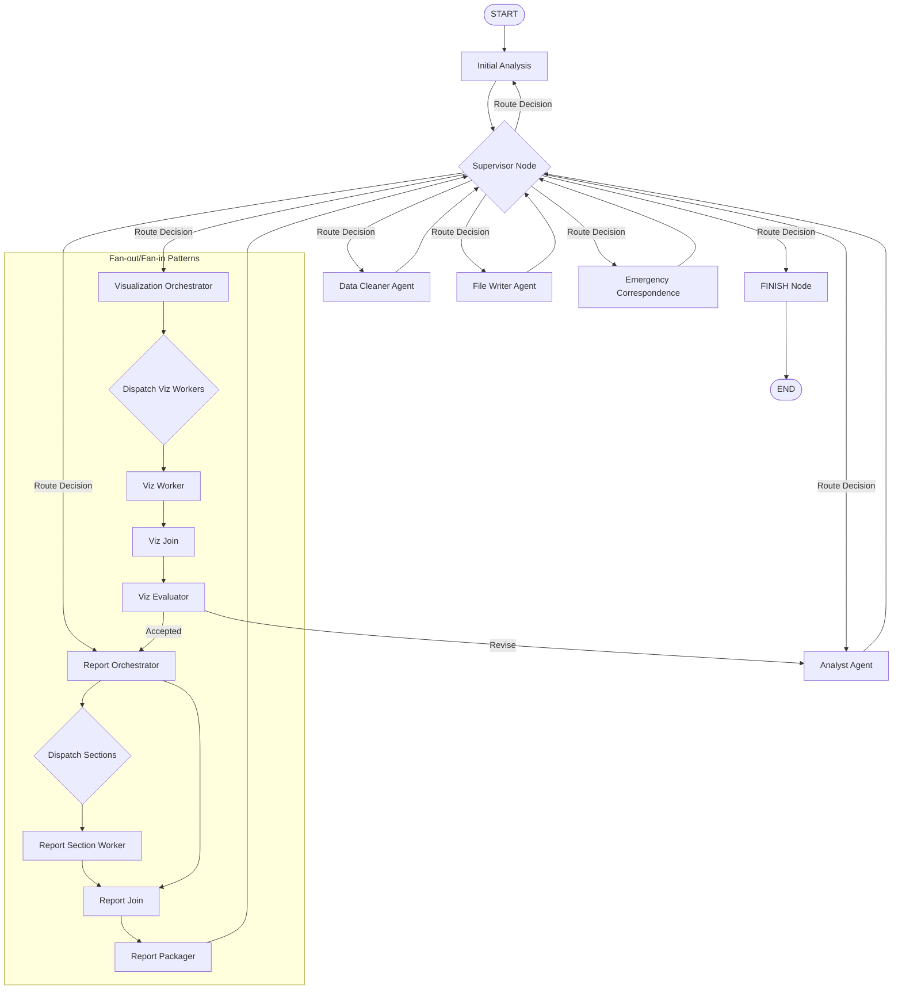
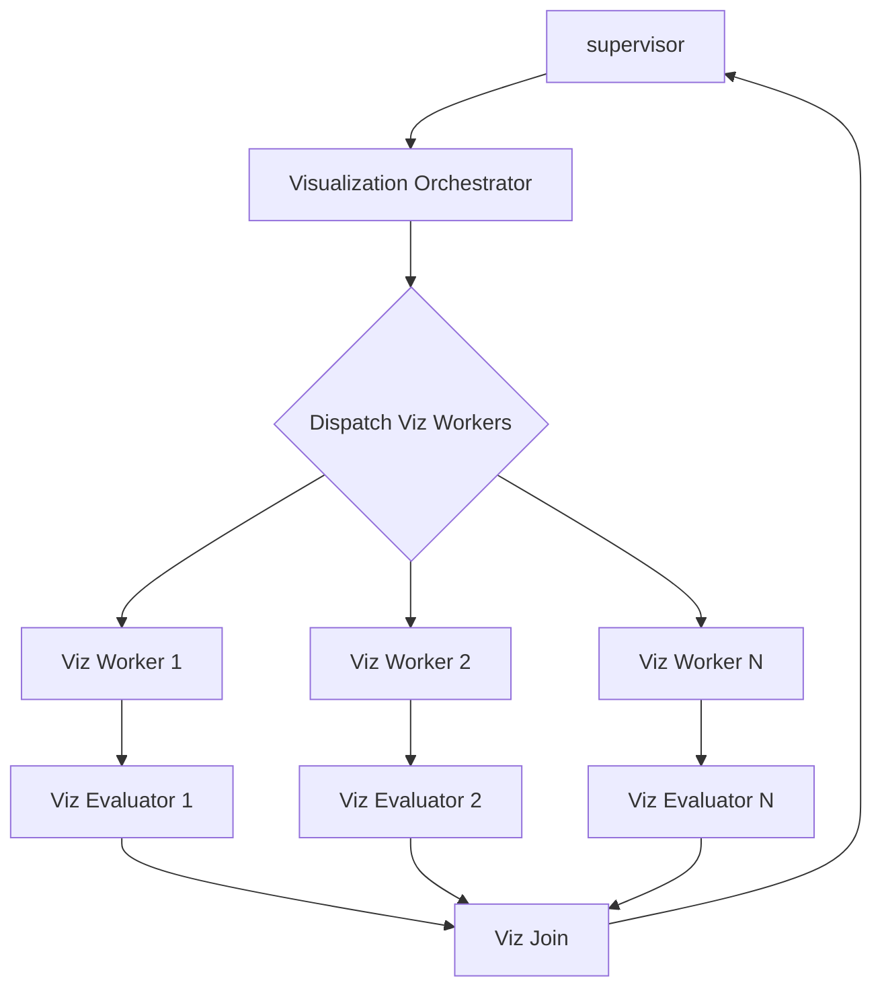
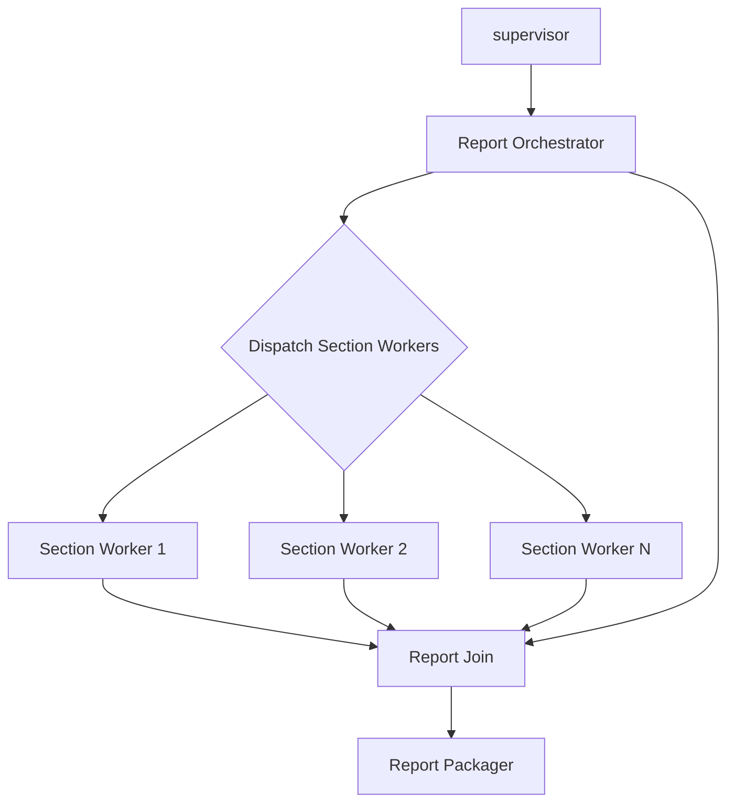
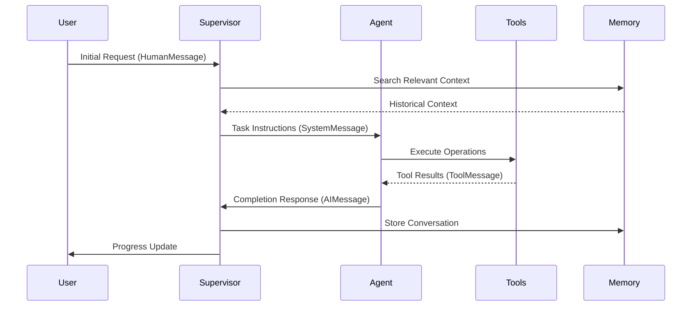

# LangGraph Message Passing and State Updates Investigation

## Executive Summary

This document provides a comprehensive investigation of the Intelligent Data Detective's LangGraph workflow, documenting the message passing, state updates, and context flow through each node of the multi-agent system. This analysis examines the compiled state graph, node implementations, and routing logic to provide an accurate and complete accounting of the graph state at each step.

## Table of Contents

1. [Graph Structure Overview](#graph-structure-overview)
2. [State Model Analysis](#state-model-analysis)
3. [Supervisor Node Deep Dive](#supervisor-node-deep-dive)
4. [Agent Node Analysis](#agent-node-analysis)
5. [Message Passing Flow](#message-passing-flow)
6. [State Updates Documentation](#state-updates-documentation)
7. [Workflow Execution Sequence](#workflow-execution-sequence)
8. [Context and Variables at Each Step](#context-and-variables-at-each-step)

## Graph Structure Overview

The Intelligent Data Detective uses a hub-and-spoke architecture with the supervisor node at the center, coordinating all agent activities.

### **Actual Graph Nodes in Compiled Graph**

Based on examination of the `IntelligentDataDetective_beta_v4.ipynb` file, the compiled graph contains exactly these 15 nodes:

1. **`supervisor`** - Central coordinator node (coordinator_node)
2. **`initial_analysis`** - Dataset exploration and characterization
3. **`data_cleaner`** - Data quality assessment and cleaning
4. **`analyst`** - Statistical analysis and insights
5. **`viz_worker`** - Individual visualization creation worker
6. **`viz_join`** - Aggregates results from parallel viz workers
7. **`viz_evaluator`** - Evaluates and validates visualizations
8. **`report_orchestrator`** - Plans and coordinates report generation
9. **`report_section_worker`** - Writes individual report sections
10. **`report_join`** - Aggregates parallel section results
11. **`report_packager`** - Packages final report in multiple formats
12. **`file_writer`** - Writes all deliverables to disk
13. **`visualization`** - Visualization orchestrator (visualization_orchestrator)
14. **`EMERGENCY_MSG`** - Emergency correspondence for error handling
15. **`FINISH`** - Final completion node (write_output_to_file)

### Mermaid Diagram of Complete Workflow



## State Model Analysis

### Core State Class Structure

The `State` class inherits from `AgentState` and `TypedDict` and contains the following major categories of fields:

#### Message Management
- `messages`: Inherited from AgentState, stores conversation history
- `final_turn_msgs_list`: Final messages from each agent turn (with `add_messages` reducer)
- `supervisor_to_agent_msgs`: Messages from supervisor to agents (with `operator.add` reducer)
- `last_agent_message`: Most recent agent message
- `last_agent_reply_msg`: Reply message from last agent

#### Routing and Flow Control
- `next`: Next agent to execute (AgentId type)
- `last_agent_id`: ID of the last executed agent
- `emergency_reroute`: For emergency routing scenarios
- `next_agent_prompt`: Specific prompt for the next agent
- `next_agent_metadata`: Metadata for next agent execution

#### Planning and Progress Tracking
- `user_prompt`: Original user request
- `current_plan`: Current execution plan (with custom `_reduce_plan_keep_sorted` reducer)
- `to_do_list`: List of remaining tasks
- `completed_plan_steps`: Steps that have been completed (validated and sorted)
- `progress_reports`: Collection of progress updates (with `operator.add` reducer)
- `completed_tasks`: Completed task descriptions (with `operator.add` reducer)
- `latest_progress`: Most recent progress update

#### Data Management
- `available_df_ids`: List of available DataFrame IDs
- `current_dataframe`: Current DataFrame being processed
- `current_dataframe_id`: ID of current DataFrame

#### Agent Results and Artifacts
- `initial_description`: Output from initial analysis agent (InitialDescription model)
- `cleaning_metadata`: Output from data cleaner agent (CleaningMetadata model)
- `analysis_insights`: Output from analyst agent (AnalysisInsights model)
- `visualization_results`: Output from visualization agent (VisualizationResults model)
- `report_results`: Output from report generator (ReportResults model)

#### Visualization Fan-out/Fan-in
- `viz_tasks`: Planned visualization tasks
- `individual_viz_task`: Per-branch visualization task (not reduced)
- `viz_results`: Aggregated visualization results (with `operator.add` reducer)
- `viz_eval_result`: Evaluation feedback for visualizations
- `viz_specs`: Visualization specifications
- `viz_spec`: Per-branch viz specification (not reduced)

#### Report Generation Fan-out/Fan-in
- `report_outline`: Report structure outline
- `sections`: Report sections (with `operator.add` reducer)
- `written_sections`: Text content of written sections (with `operator.add` reducer)
- `report_draft`: Combined report draft

#### Completion Flags
- `initial_analysis_complete`: Boolean flag (with `bool_or` reducer)
- `data_cleaning_complete`: Boolean flag (with `bool_or` reducer)
- `analyst_complete`: Boolean flag (with `bool_or` reducer)
- `visualization_complete`: Boolean flag (with `bool_or` reducer)
- `report_generator_complete`: Boolean flag (with `bool_or` reducer)
- `file_writer_complete`: Boolean flag (with `bool_or` reducer)

#### System Fields
- `_count_`: Step counter (with `merge_int_sum` reducer)
- `_id_`: Unique state instance ID
- `_config`: LangGraph execution configuration
- `run_id`: Execution run identifier

#### File Paths and Artifacts
- `artifacts_path`: Path to generated artifacts (with `keep_first` reducer)
- `reports_path`: Path to report files (with `keep_first` reducer)
- `logs_path`: Path to log files (with `keep_first` reducer)
- `final_report_path`: Path to final report (with `keep_first` reducer)
- `viz_paths`: Paths to visualization files (with `operator.add` reducer)
- `report_paths`: Dictionary of report file paths (with `operator.add` reducer)

### Key Reducer Functions

The state uses several custom reducer functions to handle state merging:

1. **`add_messages`**: Standard LangChain message aggregation
2. **`operator.add`**: Simple list concatenation
3. **`bool_or`**: Boolean OR operation (keeps True once set)
4. **`_reduce_plan_keep_sorted`**: Custom plan merging with step deduplication and sorting
5. **`merge_int_sum`**: Integer addition for counters
6. **`keep_first`**: Preserves first value set (for paths)

## Supervisor Node Deep Dive

### Function Signature and Purpose
```python
def make_supervisor_node(llms: List[BaseChatModel], members: List[str], user_prompt: str)
```

The supervisor node is the central orchestrator that:
1. Analyzes current state and completed work
2. Determines next agent to execute
3. Updates plans and progress tracking
4. Manages routing decisions
5. Handles memory storage and retrieval

### Input Context Analysis

When the supervisor node executes, it has access to:

#### From State Object:
- **Messages**: Complete conversation history via `state["messages"]`
- **Agent Results**: All completed agent outputs (`initial_description`, `cleaning_metadata`, `analysis_insights`, etc.)
- **Completion Flags**: Status of each agent (`*_complete` flags)
- **Current Plan**: The evolving plan with completed and remaining steps
- **Progress Reports**: Accumulated progress updates
- **User Context**: Original `user_prompt` and current objectives
- **Routing History**: Previous routing decisions and agent metadata

#### Memory System:
- **Retrieval**: Searches memory store using current context
- **Storage**: Stores conversation history for future reference

### Supervisor Processing Logic

The supervisor follows this execution sequence:

1. **State Analysis**
   - Increments `_count_` counter
   - Retrieves conversation history and agent results
   - Analyzes completion flags to understand workflow progress

2. **Memory Integration**
   - Calls `_mem_text(last_message_text)` to search stored memories
   - Uses `in_memory_store.search(("memories",), query=query, limit=5)`
   - Retrieves contextually relevant historical patterns and solutions
   - Includes memory search results in agent prompts via `{memories}` template variable

3. **Routing Decision**
   - Uses routing LLM to determine next agent
   - Considers completed work, current objectives, and available agents
   - Generates structured routing response with next agent and instructions

4. **Plan Management**
   - Updates current plan based on progress
   - Marks completed steps
   - Generates new plan steps if needed
   - Uses planning LLM for complex plan updates

5. **Progress Tracking**
   - Compiles progress report
   - Updates completion tracking
   - Generates status summaries

### Supervisor Output

The supervisor returns a state update containing:

```python
{
    "messages": new_messages,  # Updated conversation history
    "_count_": _count,  # Incremented counter
    "next_agent_prompt": next_agent_prompt,  # Instructions for next agent
    "current_plan": new_plan,  # Updated plan
    "to_do_list": todo_list,  # Updated task list
    "completed_plan_steps": done_steps,  # Completed steps
    "completed_tasks": done_tasks,  # Completed tasks
    "latest_progress": progress_report.latest_progress,  # Current progress
    "progress_reports": [progress_report.latest_progress],  # Progress history
    "next": goto,  # Next agent to execute
    "last_agent_id": "supervisor",  # Mark supervisor as last agent
    "last_agent_message": new_messages[-1],  # Last message sent
    "next_agent_metadata": routing.next_agent_metadata,  # Metadata for next agent
}
```

## Agent Node Analysis

Each agent node in the system follows a similar pattern but specializes in different aspects of data analysis. Here's the detailed analysis of each node:

### 1. Initial Analysis Node

#### Function Signature
```python
def initial_analysis_node(state: State) -> Dict
```

#### Input Context
The initial analysis node receives:

**From State:**
- `user_prompt`: Original user request
- `next_agent_prompt`: Specific instructions from supervisor
- `available_df_ids`: List of available DataFrames
- `messages`: Conversation history
- `initial_description`: Previous analysis (if re-running)

**Memory Retrieval:**
- Searches memory store for relevant past analyses
- Query based on `next_agent_prompt` or `user_prompt`
- Returns top 5 relevant memories

**Tools Available:**
- All initial analyst tools (data exploration, memory management)
- DataFrame registry access
- Memory search and management tools

#### Processing Logic
1. **Context Preparation**
   - Extracts user prompt and supervisor instructions
   - Prepares DataFrame ID list for tool access
   - Retrieves relevant memories

2. **Prompt Construction**
   - Uses `analyst_prompt_template_initial`
   - Includes tool descriptions, data samples, and guidelines
   - Formats with InitialDescription output schema

3. **Agent Execution**
   - Creates chat agent with initial analyst LLM
   - Invokes agent with constructed prompt and tools
   - Expects structured output as InitialDescription

4. **Response Processing**
   - Validates output against InitialDescription schema
   - Extracts completion flags and supervisor messages

#### Output State Updates
```python
{
    "initial_description": parsed_result,  # InitialDescription object
    "initial_analysis_complete": True,  # Completion flag
    "messages": updated_messages,  # Conversation history
    "last_agent_id": "initial_analysis",  # Agent identification
    "last_agent_message": final_message,  # Last message from agent
    "final_turn_msgs_list": [final_message],  # Turn completion
}
```

#### What Supervisor Sees After This Node
- **Completed Work**: Dataset description, structure analysis, data sample
- **Status**: `initial_analysis_complete = True`
- **Next Steps**: Typically routes to data cleaning based on identified issues
- **Context**: Rich understanding of dataset characteristics and quality issues

### 2. Data Cleaner Node

#### Function Signature
```python
def data_cleaner_node(state: State) -> Dict
```

#### Input Context
**From State:**
- `user_prompt`: Original request
- `next_agent_prompt`: Supervisor instructions for cleaning
- `available_df_ids`: DataFrames to clean
- `initial_description`: Dataset analysis from previous step
- `messages`: Full conversation history

**Memory Integration:**
- Supervisor calls `_mem_text()` function to search stored memories using current message as query
- Retrieves up to 5 relevant memory items from the `("memories",)` namespace  
- Memory search results included in agent prompts as contextual information
- All agents have access to memory tools: `create_manage_memory_tool()` and `create_search_memory_tool()`

**Tools Available:**
- Data cleaning tools (missing value handling, outlier detection, etc.)
- DataFrame manipulation tools
- Memory management tools

#### Processing Logic
1. **Data Quality Assessment**
   - Reviews initial description for identified issues
   - Accesses DataFrames through global registry
   - Prepares data samples for analysis

2. **Cleaning Strategy Development**
   - Uses data cleaner LLM to develop cleaning approach
   - Considers user requirements and data characteristics
   - Plans cleaning operations

3. **Cleaning Execution**
   - Applies cleaning tools to DataFrames
   - Documents all cleaning operations
   - Validates cleaning results

4. **Metadata Generation**
   - Creates CleaningMetadata with detailed documentation
   - Records all transformations applied
   - Provides cleaned dataset description

#### Output State Updates
```python
{
    "cleaning_metadata": cleaning_result,  # CleaningMetadata object
    "data_cleaning_complete": True,  # Completion flag
    "cleaned_dataset_description": description,  # Updated dataset info
    "messages": updated_messages,  # Conversation history
    "last_agent_id": "data_cleaner",  # Agent identification
    "last_agent_message": final_message,  # Last message
    "final_turn_msgs_list": [final_message],  # Turn completion
}
```

#### What Supervisor Sees After This Node
- **Completed Work**: Comprehensive data cleaning with documented transformations
- **Status**: `data_cleaning_complete = True`
- **Next Steps**: Usually routes to analyst for statistical analysis
- **Context**: Clean dataset ready for analysis, with full cleaning audit trail

### 3. Analyst Node

#### Function Signature
```python
def analyst_node(state: State) -> Dict
```

#### Input Context
**From State:**
- `user_prompt`: Original analytical objectives
- `initial_description`: Dataset characteristics
- `cleaning_metadata`: Applied cleaning operations
- `analysis_config`: User-defined analysis preferences
- `next_agent_prompt`: Specific analytical instructions

**Tools Available:**
- Statistical analysis tools
- Pattern detection algorithms
- Correlation analysis tools
- Memory management tools

#### Processing Logic
1. **Analysis Planning**
   - Reviews cleaned dataset and user objectives
   - Develops comprehensive analysis strategy
   - Considers statistical requirements and data types

2. **Statistical Analysis Execution**
   - Performs descriptive statistics
   - Conducts correlation analysis
   - Identifies patterns and anomalies
   - Generates statistical insights

3. **Insight Generation**
   - Interprets statistical results
   - Develops narrative explanations
   - Identifies key findings and recommendations

4. **Structured Output Creation**
   - Formats results as AnalysisInsights object
   - Includes statistical summaries and interpretations
   - Provides recommendations for visualization

#### Output State Updates
```python
{
    "analysis_insights": analysis_result,  # AnalysisInsights object
    "analyst_complete": True,  # Completion flag
    "messages": updated_messages,  # Conversation history
    "last_agent_id": "analyst",  # Agent identification
    "last_agent_message": final_message,  # Last message
    "final_turn_msgs_list": [final_message],  # Turn completion
}
```

#### What Supervisor Sees After This Node
- **Completed Work**: Comprehensive statistical analysis with insights
- **Status**: `analyst_complete = True`
- **Next Steps**: Routes to visualization for chart creation
- **Context**: Rich analytical insights ready for visualization and reporting

### 4. Visualization Orchestrator Node

The visualization system uses a fan-out/fan-in pattern with multiple specialized nodes:

#### Visualization Flow Overview


#### A. Visualization Orchestrator
**Input Context:**
- `analysis_insights`: Statistical findings requiring visualization
- `cleaned_dataset_description`: Data characteristics
- `user_prompt`: Visualization preferences

**Processing:**
- Plans visualization strategy
- Creates list of visualization tasks
- Dispatches tasks to viz workers using Send() commands

**Output:**
```python
{
    "viz_tasks": task_list,  # List of visualization tasks
    "viz_specs": specifications,  # Detailed viz specifications
}
```

#### B. Viz Worker Nodes
**Input Context:**
- `individual_viz_task`: Specific visualization assignment
- `viz_spec`: Detailed specification for the visualization
- `available_df_ids`: Data access

**Processing:**
- Creates specific visualization
- Saves visualization files
- Documents visualization metadata

**Output:**
```python
{
    "viz_results": [viz_dict],  # Appends to results list
}
```

#### C. Viz Evaluator Nodes
**Input Context:**
- Visualization results from worker
- Quality criteria and standards

**Processing:**
- Evaluates visualization quality
- Provides feedback and ratings
- Suggests improvements

**Output:**
```python
{
    "viz_eval_result": evaluation,  # VizFeedback object
    "viz_grade": grade,  # Quality rating
    "viz_feedback": feedback,  # Improvement suggestions
}
```

#### D. Viz Join Node
**Input Context:**
- `viz_results`: All visualization results from workers
- Evaluation feedback from evaluators

**Processing:**
- Aggregates all visualization results
- Compiles comprehensive visualization summary
- Prepares final visualization package

**Output:**
```python
{
    "visualization_results": final_viz_results,  # VisualizationResults object
    "visualization_complete": True,  # Completion flag
    "viz_paths": file_paths,  # Paths to generated visualizations
}
```

#### What Supervisor Sees After Visualization
- **Completed Work**: Complete set of visualizations with quality evaluations
- **Status**: `visualization_complete = True`
- **Next Steps**: Routes to report orchestrator for report generation
- **Context**: Rich visual representations ready for inclusion in reports

### 5. Report Generation System

The report generation follows a similar fan-out/fan-in pattern:

#### Report Generation Flow


#### A. Report Orchestrator
**Input Context:**
- `analysis_insights`: Statistical findings
- `visualization_results`: Generated charts and graphs
- `cleaning_metadata`: Data cleaning documentation
- `user_prompt`: Report requirements

**Processing:**
- Creates report outline structure
- Defines sections and their content requirements
- Dispatches section writing tasks

**Output:**
```python
{
    "report_outline": outline,  # ReportOutline object
    "sections": [section_outlines],  # Section specifications
}
```

#### B. Report Section Worker Nodes
**Input Context:**
- `section`: Specific section outline to write
- Access to all analysis results and visualizations

**Processing:**
- Writes specific section content
- Integrates data insights and visualizations
- Formats content according to section requirements

**Output:**
```python
{
    "written_sections": [section_text],  # Appends section content
}
```

#### C. Report Join Node
**Input Context:**
- `written_sections`: All section content from workers
- `report_outline`: Overall report structure

**Processing:**
- Assembles all sections into coherent report
- Ensures proper formatting and flow
- Creates report draft

**Output:**
```python
{
    "report_draft": assembled_report,  # Complete report text
}
```

#### D. Report Packager Node
**Input Context:**
- `report_draft`: Assembled report content
- `visualization_results`: Charts to include
- `analysis_insights`: Supporting data

**Processing:**
- Formats report in multiple formats (Markdown, HTML, PDF)
- Integrates visualizations
- Creates final report package

**Output:**
```python
{
    "report_results": final_reports,  # ReportResults object
    "report_generator_complete": True,  # Completion flag
    "report_paths": {"pdf": "path/to/report.pdf", "html": "path/to/report.html"},
}
```

#### What Supervisor Sees After Report Generation
- **Completed Work**: Comprehensive formatted reports in multiple formats
- **Status**: `report_generator_complete = True`
- **Next Steps**: Routes to file writer for final file operations
- **Context**: Complete analytical deliverables ready for file output

### 6. File Writer Node

#### Function Signature
```python
def write_output_to_file(state: State) -> Dict
```

#### Input Context
**From State:**
- `report_results`: Final report content
- `visualization_results`: Chart files
- `file_content`: Content to write
- `next_agent_prompt`: File writing instructions

**Tools Available:**
- File writing tools
- Path management utilities
- Format conversion tools

#### Processing Logic
1. **File Organization**
   - Creates appropriate directory structure
   - Organizes files by type and purpose
   - Ensures proper naming conventions

2. **File Writing Operations**
   - Writes report files in specified formats
   - Copies visualization files to output directory
   - Creates index files and documentation

3. **Verification**
   - Validates file creation
   - Checks file integrity
   - Documents file locations

#### Output State Updates
```python
{
    "file_writer_complete": True,  # Completion flag
    "final_report_path": output_path,  # Path to final deliverables
    "artifacts_path": artifacts_dir,  # Path to all artifacts
    "messages": updated_messages,  # Conversation history
    "last_agent_id": "file_writer",  # Agent identification
}
```

#### What Supervisor Sees After File Writing
- **Completed Work**: All files written to specified locations
- **Status**: `file_writer_complete = True`
- **Next Steps**: Typically routes to END (workflow completion)
- **Context**: Complete deliverables ready for user access

## Message Passing Flow

The message passing in the LangGraph system follows a structured pattern that ensures context preservation and proper communication between nodes.

### Message Structure and Types

#### Primary Message Types
1. **SystemMessage**: Contains prompts and instructions for agents
2. **HumanMessage**: User inputs and requests
3. **AIMessage**: Agent responses and outputs
4. **ToolMessage**: Results from tool executions

#### Message Flow Pattern


### State Updates Through Message Passing

#### 1. Message Aggregation
The system uses the `add_messages` reducer for the main message list:
```python
messages: Annotated[List[BaseMessage], add_messages]
```

This ensures that:
- Messages are appended in chronological order
- No message loss during parallel execution
- Conversation history is preserved

#### 2. Turn-based Communication
Each agent interaction follows this pattern:

**Supervisor → Agent:**
```python
# Supervisor prepares context
new_messages = [
    SystemMessage(content=agent_prompt),
    HumanMessage(content=task_instructions)
]

# State update includes new instructions
{
    "messages": new_messages,
    "next_agent_prompt": specific_instructions,
    "next": target_agent_id
}
```

**Agent → Supervisor:**
```python
# Agent completes work and responds
agent_response = AIMessage(
    content=structured_output.model_dump_json(),
    name=agent_id
)

# State update includes results
{
    "messages": [agent_response],
    "last_agent_message": agent_response,
    "{agent_type}_complete": True,
    "{agent_type}_results": structured_output
}
```

#### 3. Memory Integration
Memory storage and retrieval is actively implemented using the `langmem` package:

**Memory Search (Supervisor):**
```python
def _mem_text(query: str, limit: int = 5) -> str:
    try:
        items = in_memory_store.search(("memories",), query=query, limit=limit)
        if not items:
            return "None."
        return "\n".join(str(it) for it in items)
    except Exception:
        return "None."

# Used in supervisor at multiple points:
"memories": _mem_text(last_message_text)  # Progress accounting
"memories": _mem_text(user_prompt)        # Planning phase
```

**Memory Tools (All Agents):**
```python
mem_tools = [
    create_manage_memory_tool(namespace=("memories",)),
    create_search_memory_tool(namespace=("memories",)), 
    report_intermediate_progress
]

# Added to all agent toolkits:
for tool in mem_tools:
    data_cleaning_tools.append(tool)
    analyst_tools.append(tool) 
    report_generator_tools.append(tool)
    file_writer_tools.append(tool)
    visualization_tools.append(tool)
```

## State Updates Documentation

### State Update Patterns

#### 1. Completion Flag Updates
Each agent sets its completion flag when finished:
```python
# Pattern used by all agents
{
    f"{agent_name}_complete": True,  # Boolean OR reducer keeps True
}
```

#### 2. Result Storage
Agent outputs are stored in structured fields:
```python
# Initial Analysis
{
    "initial_description": InitialDescription(...),
    "initial_analysis_complete": True
}

# Data Cleaning
{
    "cleaning_metadata": CleaningMetadata(...),
    "data_cleaning_complete": True,
    "cleaned_dataset_description": "Updated description"
}

# Analysis
{
    "analysis_insights": AnalysisInsights(...),
    "analyst_complete": True
}
```

#### 3. Fan-out/Fan-in Updates
For parallel processing (visualization and reporting):

**Fan-out (Orchestrator):**
```python
# Orchestrator prepares tasks
{
    "viz_tasks": ["task1", "task2", "task3"],
    "viz_specs": [spec1, spec2, spec3]
}

# Dispatches with Send() commands
return [
    Send("viz_worker", {"individual_viz_task": "task1", "viz_spec": spec1}),
    Send("viz_worker", {"individual_viz_task": "task2", "viz_spec": spec2}),
    Send("viz_worker", {"individual_viz_task": "task3", "viz_spec": spec3})
]
```

**Worker Updates:**
```python
# Each worker appends to shared list
{
    "viz_results": [worker_result]  # operator.add reducer concatenates
}
```

**Fan-in (Join):**
```python
# Join node aggregates all results
all_results = state.get("viz_results", [])
aggregated = process_all_results(all_results)
{
    "visualization_results": aggregated,
    "visualization_complete": True
}
```

#### 4. Progress Tracking Updates
The supervisor continuously updates progress:
```python
{
    "_count_": 1,  # Incremented each supervisor turn
    "latest_progress": "Completed data cleaning, starting analysis",
    "progress_reports": ["Progress update"],  # Appended to list
    "completed_tasks": ["Data cleaning"],  # Appended to list
    "completed_plan_steps": [step1, step2],  # Validated and sorted
}
```

## Workflow Execution Sequence

### Happy Path Execution Flow

**Note**: Based on examination of the actual graph construction in `IntelligentDataDetective_beta_v4.ipynb`, the workflow starts directly with `initial_analysis`, not the supervisor.

#### Phase 1: Initialization  
1. **START → Initial Analysis** (Direct Edge)
   - **Input**: User prompt and DataFrame IDs via initial state
   - **State**: Fresh state with user request
   - **Agent Processing**: 
     - Analyzes dataset structure and quality
     - Creates comprehensive initial description  
     - Documents findings and recommendations
   - **State Updates**:
     - `initial_description`: Complete dataset analysis
     - `initial_analysis_complete`: True
     - `messages`: Analysis results and insights

2. **Initial Analysis → Supervisor**
   - **Context Received**:
     - Complete initial description with data insights
     - Quality issues identification
     - Recommended next steps
   - **Supervisor Processing**:
     - Increments `_count_` (step 1)
     - Reviews analysis results 
     - Searches memory for relevant context
     - Plans data cleaning phase
     - **Routing Decision**: Routes to `data_cleaner`

#### Phase 2: Data Preparation
3. **Supervisor → Data Cleaner**
3. **Supervisor → Data Cleaner**
   - **Context Passed**:
     - Initial description findings
     - Specific cleaning instructions  
     - Available DataFrames and cleaning tools
     - Memory context for cleaning patterns
   - **Agent Processing**:
     - Applies data cleaning operations
     - Documents all transformations
     - Validates cleaning results
   - **State Updates**:
     - `cleaning_metadata`: Detailed cleaning documentation
     - `data_cleaning_complete`: True
     - `cleaned_dataset_description`: Updated description

4. **Data Cleaner → Supervisor**
   - **Context Received**:
     - Cleaning metadata and results
     - Clean dataset description
     - Completion confirmation
   - **Supervisor Processing**:
     - Increments `_count_` (step 2)
     - Reviews cleaning results
     - Plans statistical analysis phase
     - **Routing Decision**: Routes to `analyst`

#### Phase 3: Statistical Analysis
5. **Supervisor → Analyst**
   - **Context Passed**:
     - Cleaned dataset information
     - User analytical objectives
     - Analysis configuration
     - Memory context
   - **Agent Processing**:
     - Performs statistical analysis
     - Identifies patterns and insights
     - Generates recommendations
   - **State Updates**:
     - `analysis_insights`: Complete statistical findings
     - `analyst_complete`: True

#### Phase 4: Visualization (Fan-out/Fan-in)
7. **Analyst → Supervisor**
   - **Context Received**:
     - Analysis insights
     - Statistical findings
     - Visualization recommendations
   - **Supervisor Processing**:
     - Reviews analysis results
     - Plans visualization strategy
     - Routes to visualization orchestrator

8. **Supervisor → Visualization Orchestrator**
   - **Context Passed**:
     - Analysis insights
     - Dataset characteristics
     - User preferences
   - **Orchestrator Processing**:
     - Plans visualization strategy
     - Creates task specifications
     - Dispatches workers using Send()
   - **Parallel Worker Execution**:
     - Multiple viz workers create charts
     - Each worker updates `viz_results`
     - Evaluators assess quality
   - **Join Processing**:
     - Aggregates all visualization results
     - Compiles final visualization package
   - **State Updates**:
     - `visualization_results`: Complete visualization package
     - `visualization_complete`: True
     - `viz_paths`: File locations

#### Phase 5: Report Generation (Fan-out/Fan-in)
9. **Visualization → Supervisor**
   - **Context Received**:
     - Complete visualization package
     - All analysis results
     - Completion confirmation
   - **Supervisor Processing**:
     - Reviews all completed work
     - Plans report generation
     - Routes to report orchestrator

10. **Supervisor → Report Orchestrator**
    - **Context Passed**:
      - All analysis results
      - Visualization package
      - User report requirements
    - **Orchestrator Processing**:
      - Creates report outline
      - Defines section specifications
      - Dispatches section workers
    - **Parallel Section Processing**:
      - Multiple workers write sections
      - Each worker updates `written_sections`
    - **Join and Packaging**:
      - Assembles complete report
      - Formats in multiple formats
      - Creates final deliverables
    - **State Updates**:
      - `report_results`: Final report package
      - `report_generator_complete`: True
      - `report_paths`: File locations

#### Phase 6: File Output
11. **Report Generation → Supervisor**
    - **Context Received**:
      - Complete report package
      - All deliverables ready
      - Final completion status
    - **Supervisor Processing**:
      - Reviews final deliverables
      - Decides on file writing
      - Routes to file writer

12. **Supervisor → File Writer**
    - **Context Passed**:
      - Complete report package
      - Visualization files
      - Output specifications
    - **Agent Processing**:
      - Organizes file structure
      - Writes all deliverables
      - Validates file creation
    - **State Updates**:
      - `file_writer_complete`: True
      - `final_report_path`: Output location
      - `artifacts_path`: All deliverables

#### Phase 7: Completion
13. **File Writer → Supervisor**
    - **Context Received**:
      - File writing confirmation
      - Deliverable locations
      - Final completion status
    - **Supervisor Processing**:
      - Reviews all completion flags
      - Confirms workflow completion
      - Routes to END

## Context and Variables at Each Step

### Initial Analysis Step Context

**What the Agent Sees:**
```python
context = {
    "user_prompt": "Analyze the customer review dataset...",
    "available_df_ids": ["customer_reviews_001"],
    "next_agent_prompt": "Provide comprehensive initial analysis...",
    "messages": [HumanMessage("User request"), SystemMessage("Instructions")],
    "memories": [
        {"content": "Similar dataset analysis", "relevance": 0.8},
        {"content": "Review data patterns", "relevance": 0.7}
    ],
    "tools": [
        "get_dataframe_info", "sample_dataframe", "detect_missing_values",
        "analyze_data_types", "manage_memory", "search_memory"
    ],
    "_count_": 1,
    "_config": {"thread_id": "thread-1", "user_id": "user-123"}
}
```

**What Gets Updated:**
```python
state_updates = {
    "initial_description": InitialDescription(
        dataset_description="Customer review dataset with 10,000 records...",
        data_sample="ProductId,UserId,Score,Summary,Text\n1,A3...",
        notes="Missing values in Summary field (15%), some duplicate reviews",
        data_quality_issues=["Missing summaries", "Potential duplicates"],
        recommended_next_steps=["Clean missing values", "Remove duplicates"],
        finished_this_task=True,
        expect_reply=False,
        reply_msg_to_supervisor="Initial analysis complete"
    ),
    "initial_analysis_complete": True,
    "messages": [
        SystemMessage("Initial analysis instructions"),
        AIMessage("Analysis complete with findings...")
    ],
    "final_turn_msgs_list": [AIMessage("Analysis complete...")],
    "last_agent_id": "initial_analysis",
    "last_agent_message": AIMessage("Analysis complete...")
}
```

**What Supervisor Sees:**
```python
supervisor_context = {
    "completed_work": {
        "initial_analysis": "✓ Complete",
        "data_cleaning": "⏳ Pending",
        "analysis": "⏳ Pending",
        "visualization": "⏳ Pending",
        "reporting": "⏳ Pending"
    },
    "available_data": {
        "dataset_info": "Customer reviews, 10k records",
        "quality_issues": ["Missing summaries", "Duplicates"],
        "next_actions": ["Data cleaning required"]
    },
    "routing_decision": {
        "next_agent": "data_cleaner",
        "reason": "Data quality issues identified",
        "instructions": "Clean missing values and remove duplicates"
    }
}
```

### Data Cleaning Step Context

**What the Agent Sees:**
```python
context = {
    "user_prompt": "Analyze the customer review dataset...",
    "next_agent_prompt": "Clean missing values and remove duplicates...",
    "initial_description": InitialDescription(...),  # Previous analysis
    "available_df_ids": ["customer_reviews_001"],
    "memories": [
        {"content": "Missing value strategies", "relevance": 0.9},
        {"content": "Duplicate detection methods", "relevance": 0.8}
    ],
    "tools": [
        "handle_missing_values", "remove_duplicates", "validate_data_quality",
        "update_dataframe_registry", "manage_memory"
    ],
    "_count_": 2
}
```

**What Gets Updated:**
```python
state_updates = {
    "cleaning_metadata": CleaningMetadata(
        operations_performed=[
            {"operation": "fill_missing", "column": "Summary", "method": "forward_fill"},
            {"operation": "remove_duplicates", "criteria": "ProductId+UserId"}
        ],
        rows_before=10000,
        rows_after=9850,
        columns_modified=["Summary"],
        data_quality_improvements=["Reduced missing values from 15% to 0%"],
        finished_this_task=True,
        expect_reply=False,
        reply_msg_to_supervisor="Data cleaning complete"
    ),
    "data_cleaning_complete": True,
    "cleaned_dataset_description": "Clean customer review dataset, 9850 records...",
    "messages": [AIMessage("Data cleaning operations completed...")],
    "last_agent_id": "data_cleaner"
}
```

### Analysis Step Context

**What the Agent Sees:**
```python
context = {
    "user_prompt": "Analyze the customer review dataset...",
    "initial_description": InitialDescription(...),
    "cleaning_metadata": CleaningMetadata(...),
    "analysis_config": AnalysisConfig(
        visualization_style="seaborn",
        statistical_tests=["correlation", "distribution"]
    ),
    "available_df_ids": ["customer_reviews_001"],
    "memories": [
        {"content": "Review sentiment analysis", "relevance": 0.9},
        {"content": "Customer behavior patterns", "relevance": 0.8}
    ],
    "tools": [
        "calculate_statistics", "correlation_analysis", "distribution_analysis",
        "sentiment_analysis", "pattern_detection"
    ]
}
```

**What Gets Updated:**
```python
state_updates = {
    "analysis_insights": AnalysisInsights(
        statistical_summary={
            "mean_score": 4.2,
            "score_distribution": {"1": 5%, "2": 8%, "3": 15%, "4": 25%, "5": 47%},
            "correlations": {"score_text_length": 0.3}
        },
        key_findings=[
            "Strong positive sentiment bias (72% ratings 4-5)",
            "Text length correlates with rating score",
            "Peak review activity in December"
        ],
        patterns_identified=["Seasonal trends", "Product category preferences"],
        recommendations=[
            "Focus visualization on sentiment distribution",
            "Highlight seasonal patterns",
            "Compare product categories"
        ],
        visualization_suggestions=[
            {"type": "histogram", "data": "score_distribution"},
            {"type": "time_series", "data": "reviews_over_time"},
            {"type": "correlation_matrix", "data": "feature_correlations"}
        ],
        finished_this_task=True
    ),
    "analyst_complete": True,
    "messages": [AIMessage("Statistical analysis complete...")]
}
```

### Visualization Step Context (Fan-out/Fan-in)

**Orchestrator Context:**
```python
orchestrator_context = {
    "analysis_insights": AnalysisInsights(...),
    "cleaned_dataset_description": "Clean customer review dataset...",
    "user_prompt": "Create meaningful visualizations...",
    "viz_suggestions": [
        {"type": "histogram", "data": "score_distribution"},
        {"type": "time_series", "data": "reviews_over_time"},
        {"type": "correlation_matrix", "data": "feature_correlations"}
    ]
}
```

**Worker Context (Each Worker):**
```python
worker_context = {
    "individual_viz_task": "Create histogram of review score distribution",
    "viz_spec": VizSpec(
        visualization_type="histogram",
        data_source="score_distribution",
        style="seaborn-whitegrid",
        title="Distribution of Customer Review Scores"
    ),
    "available_df_ids": ["customer_reviews_001"],
    "analysis_insights": AnalysisInsights(...)
}
```

**What Gets Updated (Per Worker):**
```python
worker_updates = {
    "viz_results": [
        {
            "visualization_id": "hist_001",
            "visualization_type": "histogram",
            "path": "/artifacts/score_distribution.png",
            "title": "Distribution of Customer Review Scores",
            "description": "Shows strong positive bias in ratings",
            "visualization_complete": True
        }
    ]
}
```

**Join Node Context:**
```python
join_context = {
    "viz_results": [
        {"visualization_id": "hist_001", "path": "/artifacts/score_dist.png"},
        {"visualization_id": "time_001", "path": "/artifacts/time_series.png"},
        {"visualization_id": "corr_001", "path": "/artifacts/correlation.png"}
    ]
}
```

**Final Visualization Update:**
```python
final_viz_update = {
    "visualization_results": VisualizationResults(
        visualizations_created=[
            DataVisualization(
                title="Review Score Distribution",
                chart_type="histogram",
                file_path="/artifacts/score_dist.png",
                description="Customer sentiment distribution"
            ),
            # ... more visualizations
        ],
        summary="Created 3 comprehensive visualizations",
        finished_this_task=True
    ),
    "visualization_complete": True,
    "viz_paths": [
        "/artifacts/score_dist.png",
        "/artifacts/time_series.png", 
        "/artifacts/correlation.png"
    ]
}
```

### Report Generation Context (Fan-out/Fan-in)

**Orchestrator Context:**
```python
report_orchestrator_context = {
    "analysis_insights": AnalysisInsights(...),
    "visualization_results": VisualizationResults(...),
    "cleaning_metadata": CleaningMetadata(...),
    "user_prompt": "Generate comprehensive analysis report...",
    "report_requirements": {
        "format": ["markdown", "html", "pdf"],
        "include_visualizations": True,
        "technical_detail_level": "medium"
    }
}
```

**Section Worker Context:**
```python
section_worker_context = {
    "section": SectionOutline(
        title="Executive Summary",
        content_requirements=[
            "Key findings overview",
            "Primary insights",
            "Recommendations"
        ],
        word_count_target=300
    ),
    "analysis_insights": AnalysisInsights(...),
    "visualization_results": VisualizationResults(...)
}
```

**Final Report Context:**
```python
final_report_context = {
    "written_sections": [
        "# Executive Summary\nAnalysis of 9,850 customer reviews...",
        "# Data Quality Assessment\nInitial dataset contained...",
        "# Statistical Analysis\nKey findings include...",
        "# Visualizations\nThree primary charts were created...",
        "# Conclusions and Recommendations\nBased on the analysis..."
    ],
    "report_outline": ReportOutline(...),
    "visualization_results": VisualizationResults(...)
}
```

### Final State Summary

At the completion of the workflow, the supervisor sees:

```python
final_state_summary = {
    "completion_status": {
        "initial_analysis_complete": True,
        "data_cleaning_complete": True,
        "analyst_complete": True,
        "visualization_complete": True,
        "report_generator_complete": True,
        "file_writer_complete": True
    },
    "deliverables": {
        "cleaned_dataset": "9,850 customer reviews",
        "statistical_analysis": "Comprehensive insights with 5 key findings",
        "visualizations": "3 charts (histogram, time series, correlation)",
        "reports": {
            "markdown": "/outputs/analysis_report.md",
            "html": "/outputs/analysis_report.html", 
            "pdf": "/outputs/analysis_report.pdf"
        }
    },
    "workflow_metrics": {
        "total_steps": 13,
        "total_agents_executed": 6,
        "total_tools_used": 25,
        "execution_time": "estimated 15-20 minutes",
        "memory_interactions": 8
    },
    "next_action": "END"
}
```

## Conclusion

This investigation reveals a sophisticated multi-agent system with:

1. **Rich State Management**: Complex state object with 50+ fields and custom reducers
2. **Hub-and-Spoke Architecture**: Supervisor orchestrates all agent interactions
3. **Fan-out/Fan-in Patterns**: Parallel processing for visualizations and reports
4. **Memory Integration**: Persistent context across workflow execution
5. **Structured Data Flow**: Type-safe message passing with validation
6. **Comprehensive Context**: Each agent receives full context needed for decision-making
7. **Progressive State Building**: State grows incrementally with each agent's contributions

The system ensures no information loss while maintaining clear separation of concerns across specialized agents. Each node in the workflow has access to appropriate context and contributes specific structured outputs that build toward the final deliverables.
```
