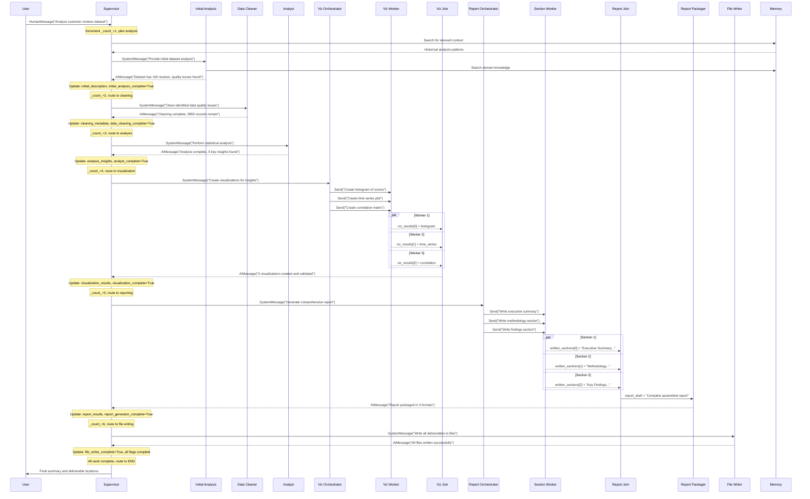
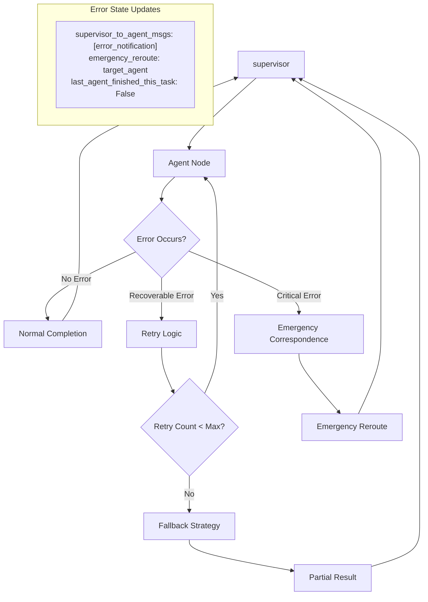

# LangGraph State Flow Diagrams

This document contains detailed mermaid diagrams to visualize the state flow and message passing in the Intelligent Data Detective workflow.

## Complete Workflow State Flow

```mermaid
graph TD
    START([User Request]) -->|user_prompt, available_df_ids| supervisor{Supervisor Node}
    supervisor -->|next_agent_prompt, tools, memories| initial_analysis[Initial Analysis]
    initial_analysis -->|initial_description, complete=True| supervisor
    supervisor -->|cleaning_instructions, initial_description| data_cleaner[Data Cleaner]
    data_cleaner -->|cleaning_metadata, cleaned_description, complete=True| supervisor
    supervisor -->|analysis_instructions, cleaned_data| analyst[Analyst]
    analyst -->|analysis_insights, complete=True| supervisor
    supervisor -->|viz_requirements, insights| viz_orchestrator[Visualization Orchestrator]
    viz_orchestrator -->|viz_tasks[], viz_specs[]| dispatch_viz{Dispatch Workers}
    dispatch_viz --> viz_worker1[Viz Worker 1]
    dispatch_viz --> viz_worker2[Viz Worker 2]
    dispatch_viz --> viz_workern[Viz Worker N]
    viz_worker1 -->|viz_results[0]| viz_evaluator1[Viz Evaluator 1]
    viz_worker2 -->|viz_results[1]| viz_evaluator2[Viz Evaluator 2]
    viz_workern -->|viz_results[n]| viz_evaluatorn[Viz Evaluator N]
    viz_evaluator1 -->|viz_eval_result| viz_join[Viz Join]
    viz_evaluator2 -->|viz_eval_result| viz_join
    viz_evaluatorn -->|viz_eval_result| viz_join
    viz_join -->|visualization_results, viz_paths[], complete=True| supervisor
    supervisor -->|report_requirements, all_results| report_orchestrator[Report Orchestrator]
    report_orchestrator -->|report_outline, sections[]| dispatch_sections{Dispatch Sections}
    dispatch_sections --> section_worker1[Section Worker 1]
    dispatch_sections --> section_worker2[Section Worker 2]
    dispatch_sections --> section_workern[Section Worker N]
    section_worker1 -->|written_sections[0]| report_join[Report Join]
    section_worker2 -->|written_sections[1]| report_join
    section_workern -->|written_sections[n]| report_join
    report_orchestrator -->|report_outline| report_join
    report_join -->|report_draft| report_packager[Report Packager]
    report_packager -->|report_results, report_paths{}, complete=True| route_decision{Route Decision}
    route_decision -->|file_instructions| file_writer[File Writer]
    route_decision -->|workflow complete| END([END])
    file_writer -->|file_writer_complete=True, final_paths| route_decision
    subgraph "State Updates Legend"
        direction TB
        legend1["🔵 Input Context"]
        legend2["🟢 State Updates"]
        legend3["🟡 Completion Flags"]
        legend4["🔴 Final Output"]
    end
```

## State Field Evolution Through Workflow

```mermaid
gantt
    title State Field Population Through Workflow
    dateFormat X
    axisFormat %s
    
    section Core Fields
    user_prompt           :done, user_prompt, 0, 1s
    available_df_ids      :done, df_ids, 0, 1s
    _count_               :active, count, 0, 13s
    messages              :active, messages, 0, 13s
    
    section Initial Analysis
    initial_description   :done, init_desc, 1, 3s
    initial_analysis_complete :done, init_complete, 2, 13s
    
    section Data Cleaning  
    cleaning_metadata     :done, clean_meta, 3, 5s
    data_cleaning_complete :done, clean_complete, 4, 13s
    cleaned_dataset_description :done, clean_desc, 4, 13s
    
    section Analysis
    analysis_insights     :done, analysis, 5, 7s
    analyst_complete      :done, analyst_complete, 6, 13s
    
    section Visualization
    viz_tasks             :done, viz_tasks, 7, 8s
    viz_results           :done, viz_results, 8, 10s
    visualization_results :done, viz_final, 10, 13s
    visualization_complete :done, viz_complete, 10, 13s
    viz_paths             :done, viz_paths, 10, 13s
    
    section Reporting
    report_outline        :done, report_outline, 11, 12s
    written_sections      :done, sections, 11, 12s
    report_draft          :done, draft, 12, 13s
    report_results        :done, report_final, 12, 13s
    report_generator_complete :done, report_complete, 12, 13s
    report_paths          :done, report_paths, 12, 13s
    
    section File Output
    file_writer_complete  :done, file_complete, 13, 13s
    final_report_path     :done, final_path, 13, 13s
    artifacts_path        :done, artifacts, 13, 13s
```



## Message Flow Sequence



## State Reducer Behavior

```mermaid
graph TD
    subgraph "Message Aggregation"
        msg1[Message 1] --> add_messages{add_messages reducer}
        msg2[Message 2] --> add_messages
        msg3[Message 3] --> add_messages
        add_messages --> msglist[["messages: [msg1, msg2, msg3]"]]
    end
    
    subgraph "List Concatenation"
        list1[["viz_results: [chart1]"]] --> operator_add{operator.add}
        list2[["viz_results: [chart2]"]] --> operator_add
        list3[["viz_results: [chart3]"]] --> operator_add
        operator_add --> combined[["viz_results: [chart1, chart2, chart3]"]]
    end
    
    subgraph "Boolean OR Logic"
        bool1["complete: False"] --> bool_or{bool_or reducer}
        bool2["complete: True"] --> bool_or
        bool3["complete: False"] --> bool_or
        bool_or --> result["complete: True"]
    end
    
    subgraph "Plan Merging"
        plan1["Plan A: steps [1,2]"] --> plan_reducer{_reduce_plan_keep_sorted}
        plan2["Plan B: steps [2,3,4]"] --> plan_reducer
        plan_reducer --> merged["Plan: steps [1,2,3,4] (sorted, deduped)"]
    end
    
    subgraph "First Value Preservation"
        path1["artifacts_path: '/tmp/run1'"] --> keep_first{keep_first}
        path2["artifacts_path: '/tmp/run2'"] --> keep_first
        keep_first --> preserved["artifacts_path: '/tmp/run1'"]
    end
```



## Error Handling and Recovery Flow

