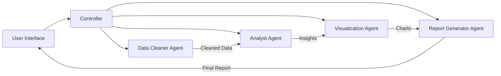

# Project Tech Spec: Intelligent Data Detective

## Overview

The Intelligent Data Detective is a multi-agent system built with LangChain and LangGraph to perform the following:
1. Clean and preprocess datasets  
2. Provide exploratory data analysis (EDA)  
3. Use chain-of-thought (CoT) reasoning to deliver insights  
4. Generate structured reports that combine textual explanations, statistics, and visualizations  

The end goal is to produce a user-friendly application that can handle arbitrary data input (CSV, JSON, etc.) and deliver a coherent, data-driven narrative that highlights hidden insights, anomalies, and recommended actions for data professionals.

## Key Components

### 1. Data Cleaner Agent
**Role:** Responsible for basic data wrangling, handling missing values, outliers, and performing initial transformations.  
**Inputs:** Raw dataset (CSV, JSON, or other structured formats)  
**Outputs:** Cleaned dataset + metadata about cleaning actions taken  
**Tools/Libraries:**  
- `pandas` for data manipulation  
- `numpy` for numerical operations  
**LangChain Integration:**  
- Sub-chain may use CoT to decide on cleaning strategies  
**Memory:**  
- Logs all cleaning decisions for downstream agents  

### 2. Analyst Agent
**Role:** Performs exploratory data analysis (EDA) and advanced statistical checks (e.g., correlation, distribution analysis, hypothesis testing).  
**Inputs:** Cleaned dataset + metadata from the Data Cleaner Agent  
**Outputs:** Natural-language insights, recommended metrics or additional transformations  
**Tools/Libraries:**  
- `pandas` or `polars` for analysis  
- `scipy.stats` for hypothesis testing  
- `scikit-learn` for basic modeling  
**LangChain Integration:**  
- Uses CoT to articulate reasoning for each EDA step  
- Can query a vector store of past dataset patterns for domain knowledge  
**Memory:**  
- Records major findings for inclusion in the final report  

### 3. Visualization Agent
**Role:** Automatically generates data visualizations (histograms, scatter plots, correlation heatmaps, etc.) and prepares them for embedding.  
**Inputs:** Cleaned dataset, Analyst Agent’s recommended visuals  
**Outputs:** Image files or base64-encoded images + brief captions  
**Tools/Libraries:**  
- `matplotlib`, `seaborn`, or `plotly`  
**LangChain Integration:**  
- May use code-generation tools to produce visualization scripts  
**Memory:**  
- Retains references to generated images for the Report Generator  

### 4. Report Generator Agent
**Role:** Aggregates all outputs into a structured document or report.  
**Inputs:** Cleaning metadata, EDA insights, visual artifacts  
**Outputs:** Final multi-page report (Markdown, JSON, or PDF)  
**Tools/Libraries:**  
- `jinja2` or equivalent template engine  
**LangChain Integration:**  
- Summarizes and synthesizes CoT logs into a coherent narrative  
**Memory:**  
- Access to each agent’s conversation logs for context  

### 5. Controller / Orchestrator
**Role:** Coordinates the Data Cleaner, Analyst, Visualization, and Report Generator agents, passing outputs sequentially.  
**LangChain Integration:**  
- Top-level chain or multi-agent manager  
**Memory:**  
- Central store of agent states and context  

## Architecture & Workflow

### High-Level Diagram

### Pipeline Steps

1. **User Interface**  
   - CLI, web dashboard, or Jupyter Notebook  
   - Upload or specify dataset path  
   - Initiates the pipeline by calling the Controller  

2. **Controller**  
   - Invokes Data Cleaner Agent  
   - Passes cleaned data to Analyst Agent for EDA  
   - Sends insights and data to Visualization Agent  
   - Hands all artifacts off to Report Generator Agent  

3. **Final Report**  
   - Generated and returned to the user  

## Detailed Agent Logic

### 1. Data Cleaner Agent
- **Input:** Path to dataset  
- **Process:**  
  1. Load dataset with pandas  
  2. Detect missing values, outliers, invalid types  
  3. Choose cleaning strategy (drop/impute/convert)  
  4. Log each decision  
- **Output:** Cleaned dataset + cleaning metadata  

### 2. Analyst Agent
- **Input:** Cleaned dataset + metadata  
- **Process:**  
  1. Compute descriptive statistics  
  2. Identify feature correlations  
  3. Apply CoT for anomaly reasoning  
  4. Optional quick modeling/clustering  
- **Output:** Findings summary + recommended visuals  

### 3. Visualization Agent
- **Input:** Cleaned dataset + visual specs  
- **Process:**  
  1. Generate plotting code  
  2. Create charts with matplotlib/seaborn  
  3. Encode or save images  
- **Output:** Visual files + captions  

### 4. Report Generator Agent
- **Input:** Metadata, insights, visuals  
- **Process:**  
  1. Synthesize narrative (“Here’s the data, here’s what we found…”)  
  2. Embed images with explanations  
  3. Render final output (Markdown/HTML/PDF)  
- **Output:** Comprehensive report  

## Memory & Chain-of-Thought

- **Memory:** Built with LangChain’s memory classes (e.g., ConversationBufferMemory)  
- **Chain-of-Thought:** Agents log step-by-step reasoning for transparency and debugging  

## Advanced RAG Techniques

1. **Domain-Specific Knowledge Base:** Store domain rules/best practices in a vector DB for retrieval  
2. **Historical Runs:** Archive past cleaning/analysis decisions in a vector store to inform future runs  

### Practical Example

For healthcare readmission data, common risk-factor rules stored in FAISS allow rapid anomaly detection. In finance, compliance guidelines can be retrieved to flag suspicious transactions.

## Implementation Stack

1. Python 3.10+  
2. LangChain  
3. LangGraph  
4. pandas, numpy  
5. matplotlib, seaborn, or Plotly  
6. jinja2 (or equivalent)  
7. FAISS or Chroma  
8. FastAPI or Streamlit (optional)  

## Deployment

- **Local:** Installable Python package or Docker image  
- **Cloud:** Containerized or serverless on AWS, Azure, or GCP  

## Security & Data Privacy

- Mask/anonymize sensitive fields during cleaning  
- Secure production environment  

## Roadmap

1. **MVP:** Single-run pipeline, minimal memory, Markdown report  
2. **Iteration 2:** CoT logging, vector storage, expanded analysis  
3. **Iteration 3:** Multi-user auth, scheduled runs, robust RAG  
4. **Iteration 4:** Advanced ML for anomaly detection, data quality scoring  

## Potential Extensions

- Multi-dataset comparative analysis  
- Interactive visualization UI  
- Dataset recommendation engine  
- Observability dashboard  

## Conclusion

The Intelligent Data Detective showcases how agent-based frameworks can automate the end-to-end data analytics workflow—cleaning, analysis, visualization, and reporting—delivering actionable insights to data professionals.
