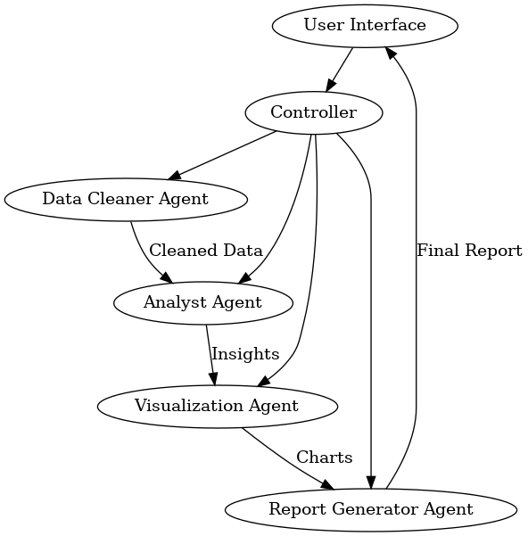

**Project Tech Spec: Intelligent Data Detective **  
**Overview **  
The Intel igent Data Detective is a multi-agent system built with LangChain and LangGraph to   
perform the fol owing:   
1.  Clean and preprocess datasets   
2.  Provide exploratory data analysis (EDA)   
3.  Use chain-of-thought (CoT) reasoning to deliver insights   
4.  Generate structured reports that combine textual explanations, statistics, and   
visualizations   
The end goal is to produce a user-friendly application that can handle arbitrary data input (CSV,   
JSON, etc.) and deliver a coherent, data-driven narrative that highlights hidden insights,   
anomalies, and recommended actions for data professionals.   
   
**Key Components **  
1.  **Data Cleaner Agent **  
** **  
○  **Role**: Responsible for basic data wrangling, handling missing values, outliers,   
and performing initial transformations.   
○  **Inputs**: Raw dataset (CSV, JSON, or other structured formats)   
○  **Outputs**: Cleaned dataset + metadata about cleaning actions taken   
○  **Tools/Libraries**:   
■  pandas for data manipulation   
■  numpy for numerical operations   
○  **LangChain Integration**:   
■  Might be a sub-chain that uses chain-of-thought to decide on cleaning   
strategies   
○  **Memory**:   
■  Maintains a log of cleaning decisions so subsequent agents can reference   
them   
2.  **Analyst Agent **  
** **  
○  **Role**: Performs exploratory data analysis (EDA) and advanced statistical checks   
(e.g., correlation, distribution analysis, hypothesis testing).   
○  **Inputs**: Cleaned dataset + metadata from the Data Cleaner Agent   
○  **Outputs**: Insights (in natural language), recommended metrics or additional   
transformations   

-----

○  **Tools/Libraries**:   
■  pandas or Polars for analysis   
■  scipy.stats for hypothesis testing   
■  sklearn for basic modeling if needed   
○  **LangChain Integration**:   
■  Uses chain-of-thought to articulate reasoning for EDA steps   
■  Could rely on a vector store of previously encountered dataset patterns to   
compare and retrieve relevant domain knowledge   
○  **Memory**:   
■  Logs al  major findings so these can be included in the final report   
3.  **Visualization Agent **  
** **  
○  **Role**: Automatical y generates data visualizations (histograms, scatter plots,   
correlation heatmaps, etc.) and optional y can embed them into a final report.   
○  **Inputs**: Cleaned dataset, Analyst Agent’s recommended visuals   
○  **Outputs**: Image files or base64-encoded images + brief text explanations   
○  **Tools/Libraries**:   
■  matplotlib, seaborn, or Plotly   
○  **LangChain Integration**:   
■  Possibly uses a specialized tool or wrapper to generate code and produce   
images   
○  **Memory**:   
■  Retains references to the images so the final Report Generator Agent can   
embed them   
4.  **Report Generator Agent **  
** **  
○  **Role**: Aggregates the outputs from previous agents into a structured   
document/report.   
○  **Inputs**: Cleaned dataset metadata, EDA insights, visualizations   
○  **Outputs**: Final multi-page report (JSON, markdown, or PDF)   
○  **Tools/Libraries**:   
■  Could use a template engine like jinja2 for HTML/PDF generation   
■  Alternatively, a direct markdown or JSON structure for flexible   
downstream consumption   
○  **LangChain Integration**:   
■  Summarizes and synthesizes the chain-of-thought from al  prior agents   
into a coherent narrative   
○  **Memory**:   
■  Has access to the conversation logs of al  agents to produce a cohesive   
summary   
5.  **Controller / Orchestrator **  
** **  

-----

○  **Role**: The orchestrator that coordinates the Data Cleaner, Analyst, Visualization,   
and Report Generator agents, passing outputs from one to the next.   
○  **LangChain Integration**:   
■  Possibly realized as a top-level chain or a specialized multi-agent   
manager   
○  **Memory**:   
■  Central store of agent states, ensures that each agent can recal  the   
relevant context   
   
**Architecture & Workflow **  
**High-Level Diagram **  
Below is a quick visual reference il ustrating how data moves through the pipeline:   
flowchart LR   
    UI\[User Interface\] --\> Control er   
    Control er --\> Cleaner\[Data Cleaner Agent\]   
    Control er --\> Analyst\[Analyst Agent\]   
    Control er --\> Viz\[Visualization Agent\]   
    Control er --\> Report\[Report Generator Agent\]   
    Cleaner --\>|Cleaned Data| Analyst   
    Analyst --\>|Insights| Viz   
    Viz --\>|Charts| Report   
    Report --\>|Final Report| UI   

-----

  
   
1.  **User Interface **  
** **  
○  Could be a CLI, a web dashboard, or a Jupyter Notebook.   
○  Al ows uploading or specifying the path of the dataset.   
○  Initiates the pipeline by cal ing the Control er.   
2.  **Controller **  
** **  
○  Receives user input and invokes the **Data Cleaner Agent**.   
○  Passes cleaned dataset to the **Analyst Agent** for EDA.   
○  Passes the dataset and EDA insights to the **Visualization Agent** for chart   
creation.   
○  Col ects everything and hands it off to the **Report Generator Agent**.   

-----

○  The final report is then returned to the user.   
3.  **LangChain + LangGraph **  
** **  
○  Use LangChain’s memory modules so each agent can maintain context.   
○  Potential y store chain-of-thought logs in a vector database (e.g., FAISS,   
Chroma) for advanced retrieval in future runs or expansions.   
○  Use LangGraph to visualize the flow of data between agents, showing how the   
system arrives at final insights.   
   
**Detailed Agent Logic **  
**1. Data Cleaner Agent **  
●  **Input**: Path to the dataset   
●  **Process**:   
1.  Load dataset with pandas.   
2.  Check for missing values, outliers, invalid data types.   
3.  Decide on a cleaning strategy: drop or impute missing values, convert data types,   
etc.   
4.  Log each decision.   
●  **Output**: Cleaned dataset, cleaning metadata (e.g., percentage of missing values, type   
conversions)   
**2. Analyst Agent **  
●  **Input**: Cleaned dataset, cleaning metadata   
●  **Process**:   
1.  Perform descriptive statistics (mean, median, mode, etc.).   
2.  Identify potential correlations among features.   
3.  Apply chain-of-thought to reason about anomalies or interesting patterns.   
4.  If needed, run quick predictive modeling or clustering to provide deeper insights.   
●  **Output**: Summary of findings, recommended visuals to highlight these findings,   
additional notes for the next step.   
**3. Visualization Agent **  
●  **Input**: Cleaned dataset, recommended visuals   
●  **Process**:   
1.  Dynamical y generate code to produce requested charts.   
2.  Create the charts (histograms, correlation heatmaps, etc.) using matplotlib or   
seaborn.   
3.  Encode images (e.g., base64) or save them to file.   
●  **Output**: Visual artifacts (file paths or encoded images), text descriptions of each.   

-----

**4. Report Generator Agent **  
●  **Input**: Cleaning metadata, EDA insights, visual artifacts   
●  **Process**:   
1.  Synthesize a coherent narrative: “Here’s the data, here’s how we cleaned it,   
here’s what we found.”   
2.  Insert images/figures and relevant explanations.   
3.  Produce a final structured output (markdown, HTML, or PDF) with references to   
the chain-of-thought logs if needed.   
●  **Output**: Final comprehensive report.   
   
**Memory & Chain-of-Thought **  
●  **Memory**: Implementation can be done using LangChain’s memory classes (e.g.,   
ConversationBufferMemory, ConversationBufferWindowMemory, or custom   
memory for each agent).   
●  **Chain-of-Thought**:   
○  Each agent can reason step-by-step about their approach, especial y the Analyst   
Agent. For instance, the agent might say, “I see that feature X is highly correlated   
with feature Y, so I want to investigate Z.”   
○  This CoT data can be stored for debugging or explanation.   
   
**Advanced RAG Techniques **  
While not strictly necessary for a first version, we can integrate retrieval augmented generation   
in the fol owing ways:   
1.  **Domain-Specific Knowledge Base**: If the user’s dataset belongs to a specific domain   
(e.g., healthcare, finance), we can store domain-specific rules or best practices in a   
vector database. The Analyst Agent can query this to see if certain anomalies are typical   
in that domain.   
2.  **Historical Runs**: The system can store past data cleaning or analysis decisions in a   
vector store for quick retrieval when a new dataset with similar patterns is encountered,   
improving consistency and learning.   
**Practical Example**: For instance, suppose you are analyzing patient readmission data in a   
healthcare scenario. By storing typical readmission risk factors or relevant medical guidelines in   
a vector database, the Analyst Agent can quickly spot anomalies that deviate from known   
patterns. Or, if you are examining financial transactions, the system can retrieve known   
anomalies or compliance guidelines to help flag suspicious activity. Integrating domain insights   
via RAG ensures more accurate, context-rich analyses.   

-----

   
**Implementation Stack **  
1.  **Python 3.10+   
**2.  **LangChain** (latest version) for building the agent-based pipelines   
3.  **LangGraph** for visualizing multi-agent interactions   
4.  **pandas**, **numpy** for data manipulation   
5.  **matplotlib**, **seaborn**, or **Plotly** for visualization   
6.  **jinja2** or an equivalent engine for generating final HTML/PDF reports   
7.  **FAISS** or **Chroma** for vector-based retrieval if implementing advanced RAG   
8.  **FastAPI** or **Streamlit** (optional) for a friendly UI   
   
**Deployment **  
●  **Local**: Provide an instal able Python package or a Docker image, al owing users to run   
the pipeline on their own machines.   
●  **Cloud**: Could be deployed as a web app on AWS, Azure, or GCP, using container   
services or serverless functions.   
   
**Security & Data Privacy **  
●  Depending on the nature of the data, ensure that personal/sensitive fields are   
appropriately masked or anonymized during cleaning.   
●  Make sure the environment is secure if deploying to production.   
   
**Roadmap **  
1.  **MVP**:   
○  Single run pipeline with minimal memory, minimal RAG.   
○  Output simple markdown report.   
2.  **Iteration 2**:   
○  Add CoT logging for debugging.   
○  Store chain-of-thought in a vector database.   
○  Expand the Analyst Agent’s advanced analysis capabilities.   
3.  **Iteration 3**:   
○  Multi-user system with user authentication.   
○  Real-time or scheduled runs on new data.   
○  More robust RAG integrations.   

-----

4.  **Iteration 4**:   
○  Integration of advanced ML models for anomaly detection or predictive insights.   
○  Automated data quality scoring.   
   
**Potential Extensions **  
●  **Multi-Dataset Analysis**: Compare multiple datasets over time.   
●  **Interactive Visualization**: Provide an interactive UI with filters and dynamic charts.   
●  **Dataset Recommendation**: Suggest external or complementary datasets.   
●  **Observability Dashboard**: Log agent interactions, memory usage, performance   
metrics.   
   
**Conclusion **  
The Intel igent Data Detective aims to show how powerful agent-based frameworks can be   
when analyzing real-world datasets. It provides a unified platform to clean data, perform   
analysis with chain-of-thought reasoning, visualize findings, and produce a polished, structured   
report. This approach not only demonstrates the best of what LangChain and LangGraph can   
offer but also delivers concrete value to data professionals by automating much of the repetitive   
work involved in data analytics.   
   

-----

# Document Outline

  - [Project Tech Spec: Intelligent Data Detective ](temp.html#1)
      - [Overview ](temp.html#1)
      - [Key Components ](temp.html#1)
      - [Architecture & Workflow ](temp.html#3)
      - [Detailed Agent Logic ](temp.html#5)
          - [1. Data Cleaner Agent ](temp.html#5)
          - [2. Analyst Agent ](temp.html#5)
          - [3. Visualization Agent ](temp.html#5)
          - [4. Report Generator Agent ](temp.html#6)
      - [Memory & Chain-of-Thought ](temp.html#6)
      - [Advanced RAG Techniques ](temp.html#6)
      - [Implementation Stack ](temp.html#7)
      - [Deployment ](temp.html#7)
      - [Security & Data Privacy ](temp.html#7)
      - [Roadmap ](temp.html#7)
      - [Potential Extensions ](temp.html#8)
      - [Conclusion ](temp.html#8)

-----
