# 🕵️ Intelligent Data Detective

[](https://opensource.org/licenses/MIT)
[](https://www.python.org/downloads/)
[](https://python.langchain.com/)
[](https://langchain-ai.github.io/langgraph/)

> **An intelligent multi-agent system that transforms raw data into actionable insights through automated data cleaning, exploratory analysis, visualization, and comprehensive reporting.**

## 🎯 Overview

The Intelligent Data Detective is a sophisticated multi-agent system built with LangChain and LangGraph that revolutionizes the data analysis workflow. It combines the power of Large Language Models (LLMs) with specialized agents to perform comprehensive data analysis tasks autonomously.

### 🚀 What It Does

- **🧹 Automated Data Cleaning**: Intelligently identifies and resolves data quality issues
- **📊 Exploratory Data Analysis (EDA)**: Performs comprehensive statistical analysis and pattern discovery
- **🎨 Dynamic Visualization**: Creates relevant charts and graphs based on data insights
- **📝 Intelligent Reporting**: Generates structured, narrative reports with explanations
- **🤔 Chain-of-Thought Reasoning**: Provides transparent, step-by-step analytical reasoning
- **🌐 Contextual Web Search**: Enriches analysis with relevant external information

### 💡 Key Innovation

Unlike traditional data analysis tools, the Intelligent Data Detective uses **collaborative AI agents** that work together, each specializing in different aspects of the data analysis pipeline. This approach ensures thorough, consistent, and explainable results.

## 🏗️ Architecture

### Multi-Agent System Design

```mermaid
flowchart LR
    UI[🖥️ User Interface] --> Controller{🎯 Supervisor Agent}
    Controller --> Cleaner[🧹 Data Cleaner Agent]
    Controller --> Analyst[📊 Analyst Agent]
    Controller --> Viz[🎨 Visualization Agent]
    Controller --> Report[📝 Report Generator Agent]
    
    Cleaner -- Cleaned Data --> Analyst
    Analyst -- Insights --> Viz
    Viz -- Charts --> Report
    Report -- Final Report --> UI
    
    subgraph "🔄 Workflow Orchestration"
        Controller
    end
    
    subgraph "🛠️ Processing Agents"
        Cleaner
        Analyst
        Viz
        Report
    end
```



### 🤖 Agent Roles & Responsibilities

#### 🎯 **Supervisor Agent (Controller)**
- **Role**: Orchestrates the entire workflow and coordinates agent interactions
- **Responsibilities**: 
  - Manages task delegation and sequencing
  - Monitors agent completion status
  - Maintains global state and memory
  - Makes routing decisions based on current progress

#### 🧹 **Data Cleaner Agent**
- **Role**: Performs intelligent data preprocessing and quality assurance
- **Capabilities**:
  - Missing value detection and imputation strategies
  - Outlier identification and handling
  - Data type conversions and standardization
  - Duplicate detection and removal
  - Column name standardization
- **Tools**: pandas, numpy, custom data quality assessment tools
- **Output**: Cleaned dataset + detailed metadata about cleaning actions taken

#### 📊 **Analyst Agent**
- **Role**: Conducts comprehensive exploratory data analysis
- **Capabilities**:
  - Descriptive statistics computation
  - Correlation analysis and feature relationships
  - Anomaly and pattern detection
  - Hypothesis testing (normality, t-tests)
  - Basic machine learning model training
  - Data quality assessment
- **Tools**: pandas, scipy.stats, scikit-learn, custom analysis tools
- **Output**: Structured insights, correlations, anomalies, and visualization recommendations

#### 🎨 **Visualization Agent**
- **Role**: Creates compelling and relevant data visualizations
- **Capabilities**:
  - Histogram generation for distribution analysis
  - Scatter plots for relationship exploration
  - Correlation heatmaps for feature relationships
  - Box plots for outlier visualization
  - Dynamic chart selection based on data types and insights
- **Tools**: matplotlib, seaborn, base64 encoding for web compatibility
- **Output**: Generated visualizations with descriptive captions

#### 📝 **Report Generator Agent**
- **Role**: Synthesizes all findings into comprehensive, actionable reports
- **Capabilities**:
  - Multi-format report generation (HTML, Markdown, PDF)
  - Narrative synthesis from agent findings
  - Visual integration with explanatory text
  - Executive summary creation
  - Recommendation generation
- **Tools**: Jinja2 templating, xhtml2pdf, custom formatting tools
- **Output**: Professional reports combining text, statistics, and visualizations

## ✨ Features

### 🎯 **Core Features (Implemented)**

#### 🔄 **Automated Workflow Orchestration**
- Intelligent task routing between specialized agents
- State management with checkpointing and recovery
- Memory persistence across analysis sessions
- Real-time streaming updates during processing

#### 🧠 **Advanced Chain-of-Thought Reasoning**
- Transparent step-by-step analytical reasoning
- Decision logging for reproducibility
- Explainable AI approaches to data insights
- Audit trail for all analytical decisions

#### 📈 **Comprehensive Data Analysis**
- **Statistical Analysis**: Descriptive statistics, correlation matrices, hypothesis testing
- **Quality Assessment**: Missing value analysis, duplicate detection, data type validation
- **Pattern Recognition**: Anomaly detection, trend identification, relationship discovery
- **Machine Learning**: Basic classification and regression model training

#### 🎨 **Dynamic Visualization Generation**
- **Adaptive Chart Selection**: Automatically chooses appropriate visualization types
- **Interactive Elements**: Base64-encoded images for web integration
- **Custom Styling**: Configurable themes and color schemes
- **Multi-format Output**: PNG, SVG, and interactive plot support

#### 🌐 **Contextual Intelligence**
- **Web Search Integration**: Tavily API for external context and domain knowledge
- **Domain-Specific Insights**: Retrieval of relevant best practices and guidelines
- **Historical Learning**: Memory of past analysis patterns and decisions

#### 📊 **Flexible Data Handling**
- **Multiple Format Support**: CSV, JSON, Excel file processing
- **Large Dataset Optimization**: Efficient memory management and processing
- **Data Registry System**: Centralized DataFrame management with LRU caching
- **Merge and Join Operations**: Multi-dataset analysis capabilities

### 🔮 **Future Features (Roadmap)**

#### 🚀 **Phase 2: Enhanced Intelligence**
- **Advanced RAG Implementation**: Vector database integration for domain knowledge
- **Interactive Dashboard**: Real-time data exploration interface
- **Multi-dataset Comparative Analysis**: Cross-dataset insights and relationships
- **Advanced ML Pipeline**: Automated feature engineering and model selection

#### 🔐 **Phase 3: Enterprise Features**
- **Multi-user Authentication**: Secure user management and access control
- **Scheduled Analysis**: Automated recurring analysis jobs
- **Data Privacy Controls**: Field masking and anonymization capabilities
- **Observability Dashboard**: System monitoring and performance metrics

#### 🌟 **Phase 4: Advanced Analytics**
- **Real-time Data Streaming**: Live data analysis capabilities
- **Predictive Analytics**: Forecasting and trend prediction models
- **Natural Language Queries**: Conversational data exploration
- **Custom Agent Development**: User-defined specialized agents

## 🛠️ Technology Stack

### **Core Framework**
- **Python 3.10+**: Primary programming language
- **LangChain**: LLM application framework and tool integration
- **LangGraph**: Multi-agent workflow orchestration
- **OpenAI GPT-4**: Primary language model for reasoning and analysis

### **Data Processing & Analysis**
- **pandas**: Data manipulation and analysis
- **numpy**: Numerical computing and array operations
- **scipy**: Statistical analysis and hypothesis testing
- **scikit-learn**: Machine learning algorithms and model training

### **Visualization & Reporting**
- **matplotlib**: Comprehensive plotting library
- **seaborn**: Statistical data visualization
- **Jinja2**: Template engine for report generation
- **xhtml2pdf**: PDF report generation from HTML

### **Integration & Storage**
- **Tavily API**: Web search and external context retrieval
- **FAISS/Chroma**: Vector database for RAG implementations (future)
- **Memory Persistence**: LangGraph's built-in state management
- **File I/O**: Multiple format support (CSV, JSON, Excel)

### **Development & Deployment**
- **Jupyter Notebooks**: Interactive development environment
- **Pydantic**: Data validation and serialization
- **asyncio**: Asynchronous processing capabilities
- **Docker**: Containerization support (planned)

## 🚀 Quick Start

### Prerequisites

- Python 3.10 or higher
- OpenAI API key
- Tavily API key (optional, for web search features)

### Installation

1. **Clone the repository**:
   ```bash
   git clone https://github.com/dhar174/intelligent_data_detective.git
   cd intelligent_data_detective
   ```

2. **Set up environment variables**:
   ```bash
   export OPENAI_API_KEY="your-openai-api-key"
   export TAVILY_API_KEY="your-tavily-api-key"  # Optional
   ```

3. **Install dependencies**:
   ```bash
   pip install langchain langchain-core langchain-openai langchain_experimental langgraph
   pip install pandas numpy scipy scikit-learn matplotlib seaborn
   pip install pydantic python-dotenv tiktoken openpyxl xhtml2pdf
   pip install tavily-python chromadb joblib
   ```

### 📊 Basic Usage

#### Using Jupyter Notebook (Recommended)

1. **Open the main notebook**:
   ```bash
   jupyter notebook IntelligentDataDetective_beta_v3.ipynb
   ```

2. **Configure your analysis**:
   ```python
   # Set your data source
   sample_prompt_text = "Analyze this customer review dataset for sentiment patterns and insights"
   
   # Configure analysis parameters
   config = {
       "configurable": {
           "thread_id": "data-analysis-session",
           "user_id": "analyst-1",
           "recursion_limit": 50
       }
   }
   ```

3. **Run the analysis**:
   ```python
   # Execute the multi-agent workflow
   for chunk in data_detective_graph.stream(inputs, config=config, stream_mode="updates"):
       print(chunk)
   ```

#### Example Workflow

```python
from intelligent_data_detective import DataDetectiveGraph

# Initialize the system
detective = DataDetectiveGraph()

# Load your data
df_id = detective.load_data("path/to/your/dataset.csv")

# Configure analysis
analysis_config = {
    "user_prompt": "Identify key patterns and anomalies in this sales data",
    "df_ids": [df_id],
    "report_format": "html"
}

# Run comprehensive analysis
results = detective.analyze(analysis_config)

# Access results
print(f"Cleaning Actions: {results.cleaning_metadata.steps_taken}")
print(f"Key Insights: {results.analysis_insights.summary}")
print(f"Report Location: {results.report_results.report_path}")
```

## 📖 Detailed Usage Examples

### 🔍 **Customer Review Analysis**
```python
# Analyze customer sentiment and feedback patterns
analysis_prompt = """
Analyze this customer review dataset to identify:
1. Overall sentiment distribution
2. Common complaint themes
3. Product rating correlations
4. Seasonal trends in feedback
"""

detective.analyze({
    "user_prompt": analysis_prompt,
    "df_ids": [review_data_id],
    "focus_areas": ["sentiment", "themes", "correlations"]
})
```

### 📈 **Sales Performance Analysis**
```python
# Comprehensive sales data exploration
sales_analysis = """
Examine sales performance data for:
1. Revenue trends over time
2. Top performing products/categories
3. Seasonal patterns and anomalies
4. Customer segmentation insights
"""

detective.analyze({
    "user_prompt": sales_analysis,
    "df_ids": [sales_data_id],
    "include_forecasting": True
})
```

### 🏥 **Healthcare Data Analysis**
```python
# Medical data analysis with privacy considerations
healthcare_prompt = """
Analyze patient readmission data while maintaining privacy:
1. Risk factor identification
2. Readmission pattern analysis
3. Treatment effectiveness correlation
4. Demographic trend analysis
"""

detective.analyze({
    "user_prompt": healthcare_prompt,
    "df_ids": [patient_data_id],
    "privacy_mode": True,
    "anonymize_fields": ["patient_id", "ssn"]
})
```

## 🤝 Contributing

We welcome contributions from the community! Here's how you can help:

### 🐛 **Bug Reports**
- Use the GitHub issue tracker
- Include detailed reproduction steps
- Provide sample data (anonymized) when possible

### 💡 **Feature Requests**
- Describe the use case and expected behavior
- Consider contributing implementation ideas
- Discuss design approaches in issues before major changes

### 🔧 **Development Setup**
```bash
# Clone and setup development environment
git clone https://github.com/dhar174/intelligent_data_detective.git
cd intelligent_data_detective

# Install development dependencies
pip install -e .
pip install pytest black flake8 mypy

# Run tests
pytest tests/

# Code formatting
black .
flake8 .
```

### 📋 **Contribution Guidelines**
1. Fork the repository
2. Create a feature branch (`git checkout -b feature/amazing-feature`)
3. Commit your changes (`git commit -m 'Add amazing feature'`)
4. Push to the branch (`git push origin feature/amazing-feature`)
5. Open a Pull Request

## 📄 License

This project is licensed under the MIT License - see the [LICENSE](LICENSE) file for details.

## 🙏 Acknowledgments

- **LangChain Team**: For the incredible LLM application framework
- **LangGraph Developers**: For the multi-agent orchestration capabilities
- **OpenAI**: For providing powerful language models
- **Python Data Science Community**: For the amazing ecosystem of tools

## 📞 Support & Contact

- **Documentation**: Check out our [detailed documentation](IntelligentDataDetective_Documentation.md)
- **Technical Specification**: See our [comprehensive tech spec](Project_Tech_Spec_Intelligent_Data_Detective.md)
- **Issues**: Report bugs and request features via [GitHub Issues](https://github.com/dhar174/intelligent_data_detective/issues)

---

<div align="center">

**🔍 Transform your data into insights with the power of AI! 🔍**

</div>